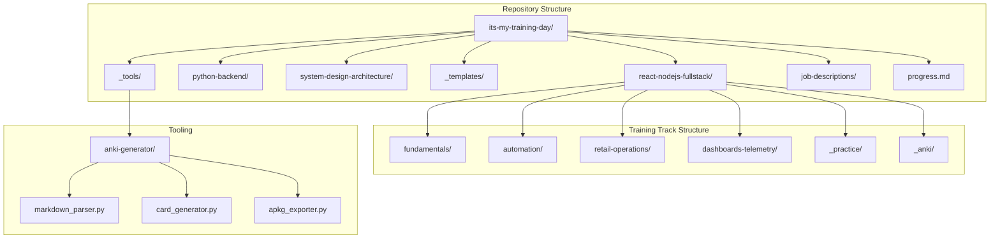
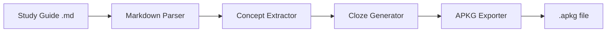

# Design Document: Interview Training Platform

## Overview

This design describes a file-based interview preparation repository with three training tracks, structured templates, and tooling for Anki card generation. The system prioritizes simplicity—using markdown files and directory conventions—while providing automation for flashcard creation.

## Architecture



## Components and Interfaces

### 1. Directory Structure Component

Each training track follows an identical internal structure:

```
{track-name}/
├── README.md                    # Concept guide for the track
├── fundamentals/
│   ├── README.md               # Concept guide for fundamentals
│   └── {topic}-study-guide.md  # Individual study guides
├── {subdomain}/
│   ├── README.md
│   └── {topic}-study-guide.md
├── _practice/
│   ├── README.md
│   ├── {exercise}-problem.md
│   └── {exercise}-solution.md
└── _anki/
    └── {session-date}.apkg     # Generated Anki decks
```

### 2. Study Guide Template Interface

```markdown
# Study Guide: {Topic Name}

## Metadata
- **Track**: {react-nodejs-fullstack | python-backend | system-design-architecture}
- **Subdomain**: {subdomain-name}
- **Difficulty**: {beginner | intermediate | advanced}
- **Target Roles**: {comma-separated list}
- **Source JD**: {optional link to job description}
- **Estimated Time**: {X minutes}

## Questions

### Q1: {Question text as a senior engineer would ask}

**Answer:**
{Detailed answer demonstrating problem-solving and technical depth}

**Key Concepts:**
- {concept 1}
- {concept 2}

**Follow-up Questions:**
1. {follow-up 1}
2. {follow-up 2}

---

### Q2: {Next question}
...
```

### 3. README Concept Guide Interface

```markdown
# {Directory Name} - Concept Guide

## Overview
{Brief description of what this directory covers and why it matters for interviews}

## Prerequisites
- {prerequisite 1}
- {prerequisite 2}

## Topics Covered

| Topic | Study Guide | Difficulty | Est. Time |
|-------|-------------|------------|-----------|
| {topic} | [{filename}](./{filename}.md) | {level} | {time} |

## Recommended Study Order
1. {first topic}
2. {second topic}

## Interview Relevance
{Explanation of how these topics appear in interviews and what roles ask about them}

## Total Estimated Time: {X hours}
```

### 4. Practice Exercise Interface

**Problem File** (`{exercise}-problem.md`):
```markdown
# Practice Exercise: {Exercise Name}

## Metadata
- **Related Study Guide**: [{guide-name}](../{subdomain}/{guide-name}.md)
- **Difficulty**: {level}
- **Time Limit**: {X minutes}

## Problem Statement
{Clear problem description}

## Requirements
- {requirement 1}
- {requirement 2}

## Hints (Optional)
<details>
<summary>Hint 1</summary>
{hint content}
</details>
```

**Solution File** (`{exercise}-solution.md`):
```markdown
# Solution: {Exercise Name}

## Approach
{Explanation of the solution approach}

## Solution Code
```{language}
{code}
```

## Complexity Analysis
- Time: O(?)
- Space: O(?)

## Alternative Approaches
{Other valid solutions}
```

### 5. Anki Card Generator Component



**Python Module Structure:**
```
_tools/anki-generator/
├── __init__.py
├── markdown_parser.py      # Parse study guide markdown
├── concept_extractor.py    # Extract key terms, definitions, code
├── cloze_generator.py      # Create cloze deletion cards
├── apkg_exporter.py        # Export to Anki package format
├── config.py               # Configuration (min cards, tags)
└── cli.py                  # Command-line interface
```

**CLI Interface:**
```bash
python -m anki_generator generate \
    --input "./react-nodejs-fullstack/fundamentals/hooks-study-guide.md" \
    --output "./_anki/" \
    --min-cards 100 \
    --tags "react,fundamentals,hooks"
```

### 6. Progress Tracking Interface

**progress.md:**
```markdown
# Training Progress

## React/Node.js Full Stack
| Topic | Status | Last Reviewed | Next Review |
|-------|--------|---------------|-------------|
| React Hooks | ✅ Completed | 2024-01-15 | 2024-01-22 |
| State Management | 🔄 In Progress | - | - |
| Event Loop | ⬜ Not Started | - | - |

## Python Backend
...

## System Design
...

## Summary
- **Total Topics**: X
- **Completed**: Y (Z%)
- **Due for Review**: N
```

### 7. Job Description Mapping Interface

**job-descriptions/README.md:**
```markdown
# Job Description Library

## How to Use
1. Save job descriptions as markdown files in this directory
2. Tag them with relevant training tracks
3. Use the mapping table to create focused study plans

## Mapping Guide

| JD Keyword | Training Track | Relevant Topics |
|------------|----------------|-----------------|
| "React hooks" | react-nodejs-fullstack | fundamentals/hooks |
| "FastAPI" | python-backend | fastapi/ |
| "distributed systems" | system-design-architecture | fundamentals/ |
```

## Data Models

### Study Guide Metadata
```typescript
interface StudyGuideMetadata {
  track: 'react-nodejs-fullstack' | 'python-backend' | 'system-design-architecture';
  subdomain: string;
  difficulty: 'beginner' | 'intermediate' | 'advanced';
  targetRoles: string[];
  sourceJD?: string;
  estimatedTimeMinutes: number;
  createdDate: string;
  lastModified: string;
}
```

### Anki Card Model
```typescript
interface AnkiCard {
  id: string;
  front: string;           // Question or cloze text with {{c1::deletions}}
  back: string;            // Answer or revealed text
  tags: string[];          // [track, subdomain, topic]
  sourceFile: string;      // Path to originating study guide
  cardType: 'cloze' | 'basic';
}
```

### Progress Entry
```typescript
interface ProgressEntry {
  topic: string;
  track: string;
  status: 'not_started' | 'in_progress' | 'completed' | 'needs_review';
  lastReviewed?: string;   // ISO date
  nextReview?: string;     // ISO date (calculated from spaced repetition)
  completionCount: number; // Times reviewed
}
```


## Correctness Properties

*A property is a characteristic or behavior that should hold true across all valid executions of a system—essentially, a formal statement about what the system should do. Properties serve as the bridge between human-readable specifications and machine-verifiable correctness guarantees.*

### Property 1: Anki Card Minimum Count
*For any* study guide with sufficient content (at least 10 Q&A pairs), the Anki generator SHALL produce at least 100 cloze deletion cards.
**Validates: Requirements 11.2**

### Property 2: APKG Export Round-Trip
*For any* generated Anki card set, exporting to .apkg and re-importing SHALL preserve all card content, tags, and metadata.
**Validates: Requirements 11.3**

### Property 3: Cloze Deletion Validity
*For any* generated cloze card, the cloze deletion syntax SHALL be valid Anki format ({{c1::text}}) and the revealed answer SHALL match the original content.
**Validates: Requirements 11.4**

### Property 4: Tag Consistency
*For any* generated Anki card, the tags SHALL include the correct training track and topic matching the source study guide's metadata.
**Validates: Requirements 11.5**

### Property 5: Study Guide Template Conformance
*For any* study guide file, parsing the markdown SHALL successfully extract all required metadata fields and Q&A sections.
**Validates: Requirements 5.2, 5.3**

### Property 6: Progress Status Transitions
*For any* progress entry, status transitions SHALL follow valid paths: not_started → in_progress → completed → needs_review → completed.
**Validates: Requirements 7.2**

### Property 7: Spaced Repetition Interval Calculation
*For any* completed topic, the next review date SHALL be calculated correctly based on the spaced repetition schedule (1, 3, 7, 14, 30 days).
**Validates: Requirements 9.3**

## Error Handling

### Anki Generator Errors
| Error Condition | Handling |
|-----------------|----------|
| Study guide has insufficient content | Warning + generate available cards with count notice |
| Invalid markdown structure | Error message with line number + skip malformed sections |
| APKG export failure | Retry once + save cards as JSON backup |
| Missing metadata fields | Use defaults + log warning |

### File System Errors
| Error Condition | Handling |
|-----------------|----------|
| Directory doesn't exist | Create directory automatically |
| File permission denied | Clear error message with path |
| Invalid file path characters | Sanitize filename + warn user |

## Testing Strategy

### Unit Tests
- Markdown parser correctly extracts Q&A sections
- Cloze generator creates valid Anki syntax
- Progress tracker calculates review dates correctly
- Metadata parser handles missing/optional fields

### Property-Based Tests
- **Anki Card Generation**: For random study guide content, verify minimum card count
- **Round-Trip**: For random card sets, verify APKG export/import preserves data
- **Cloze Syntax**: For random text inputs, verify generated cloze deletions are valid
- **Tag Generation**: For random metadata, verify tags match source

### Integration Tests
- End-to-end: Study guide → Anki cards → .apkg file
- Progress tracking across multiple study sessions
- README generation reflects actual directory contents

### Testing Framework
- **Python**: pytest with hypothesis for property-based testing
- **Minimum iterations**: 100 per property test
- **Test annotation format**: `# Feature: interview-training-platform, Property N: {property_text}`
