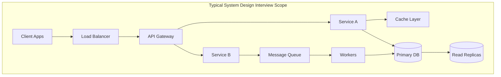

# System Design & Architecture - Concept Guide

## Overview

This training track covers system design and architecture topics essential for senior engineering, architect, and staff-level interviews. Content spans distributed systems fundamentals, observability architecture, cloud solutions design, DevOps practices, and structured frameworks for tackling system design interviews.

## Prerequisites

- Understanding of basic networking (HTTP, TCP/IP, DNS)
- Familiarity with databases (SQL and NoSQL concepts)
- Experience with at least one cloud platform (AWS, GCP, Azure)
- Basic understanding of containerization and deployment

## Topics Covered

| Subdomain | Focus Area | Difficulty Range | Est. Time |
|-----------|------------|------------------|-----------|
| [fundamentals/](./fundamentals/) | Distributed systems, CAP theorem, consistency models, scalability | Intermediate - Advanced | 10 hours |
| [observability/](./observability/) | Monitoring, logging, tracing, alerting architecture | Intermediate - Advanced | 6 hours |
| [solutions-architecture/](./solutions-architecture/) | Cloud patterns, multi-region, cost optimization | Advanced | 8 hours |
| [devops/](./devops/) | CI/CD, infrastructure as code, deployment strategies | Intermediate - Advanced | 6 hours |
| [interview-frameworks/](./interview-frameworks/) | Structured approaches to system design interviews | All levels | 4 hours |

## Recommended Study Order

1. **fundamentals/** - Build core distributed systems knowledge
2. **interview-frameworks/** - Learn structured approaches early
3. **observability/** - Understand how to make systems observable
4. **devops/** - Learn deployment and operational patterns
5. **solutions-architecture/** - Advanced cloud and multi-system design

## Interview Relevance

System design topics appear in interviews for:
- **Senior Software Engineer**: Design scalable services, data pipelines
- **Staff/Principal Engineer**: Cross-system architecture, technical strategy
- **Solutions Architect**: Cloud patterns, customer-facing designs
- **Platform Engineer**: Infrastructure, deployment, observability
- **Engineering Manager**: Technical depth, system trade-offs

Common interview formats:
- 45-60 minute system design whiteboard sessions
- Architecture review and critique exercises
- Scaling and optimization discussions
- Incident response and debugging scenarios

## Architecture Diagram Example

## Practice & Flashcards

- **[_practice/](./_practice/)** - System design exercises with constraints
- **[_anki/](./_anki/)** - Generated Anki flashcard decks

## Total Estimated Time: 34 hours
