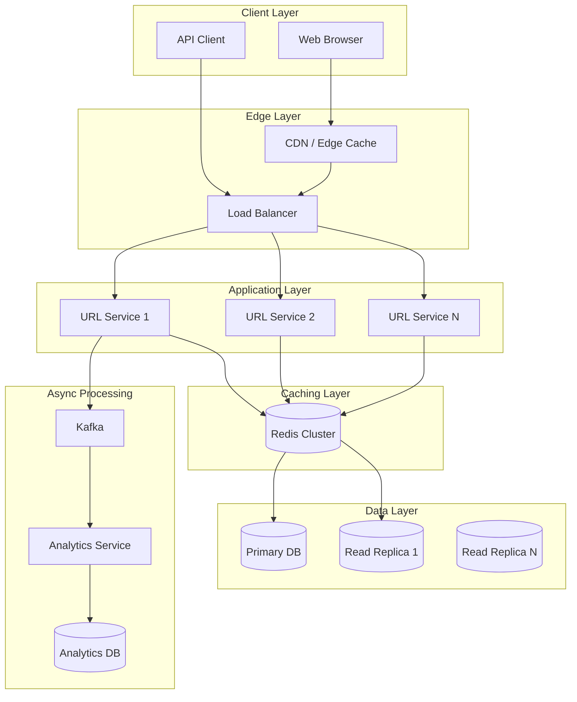
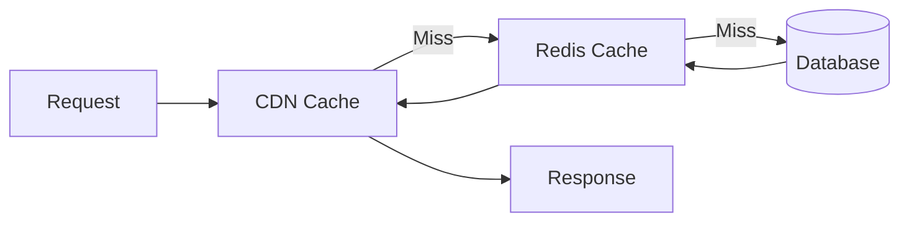
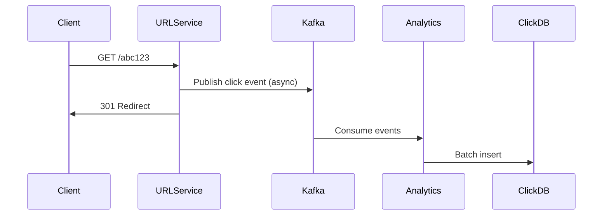
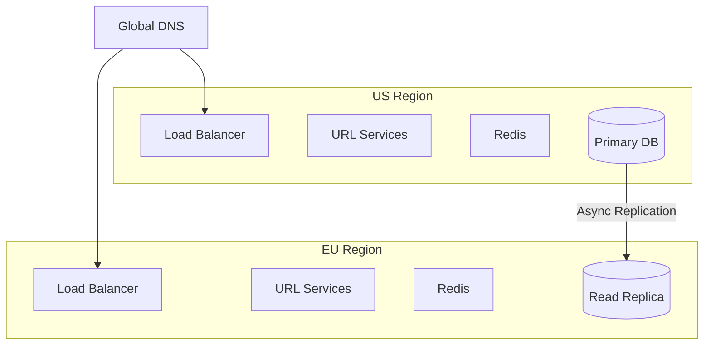

# Solution: Design a URL Shortener

## Metadata
- **Problem**: [url-shortener-problem.md](./url-shortener-problem.md)
- **Difficulty**: intermediate
- **Time to Solve**: 45 minutes

## Approach

### Requirements Clarification

Questions to ask the interviewer:
- Should we support custom aliases? (Yes)
- Do URLs expire? (Configurable, default never)
- Do we need analytics? (Basic: click count)
- What's the expected scale? (100M URLs/month, 100:1 read ratio)

### Capacity Estimation

**Traffic:**
- New URLs: 100M / month = ~40 URLs/second
- Redirects: 100:1 ratio = 4,000 redirects/second
- Peak: 3x average = ~12,000 redirects/second

**Storage (5 years):**
- URLs: 100M × 12 months × 5 years = 6 billion URLs
- Per URL: ~500 bytes (short code + long URL + metadata)
- Total: 6B × 500 bytes = 3 TB

**Bandwidth:**
- Writes: 40 × 500 bytes = 20 KB/s
- Reads: 4,000 × 500 bytes = 2 MB/s

**Cache:**
- 20% of URLs get 80% of traffic (Pareto)
- Cache 20% of 6B = 1.2B URLs × 500 bytes = 600 GB
- Realistically, cache hot URLs: ~100 GB sufficient

## High-Level Architecture



## API Design

### REST API

```
POST /api/v1/urls
Request:
{
  "long_url": "https://example.com/very/long/path",
  "custom_alias": "my-link",     // optional
  "expires_at": "2025-12-31"     // optional
}

Response: 201 Created
{
  "short_url": "https://short.ly/abc123",
  "short_code": "abc123",
  "long_url": "https://example.com/very/long/path",
  "expires_at": "2025-12-31",
  "created_at": "2024-01-15T10:30:00Z"
}

---

GET /{short_code}
Response: 301 Moved Permanently
Location: https://example.com/very/long/path

---

GET /api/v1/urls/{short_code}/stats
Response: 200 OK
{
  "short_code": "abc123",
  "click_count": 1542,
  "last_accessed": "2024-01-15T14:22:00Z"
}
```

### Why 301 vs 302 Redirect?

- **301 (Permanent)**: Browser caches redirect, reduces server load
- **302 (Temporary)**: Every request hits server, better for analytics

**Decision**: Use 301 for performance, track analytics asynchronously via Kafka.

## Database Schema

### Primary Store: PostgreSQL (or DynamoDB)

```sql
CREATE TABLE urls (
    id              BIGSERIAL PRIMARY KEY,
    short_code      VARCHAR(7) UNIQUE NOT NULL,
    long_url        TEXT NOT NULL,
    user_id         BIGINT,                    -- optional, for user accounts
    custom_alias    BOOLEAN DEFAULT FALSE,
    created_at      TIMESTAMP DEFAULT NOW(),
    expires_at      TIMESTAMP,
    click_count     BIGINT DEFAULT 0,
    last_accessed   TIMESTAMP
);

CREATE INDEX idx_short_code ON urls(short_code);
CREATE INDEX idx_expires_at ON urls(expires_at) WHERE expires_at IS NOT NULL;
```

### Why PostgreSQL?

- Strong consistency for short code uniqueness
- ACID transactions for custom alias reservation
- Read replicas for scaling reads
- Mature, well-understood operational model

### Alternative: DynamoDB

- Better for extreme scale (millions of writes/second)
- Built-in TTL for expiration
- Global tables for multi-region
- Trade-off: Eventually consistent reads, higher cost

## Short Code Generation

### Approach: Base62 Encoding with Distributed Counter

```python
import string

ALPHABET = string.digits + string.ascii_lowercase + string.ascii_uppercase  # 62 chars

def encode_base62(num: int) -> str:
    """Convert integer to base62 string."""
    if num == 0:
        return ALPHABET[0]
    
    result = []
    while num:
        num, remainder = divmod(num, 62)
        result.append(ALPHABET[remainder])
    return ''.join(reversed(result))

def generate_short_code(counter_value: int) -> str:
    """Generate 7-character short code from counter."""
    return encode_base62(counter_value).zfill(7)
```

### Counter Service (Redis or ZooKeeper)

```python
class CounterService:
    def __init__(self, redis_client):
        self.redis = redis_client
        self.local_counter = 0
        self.local_max = 0
        self.range_size = 10000  # Fetch 10K IDs at a time
    
    def get_next_id(self) -> int:
        """Get next unique ID, fetching range from Redis if needed."""
        if self.local_counter >= self.local_max:
            # Atomically increment and get new range
            self.local_max = self.redis.incrby("url_counter", self.range_size)
            self.local_counter = self.local_max - self.range_size
        
        self.local_counter += 1
        return self.local_counter
```

### Why This Approach?

- **No collisions**: Counter guarantees uniqueness
- **Scalable**: Each server fetches ID ranges, minimal coordination
- **Short codes**: 7 base62 chars = 62^7 = 3.5 trillion combinations
- **Not predictable**: Can add random offset or shuffle alphabet

### Handling Custom Aliases

```python
def create_short_url(long_url: str, custom_alias: str = None) -> str:
    if custom_alias:
        # Check if alias is available (database lookup)
        if is_alias_taken(custom_alias):
            raise AliasAlreadyExistsError()
        short_code = custom_alias
    else:
        # Generate from counter
        counter = counter_service.get_next_id()
        short_code = encode_base62(counter)
    
    # Insert into database
    save_url_mapping(short_code, long_url)
    return short_code
```

## Caching Strategy

### Multi-Layer Caching



### Cache Configuration

**CDN (CloudFront/Cloudflare):**
- Cache 301 redirects at edge
- TTL: 1 hour for popular URLs
- Geographic distribution for low latency

**Redis Cluster:**
- Cache all active URLs
- TTL: 24 hours (refresh on access)
- LRU eviction when memory full
- Cluster mode for horizontal scaling

### Cache-Aside Pattern

```python
def get_long_url(short_code: str) -> str:
    # 1. Check Redis cache
    long_url = redis.get(f"url:{short_code}")
    if long_url:
        return long_url
    
    # 2. Cache miss - query database
    url_record = db.query("SELECT long_url FROM urls WHERE short_code = ?", short_code)
    if not url_record:
        raise UrlNotFoundError()
    
    # 3. Populate cache
    redis.setex(f"url:{short_code}", 86400, url_record.long_url)  # 24h TTL
    
    return url_record.long_url
```

## Analytics Pipeline

### Asynchronous Click Tracking



### Why Async?

- Redirect latency not impacted by analytics
- Can handle traffic spikes (Kafka buffers)
- Analytics can be processed in batches
- Decoupled: analytics failures don't affect redirects

### Click Event Schema

```json
{
  "short_code": "abc123",
  "timestamp": "2024-01-15T14:22:00Z",
  "user_agent": "Mozilla/5.0...",
  "ip_address": "192.168.1.1",
  "referer": "https://twitter.com",
  "country": "US"
}
```

## Scalability Approach

### Horizontal Scaling

| Component | Scaling Strategy |
|-----------|------------------|
| Load Balancer | Multiple LBs with DNS round-robin |
| URL Service | Stateless, add more instances |
| Redis | Cluster mode with sharding |
| PostgreSQL | Read replicas, eventual sharding |
| Kafka | Partition by short_code |

### Database Sharding (Future)

When single PostgreSQL can't handle writes:

```
Shard key: first character of short_code
Shard 0: [0-9] → 10 shards
Shard 1: [a-z] → 26 shards  
Shard 2: [A-Z] → 26 shards
Total: 62 shards
```

### Multi-Region Deployment



## Trade-off Analysis

| Decision | Choice | Alternative | Rationale |
|----------|--------|-------------|-----------|
| Short code generation | Counter + Base62 | Hash-based | No collisions, shorter codes |
| Primary database | PostgreSQL | DynamoDB | Consistency for aliases, familiar ops |
| Cache | Redis Cluster | Memcached | Rich data types, persistence |
| Redirect type | 301 | 302 | Performance over real-time analytics |
| Analytics | Async (Kafka) | Sync | Latency over real-time accuracy |

## Interview Tips

### How to Present This Solution

1. **Clarify requirements** (2-3 min): Ask about scale, features, constraints
2. **Estimate capacity** (3-5 min): Show you can do back-of-envelope math
3. **High-level design** (10-15 min): Draw the architecture, explain data flow
4. **Deep dive** (15-20 min): Pick 2-3 components to detail (interviewer may guide)
5. **Trade-offs** (5 min): Discuss alternatives and why you chose this approach

### Common Follow-up Questions

1. **Q**: How would you handle a surge in traffic (10x normal)?
   **A**: CDN absorbs reads, Kafka buffers analytics, auto-scale app servers, Redis handles hot keys.

2. **Q**: How do you prevent abuse (spam URLs)?
   **A**: Rate limiting per IP/user, URL validation, blocklist for malicious domains, CAPTCHA for anonymous users.

3. **Q**: How would you implement URL preview (like Twitter cards)?
   **A**: Async job to fetch URL metadata (title, image), store in database, serve via API.

### Mistakes to Avoid

- Jumping into details without clarifying requirements
- Forgetting to estimate capacity
- Designing for current scale only (no growth plan)
- Ignoring failure scenarios (what if Redis is down?)
- Not discussing trade-offs

## Related Problems

- [Design TinyURL with Analytics Dashboard](./tinyurl-analytics-problem.md) (coming soon)
- [Design Pastebin](./pastebin-problem.md) (coming soon)

## References

- [System Design Primer - URL Shortener](https://github.com/donnemartin/system-design-primer)
- [Designing a URL Shortening Service - Educative](https://www.educative.io/courses/grokking-the-system-design-interview)
