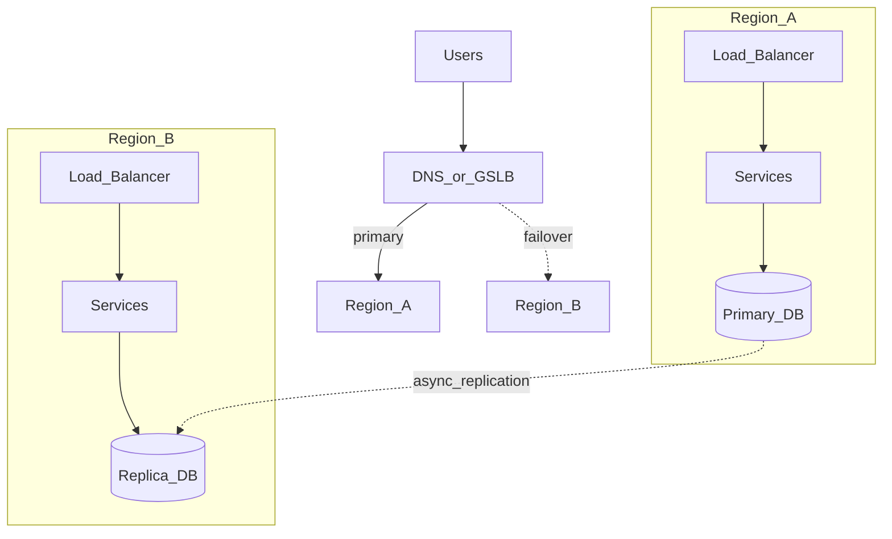
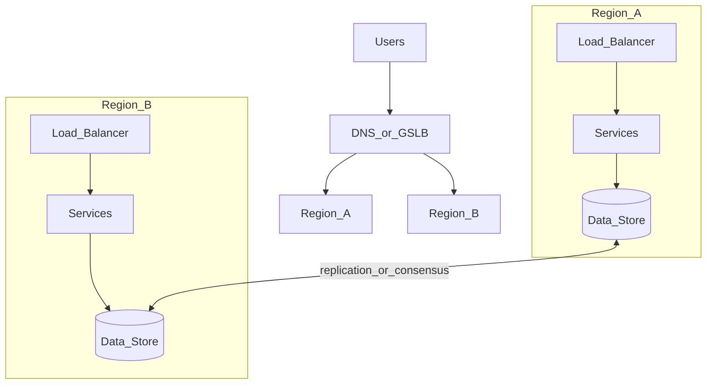

# Study Guide: Multi-Region Architecture

## Metadata
- **Track**: system-design-architecture
- **Subdomain**: solutions-architecture
- **Difficulty**: Advanced
- **Target audience**: Junior engineers designing for global availability and latency
- **Estimated time**: 90–120 minutes

## What you’ll learn
- The main multi-region shapes: **active-passive** vs **active-active**
- How to think about **data replication** (latency, consistency, failover)
- Traffic management patterns (DNS/GSLB, Anycast, CDNs)
- Failure modes (split brain, partial failover, dependency regions) and mitigations

## Mental model
Multi-region is fundamentally about **surviving correlated failures** (region outage) while balancing:
- **Latency**: keep users close to compute
- **Availability**: keep serving if a region fails
- **Consistency**: keep data correct across distance

The hard part is **state**. Stateless compute is easy to fail over; databases are not.

## Reference architectures

### Active-passive (simpler, common)

### Active-active (harder, lower latency, higher complexity)

## Data/control flows

### Happy path (active-passive)
1. User resolves DNS to Region A and hits services.
2. Writes go to Region A primary database.
3. Database replicates asynchronously to Region B.
4. Read replicas may be used in Region B for warm standby or analytics.

### Region failure (active-passive)
1. Health checks fail for Region A.
2. DNS/GSLB routes to Region B.
3. Promote replica to primary (manual or automated).
4. Validate core journeys; then scale up Region B capacity.

### Under partial failure (hard cases)
- Region A is “alive” but dependencies are degraded (e.g., payments, identity).
- Network partition between regions causes replication lag or divergence.

## Key design decisions (what interviewers expect)

### 1) Traffic management
Options:
- **DNS failover**: simplest, but TTL delays and caching can slow cutover.
- **Anycast**: fast routing, but harder to reason about.
- **CDN**: reduces latency and offloads static/edge logic.

### 2) Data model per workload
Pick per data domain:
- **Single-writer**: easiest (all writes in one region).
- **Multi-writer**: hardest; needs conflict resolution or strong consistency.

### 3) Consistency strategy
Trade-offs:
- **Strong consistency across regions**: higher latency, lower throughput; usually only for small critical metadata.
- **Eventual consistency**: faster, but needs idempotency + reconciliation.

### 4) Blast radius boundaries
Keep critical dependencies region-independent where possible:
- multi-region identity, secrets, and control planes
- or explicitly document that they are “regional” and impact failover

## Trade-offs (latency / availability / cost / operability / security)
- **Active-passive**
  - Pros: simpler operations, easier data correctness
  - Cons: higher latency for users near passive region; failover complexity for state
- **Active-active**
  - Pros: better latency and availability (if done right)
  - Cons: expensive; conflict resolution; harder incident response
- **Synchronous replication**
  - Pros: strong correctness
  - Cons: latency penalties; can reduce availability under partitions

## Failure modes & mitigations
- **Split brain (two primaries)**
  - Mitigation: automated fencing, single-writer controls, consensus for leader election, clear runbooks.
- **Stale DNS routes**
  - Mitigation: low TTLs, health-check-based routing, client retries with regional hints.
- **Replication lag / data loss window**
  - Mitigation: define RPO, measure lag, pause failover until lag acceptable, use write-ahead logs/backups.
- **Regional dependency coupling**
  - Mitigation: make dependencies multi-region or design graceful degradation/fallbacks.

## Operational playbook (runbook starter)
- **Detect**: region health alert + SLO burn rate (user impact).
- **Triage**: confirm blast radius, compare Region A vs B golden signals.
- **Mitigate**:
  - disable risky features (flags)
  - shed load / rate limit
  - route traffic to healthy region
- **Failover** (if needed): DNS/GSLB switch, promote DB, verify key flows.
- **Recover**: restore failed region; decide failback approach (planned, not rushed).

## Security considerations
- Least privilege IAM per region; avoid global admin credentials.
- Key management: multi-region KMS strategy and rotation.
- Audit logs should remain available during regional outages (store redundantly).

## Metrics & SLOs (suggested)
- Region-level SLIs: availability, p95 latency, error rate, saturation.
- Failover SLIs: time to detect, time to route, time to promote DB, time to recover.
- Replication SLIs: lag, apply error rate.

## Hands-on exercises
1. Design active-passive for a checkout service. Define RTO and RPO and defend them.
2. Identify which data domains can be single-writer vs multi-writer.
3. Write a failover runbook: DNS switch + DB promotion + verification checklist.

## Interview pack

### Common questions
1. “Active-active vs active-passive: when would you choose each?”
2. “How do you handle database replication and failover?”
3. “What happens during a network partition between regions?”
4. “How do you test your failover plan?”

### Strong answer outline
- Start from requirements (latency, RTO/RPO, budget, consistency)
- Choose architecture shape and explain traffic + data strategy
- Call out failure modes and operational runbooks
- Tie to observability and SLOs for measurable correctness

### Red flags
- “Just use DNS” without TTL/failover mechanics
- No plan for state failover or split brain
- Assuming strong consistency across regions is “free”

## Related guides
- `01-cloud-design-patterns.md`
- `03-disaster-recovery-strategies.md`
- `..\..\observability\study-guides\06-slis-slos-and-slas.md`
