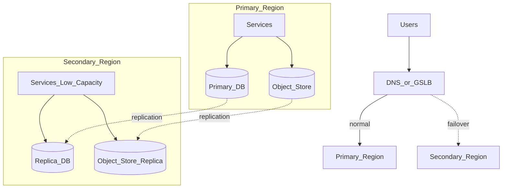

# Study Guide: Disaster Recovery Strategies

## Metadata
- **Track**: system-design-architecture
- **Subdomain**: solutions-architecture
- **Difficulty**: Advanced
- **Target audience**: Junior engineers designing and practicing recovery plans
- **Estimated time**: 60–90 minutes

## What you’ll learn
- How to define and use **RTO** and **RPO**
- DR tiers: backup/restore, pilot light, warm standby, hot standby
- How to build DR runbooks and validate them with game days
- Common failure modes (restore surprises, IAM breakage, data corruption) and mitigations

## Core definitions
- **RTO (Recovery Time Objective)**: maximum acceptable downtime.
- **RPO (Recovery Point Objective)**: maximum acceptable data loss (time window).

You don’t pick DR by “best practice”; you pick it by **business tolerance** for downtime and loss.

## Mental model
DR is a **repeatable process**, not a diagram.
Your goal is to reduce:
- unknowns (documentation, ownership, dependencies)
- manual heroics (automation)
- time-to-recover (practice)

## DR tiers (common patterns)

### Backup and restore (cheapest, slowest)
- Restore infra and data from backups when disaster occurs.
- Good for: non-critical workloads, cost-sensitive systems.

### Pilot light
- Minimal core services always-on (DNS, minimal compute); scale during disaster.
- Good for: medium criticality with some pre-provisioning.

### Warm standby
- Full stack running at reduced capacity in secondary; scale up on failover.
- Good for: low RTO needs without paying full double-cost.

### Hot standby (active-passive)
- Full-capacity standby ready to take traffic quickly.
- Good for: strict RTO/RPO requirements.

## Reference architecture (warm standby)

## Data/control flows

### Happy path
1. Primary region handles traffic.
2. Backups are taken on schedule and validated.
3. Data replicates (if using warm/hot patterns).
4. DR runbooks and ownership are kept current (not stale docs).

### Disaster event
1. Detect incident and declare disaster (clear decision authority).
2. Execute runbook: route traffic, promote data stores, scale capacity.
3. Verify key user journeys and data correctness.
4. Communicate status and recovery progress.

## Trade-offs
- **Lower RTO/RPO** costs more (infra, replication, ops).
- **Automation** reduces RTO but increases build complexity—worth it for critical systems.
- **Cross-region strong consistency** can harm availability and latency; use selectively.

## Failure modes & mitigations
- **Backups exist but are unusable**
  - Mitigation: automated restore tests, checksum validation, “backup SLOs”.
- **IAM or secrets fail in DR**
  - Mitigation: replicate secrets and key management; pre-provision roles; least privilege with tested assumptions.
- **Data corruption replicated**
  - Mitigation: point-in-time restore, immutability for backups, corruption detection, write protection controls.
- **Runbooks rot**
  - Mitigation: quarterly game days; change management requires runbook updates; owners.
- **Dependencies not included**
  - Mitigation: dependency mapping (identity, email, payments, observability); explicit DR stance per dependency.

## Operational playbook (runbook skeleton)
- **Decision**: who declares DR, and under what triggers?
- **Checklist**:
  - [ ] Freeze risky deploys / changes
  - [ ] Route traffic to DR region (DNS/GSLB)
  - [ ] Promote DB / enable writes (avoid split brain)
  - [ ] Scale compute/queues
  - [ ] Verify top user journeys + SLO recovery
  - [ ] Communicate externally/internal cadence
- **Failback plan**: planned return to primary, with data sync and validation.

## Security considerations
- Backups must be encrypted and access-controlled.
- DR access should be audited and tightly scoped (break-glass procedure).
- Ensure logging/auditing remains available during DR events.

## Metrics & SLOs (suggested)
- **Recovery SLIs**: time to detect, time to route, time to restore, time to verify.
- **Backup SLIs**: backup success rate, restore test pass rate, backup age.
- **Replication SLIs**: lag, apply errors, failover readiness.

## Exercises
1. For a user-facing API, propose RTO/RPO targets and justify by business impact.
2. Write a DR runbook for warm standby including verification steps.
3. Design an automated “restore test” job and define what “pass” means.

## Interview pack

### Common questions
1. “Explain RTO and RPO with examples.”
2. “How would you choose between warm standby and backup/restore?”
3. “How do you validate that backups work?”
4. “How do you prevent split brain during failover?”

### Strong answer outline
- Start with business requirements (RTO/RPO) and choose a DR tier
- Include operational details: runbooks, automation, and game days
- Call out state correctness and data corruption risks
- Tie back to measurable recovery SLIs and SLOs

### Red flags
- Assuming backups are valid without restore testing
- No ownership or practiced runbooks
- No plan for dependencies and secrets in DR

## Related guides
- `02-multi-region-architecture.md`
- `04-cost-optimization.md`
- `..\..\devops\study-guides\08-reliability-engineering.md`
