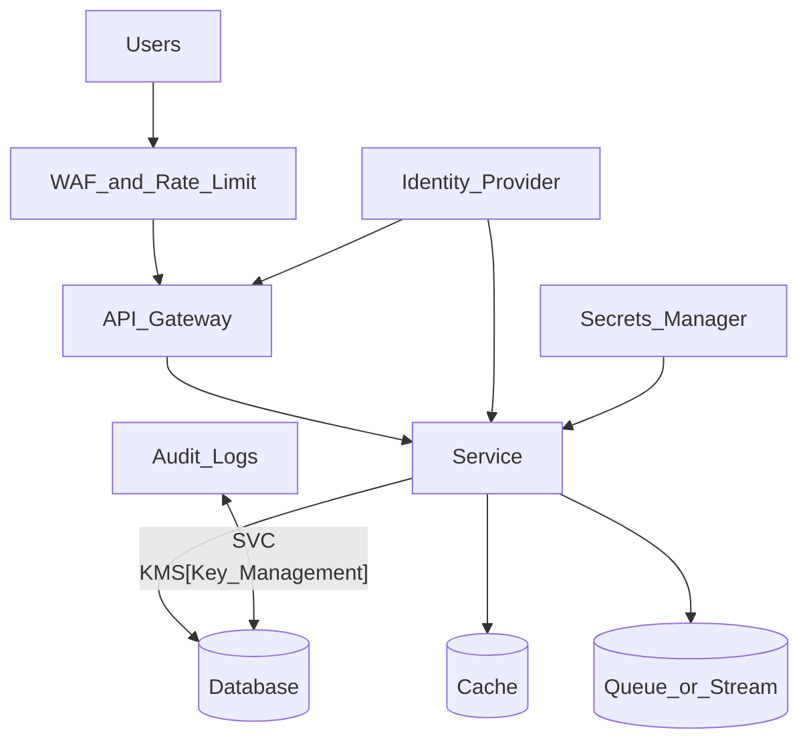

# Study Guide: Security Architecture

## Metadata
- **Track**: system-design-architecture
- **Subdomain**: solutions-architecture
- **Difficulty**: Advanced
- **Target audience**: Junior engineers designing secure-by-default cloud systems
- **Estimated time**: 60–90 minutes

## What you’ll learn
- How to design security with **defense in depth** and **least privilege**
- Identity-first architecture: authentication, authorization, and service-to-service trust
- Secure networking defaults (segmentation, private endpoints, egress control)
- Operational security: secrets, auditing, incident response, and supply chain

## Mental model
Security architecture is about reducing:
- **probability** of compromise (prevent)
- **blast radius** (contain)
- **time to detect and respond** (observe + operate)

Assume breach: design so one compromised component does not own everything.

## Reference architecture (identity + network + data)

## Concepts (practical defaults)

### 1) Authentication vs authorization
- **Authentication**: who are you?
- **Authorization**: what can you do?

Design rule: authn/authz should be consistent and testable across services.

### 2) Least privilege (everywhere)
Apply to:
- human access (break-glass)
- service identities (workload identity, short-lived creds)
- data access (row/tenant-level policies where needed)

### 3) Network boundaries as guardrails
Defaults:
- private subnets for stateful stores
- private endpoints to managed services when possible
- restrict outbound egress (egress proxy, allowlist)

### 4) Data protection
- encrypt in transit (TLS) and at rest
- classify data (PII, secrets, financial)
- minimize data exposure in logs and traces

### 5) Supply chain security
Controls:
- dependency scanning
- SBOM generation
- artifact signing + verification at deploy time
- protected branches and required checks

## Data/control flows (examples)

### User request (token-based)
1. User authenticates with identity provider and gets a token.
2. API gateway validates token and enforces coarse authorization.
3. Service enforces fine-grained authorization (resource/tenant).
4. Access is logged to audit logs (who, what, when, where).

### Service-to-service calls
1. Caller uses workload identity (short-lived credentials).
2. Mutual TLS or token exchange proves identity.
3. Authorization policy allows only required actions.

## Trade-offs
- **Centralized authz**: consistent, but can become a bottleneck.
- **Decentralized authz**: scalable, but risks inconsistency; needs shared libraries and tests.
- **Zero trust**: strong posture, but more operational complexity.

## Failure modes & mitigations
- **Over-privileged IAM roles**
  - Mitigation: least privilege reviews, automated policy scanning, separate roles per service.
- **Secret sprawl**
  - Mitigation: secrets manager, rotation, short-lived credentials, no secrets in CI logs.
- **Lateral movement**
  - Mitigation: network segmentation, mTLS, per-service identities, rate limits.
- **Data leakage via logs**
  - Mitigation: structured logging with redaction; access controls; audit queries.
- **Insecure defaults**
  - Mitigation: secure templates and policy-as-code (deny by default).

## Operational playbook
- **Prevent**: secure baselines, scanning, patching, configuration policies.
- **Detect**: audit logs, anomaly detection, alerts for privilege escalation and suspicious access.
- **Respond**:
  - revoke/rotate credentials
  - isolate workloads (network policies)
  - contain blast radius (disable tokens/keys)
  - preserve evidence and timelines

## Security checklist (junior-friendly)
- [ ] All services use short-lived credentials (OIDC/workload identity)
- [ ] DB and caches are not publicly reachable
- [ ] Secrets are stored in a secrets manager and rotated
- [ ] Audit logs exist for authz decisions and admin actions
- [ ] Dependencies scanned; artifacts signed; deployments verify signatures
- [ ] Logs/traces are scrubbed of PII/secrets

## Exercises
1. Threat model a “checkout” system: list 5 threats and mitigations.
2. Design IAM roles for API service vs worker service with least privilege.
3. Write a break-glass procedure for production access (steps + auditing).

## Interview pack

### Common questions
1. “How do you design least-privilege access in the cloud?”
2. “How do you handle secrets and key rotation?”
3. “How do you secure service-to-service communication?”
4. “What is defense in depth and how do you apply it?”

### Strong answer outline
- Start from identity and least privilege
- Add network segmentation and secure defaults
- Cover data protection and auditing
- Include supply chain security controls

### Red flags
- Long-lived access keys in CI or on laptops
- Relying only on network security without identity controls
- No auditing or incident response plan

## Related guides
- `01-cloud-design-patterns.md`
- `08-migration-strategies.md`
- `..\..\devops\study-guides\01-ci-cd-pipeline-design.md`
