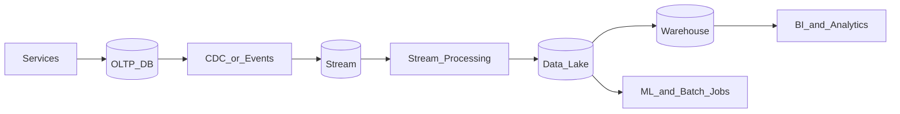

# Study Guide: Data Architecture

## Metadata
- **Track**: system-design-architecture
- **Subdomain**: solutions-architecture
- **Difficulty**: Advanced
- **Target audience**: Junior engineers designing data systems and pipelines
- **Estimated time**: 60–90 minutes

## What you’ll learn
- How to choose between OLTP, OLAP, lake, warehouse, and streaming approaches
- Core pipeline patterns (batch vs streaming, CDC, backfills, late data)
- Data governance basics: quality, lineage, access controls
- Reliability failure modes (duplicates, schema drift, hot partitions) and mitigations

## Mental model
Data architecture is about:
- **serving** different access patterns (transactions vs analytics)
- **moving** data reliably (pipelines)
- **trusting** data (quality + governance)

Almost every “data bug” is one of: bad contracts, late/duplicate events, or unclear ownership.

## Reference architecture (hybrid batch + stream)

## Key concepts

### OLTP vs OLAP
- **OLTP**: fast reads/writes for application transactions (normalized, indexed for point queries).
- **OLAP**: analytical queries over large datasets (columnar, denormalized, partitioned).

### Lake vs warehouse
- **Data lake**: cheap storage of raw and curated data; flexible schemas.
- **Warehouse**: curated, modeled, query-optimized datasets for analytics.

### Streaming vs batch
- **Streaming**: low-latency updates; harder correctness and ops.
- **Batch**: simpler correctness; higher latency.

Most real systems are hybrid.

## Data/control flows

### Happy path
1. App writes to OLTP.
2. CDC captures changes and publishes events.
3. Stream processing enriches and writes curated datasets.
4. Lake stores raw + curated; warehouse stores modeled tables.
5. BI queries warehouse; ML/batch jobs use lake.

### Under failure
- **Processing behind**: lag grows; downstream dashboards become stale.
- **Schema drift**: pipeline breaks or silently drops fields.
- **Duplicate events**: counts inflate; analytics wrong.

## Design decisions

### 1) Event contracts and schemas
Use schema registry/versioning and define compatibility rules:
- backward compatible changes preferred
- explicit deprecation windows

### 2) Partitioning and hotspots
Streams and warehouses need good partition keys:
- avoid single hot keys (e.g., “all events for one tenant”)
- use composite keys or sharding for uneven distributions

### 3) Exactly-once (business layer)
Don’t rely on platform promises alone.
Use:
- idempotent processing
- dedupe keys
- transactional outbox/CDC patterns

### 4) Backfills and reprocessing
You will need to recompute.
Plan for:
- replayable inputs
- deterministic transforms
- versioned datasets

## Trade-offs
- **Streaming**: fresher data, higher operational complexity.
- **Warehouse modeling**: faster analytics, more maintenance and governance.
- **Raw retention**: better forensic ability, more storage cost and access risk.

## Failure modes & mitigations
- **Late data**
  - Mitigation: watermarking, windowing strategies, update semantics for aggregates.
- **Duplicates**
  - Mitigation: idempotent consumers, dedupe keys, exactly-once at business layer.
- **Schema drift**
  - Mitigation: schema registry, compatibility checks in CI, canary pipelines.
- **Data quality regressions**
  - Mitigation: data tests (nulls, ranges, uniqueness), anomaly detection, ownership.
- **Access leaks**
  - Mitigation: RBAC/ABAC, row-level security, masking, audit logs.

## Operational playbook
- **Lag spike**:
  - identify bottleneck (ingestion vs processing vs storage)
  - scale consumers/compute
  - check downstream dependency limits
- **Bad data detected**:
  - stop propagation (pause writes to curated)
  - identify source and scope
  - backfill corrected data
  - add tests to prevent recurrence

## Security considerations
- Data classification and least privilege access.
- Encryption at rest and in transit.
- Audit access to sensitive datasets.
- Masking/tokenization for PII where appropriate.

## Metrics & SLOs (suggested)
- Pipeline freshness SLI: lag under threshold (e.g., p95 under 5 minutes)
- Ingestion and processing success rates
- Data quality SLIs: null rates, duplicate rates, schema errors
- Cost KPIs: cost per TB stored and queried

## Exercises
1. Design a pipeline for “orders” events: raw, curated, and warehouse tables.
2. Propose a schema versioning strategy and compatibility rules.
3. Create a runbook for “pipeline lag is 10x normal”.

## Interview pack

### Common questions
1. “How do you choose between batch and streaming?”
2. “How do you handle duplicate or late events?”
3. “What’s the difference between a data lake and a warehouse?”
4. “How do you ensure data quality?”

### Strong answer outline
- Start from access patterns (OLTP/OLAP) and freshness requirements
- Choose a hybrid pipeline with CDC/events
- Call out contracts, backfills, quality tests, and governance
- Tie to measurable SLIs (freshness, correctness) and operational playbooks

### Red flags
- No plan for backfills or reprocessing
- Assuming exactly-once without idempotency
- Ignoring governance and access control

## Related guides
- `01-cloud-design-patterns.md`
- `08-migration-strategies.md`
