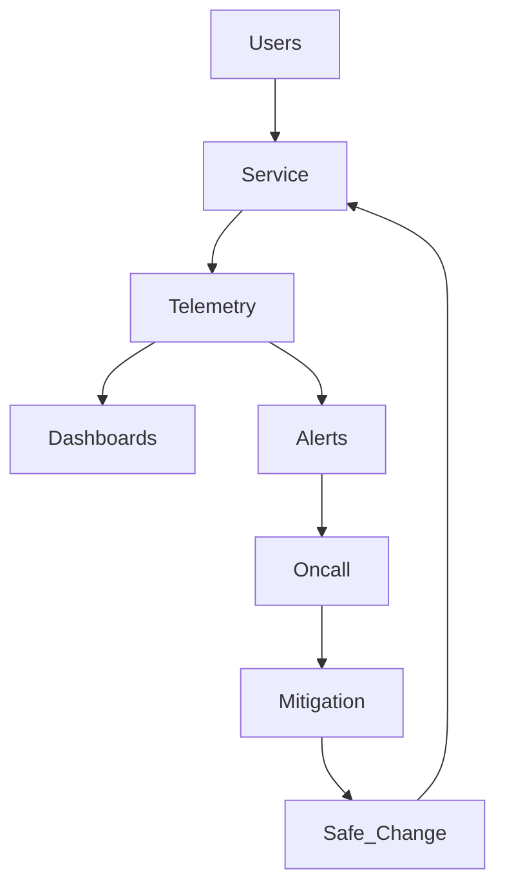

# Study Guide: Reliability Engineering (SRE Fundamentals)

## Metadata
- **Track**: system-design-architecture
- **Subdomain**: devops
- **Difficulty**: Advanced
- **Target audience**: Junior engineers learning production reliability
- **Estimated time**: 45–90 minutes

## Prerequisites
- Basic understanding of web services (requests, dependencies, timeouts)
- Familiarity with dashboards/alerts at a high level
- Helpful: experience shipping at least one production change

## Suggested study path (junior)
1. Start with [Three Pillars of Observability](../../observability/study-guides/01-three-pillars-of-observability.md) (how you detect/diagnose)
2. Next: [Metrics Architecture](../../observability/study-guides/02-metrics-architecture.md) (how to build trustworthy signals)
3. Then read this guide (SLIs/SLOs + safe change + incident discipline)
4. Apply it to shipping: [Deployment Strategies](./04-deployment-strategies.md) and [CI/CD Pipeline Design](./01-ci-cd-pipeline-design.md)
5. Tie it to architecture choices: [Cloud Design Patterns](../../solutions-architecture/study-guides/01-cloud-design-patterns.md)

## Related guides
- [Three Pillars of Observability](../../observability/study-guides/01-three-pillars-of-observability.md)
- [Metrics Architecture](../../observability/study-guides/02-metrics-architecture.md)
- [Distributed Tracing](../../observability/study-guides/03-distributed-tracing.md)
- [Deployment Strategies](./04-deployment-strategies.md)
- [CI/CD Pipeline Design](./01-ci-cd-pipeline-design.md)
- [Cloud Design Patterns](../../solutions-architecture/study-guides/01-cloud-design-patterns.md)

## What you’ll learn
- The reliability “contract”: SLIs, SLOs, error budgets
- How to build reliable systems using redundancy, timeouts, and backpressure
- How to run incident response with clear roles and operational discipline
- How to balance shipping velocity vs system stability

## Reliability is a product feature
Reliability means users can depend on your system. It’s not “uptime vanity metrics”, it’s meeting user expectations consistently.

## Key concepts

### SLI (Service Level Indicator)
A **measure** of service behavior (latency, availability, correctness).

Examples:
- Request success rate
- p95 latency for `GET /checkout`
- Freshness of data (lag)

### SLO (Service Level Objective)
A **target** for an SLI over a time window.

Example:
- “99.9% of checkout requests succeed over 28 days”

### SLA (Service Level Agreement)
A **contract** with users/customers. Usually includes penalties.

### Error budget
Allowed unreliability: \(1 - SLO\).
- SLO 99.9% over 30 days ≈ ~43 minutes of error budget.

Error budgets convert reliability into an operational decision tool:
- If you’re burning budget fast, you slow down risky changes.

## The four golden signals (operational default)
- **Latency**: how long requests take
- **Traffic**: how many requests
- **Errors**: failed requests (and correctness errors)
- **Saturation**: resource usage approaching limits (CPU, memory, queue depth)

## Reference architecture: reliability control loops

## Reliability building blocks (what juniors should implement)

### Timeouts (mandatory)
No timeout = your system can hang forever.
- Set timeouts on all network calls.
- Prefer shorter timeouts for dependencies than for the overall request budget.

### Retries (dangerous if naive)
Retries can amplify load during incidents.
Rules:
- Retry only idempotent operations.
- Use exponential backoff + jitter.
- Cap retries and overall time.

### Circuit breakers
When a dependency is failing, stop calling it aggressively.
- Prevents resource exhaustion
- Gives dependencies time to recover

### Bulkheads
Isolate resources so one failing dependency doesn’t take down everything.
- Separate thread pools / connection pools
- Separate queues per workload class

### Backpressure
If you can’t keep up, you must shed or queue load safely.
- Queue with limits
- Shed non-critical work
- Fail fast with clear error responses

### Rate limiting
Protects you from abusive clients and accidental traffic spikes.
- Per-user and per-IP controls
- Global circuit for total load

### Graceful degradation
Return partial functionality instead of total failure.
- Disable non-critical features under load
- Serve cached/stale reads when acceptable

## Incident response (operational discipline)

### Roles
- **Incident commander**: coordinates, communicates, makes decisions
- **Ops lead**: executes mitigations
- **Comms**: updates stakeholders
- **Scribe**: records timeline

### Timeline discipline
During an incident:
- Stabilize first (stop the bleeding)
- Then diagnose and fix root cause

### Common mitigations
- Roll back deploy
- Disable feature flag
- Scale up
- Fail over to another region
- Shed load / rate limit

## Postmortems (how reliability improves)
Blameless postmortems should produce:
- Clear timeline
- Root causes and contributing factors
- Action items with owners and dates
- Preventive controls (tests, alerts, automation)

Avoid “human error” as the root cause; fix the system that allowed it.

## Reliability and delivery velocity (error budget policy)
A simple policy:
- If burn rate is high: freeze risky deploys, focus on stabilization.
- If burn rate is healthy: ship normally, invest some time in reliability debt.

## Failure modes & mitigations
- **Thundering herd** after an outage
  - Mitigation: jitter, gradual re-enable, caching.
- **Retry storms**
  - Mitigation: circuit breakers, retry budgets, backoff.
- **Slow dependencies cause saturation**
  - Mitigation: timeouts, bulkheads, queues with limits.
- **Noisy alerts and alert fatigue**
  - Mitigation: SLO-based paging, actionable alerts only.

## Operational checklist
- [ ] SLIs and SLOs defined for key user journeys
- [ ] Alerts are actionable and tied to SLOs where possible
- [ ] Runbooks exist for top failure modes
- [ ] Timeouts + retries + circuit breakers implemented for dependencies
- [ ] Load shedding / backpressure strategy exists
- [ ] Postmortem process produces real follow-up work

## Exercises
1. Pick SLIs/SLOs for an API service (availability + latency + correctness).
2. Design a retry policy for a dependency that sometimes returns 503.
3. Create an incident response playbook for “latency spike + error rate increase”.

## Interview pack

### Common questions
1. “What’s the difference between SLI, SLO, and SLA?”
2. “How do you prevent retries from making outages worse?”
3. “How would you design alerting to avoid noise?”
4. “Describe an incident response process.”

### Strong answer outline
- Golden signals + SLOs and error budgets
- Defensive client patterns (timeouts, retries, breakers)
- Operational process (oncall, runbooks, postmortems)
- Trade-offs between velocity and reliability using error budgets

