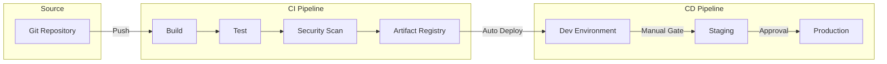
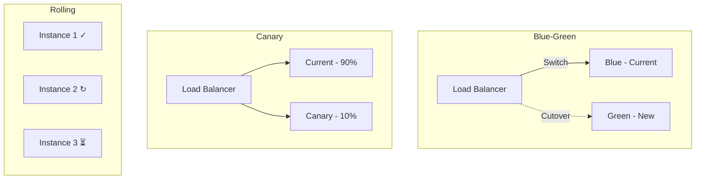

# DevOps - Concept Guide

## Overview

DevOps engineering topics covering CI/CD pipelines, infrastructure as code, deployment strategies, and operational practices. Essential knowledge for engineers who build and maintain production systems and need to demonstrate operational excellence in interviews.

## Prerequisites

- Familiarity with version control (Git)
- Basic understanding of containerization (Docker)
- Experience with at least one CI/CD tool

## Topics Covered

| Topic | Study Guide | Difficulty | Est. Time |
|-------|-------------|------------|-----------|
| CI/CD Pipeline Design | [Study guide](study-guides/01-ci-cd-pipeline-design.md) | Intermediate | 60 min |
| Infrastructure as Code | [Study guide](study-guides/02-infrastructure-as-code.md) | Intermediate | 60 min |
| Container Orchestration | [Study guide](study-guides/03-container-orchestration.md) | Advanced | 60 min |
| Deployment Strategies | [Study guide](study-guides/04-deployment-strategies.md) | Intermediate | 45 min |
| GitOps Patterns | [Study guide](study-guides/05-gitops-patterns.md) | Intermediate | 45 min |
| Secret Management | [Study guide](study-guides/06-secret-management.md) | Intermediate | 30 min |
| Environment Management | [Study guide](study-guides/07-environment-management.md) | Intermediate | 30 min |
| Reliability Engineering | [Study guide](study-guides/08-reliability-engineering.md) | Advanced | 45 min |

## What you’ll learn (by topic)

### CI/CD Pipeline Design
- How to structure CI vs CD stages (fast feedback vs safe rollout)
- Immutable artifacts: build once, promote through environments
- Gates, verification, and rollback as first-class pipeline features
- Deep dive: `study-guides/01-ci-cd-pipeline-design.md`

### Infrastructure as Code
- Declarative infra workflows (plan/apply) and safe change management
- State, drift detection, and environment separation
- Policy-as-code guardrails and reviewable changes
- Deep dive: `study-guides/02-infrastructure-as-code.md`

### Container Orchestration
- Core scheduler primitives (pods, deployments, services, ingress)
- Scaling and rollout behavior (health checks, probes, disruption)
- Operational patterns (resource requests/limits, autoscaling)
- Deep dive: `study-guides/03-container-orchestration.md`

### Deployment Strategies
- Rolling vs blue/green vs canary trade-offs
- Progressive delivery with measurable verification signals
- Safe rollback and database migration compatibility
- Deep dive: `study-guides/04-deployment-strategies.md`

### GitOps Patterns
- Desired-state reconciliation and auditability via Git
- Separating config, secrets, and app delivery pipelines
- Drift prevention and controlled rollouts across clusters
- Deep dive: `study-guides/05-gitops-patterns.md`

### Secret Management
- Storing, rotating, and accessing secrets safely
- Short-lived credentials and least-privilege access
- Preventing leaks (scanning, masking, and runtime protections)
- Deep dive: `study-guides/06-secret-management.md`

### Environment Management
- Dev/stage/prod parity and reducing “works in staging” failures
- Config promotion, feature flags, and release controls
- Strategies for test data, tenancy, and isolation
- Deep dive: `study-guides/07-environment-management.md`

### Reliability Engineering
- SLIs/SLOs/error budgets as the reliability contract
- Defensive dependency patterns (timeouts, retries, breakers, bulkheads)
- Incident response basics and operational discipline
- Deep dive: `study-guides/08-reliability-engineering.md`

## Recommended Study Order

1. **CI/CD Pipeline Design** - Automated build, test, deploy
2. **Infrastructure as Code** - Terraform, CloudFormation, Pulumi
3. **Container Orchestration** - Kubernetes concepts and patterns
4. **Deployment Strategies** - Blue-green, canary, rolling updates
5. **GitOps Patterns** - Declarative infrastructure management
6. **Secret Management** - Vault, AWS Secrets Manager patterns
7. **Environment Management** - Dev, staging, production parity
8. **Reliability Engineering** - SRE practices, error budgets

## CI/CD Pipeline Diagram

## Deployment Strategies Comparison

## Interview Relevance

DevOps questions assess operational maturity:
- **Design**: "How would you design a CI/CD pipeline for this service?"
- **Troubleshooting**: "A deployment failed - walk me through your process"
- **Strategy**: "How would you implement zero-downtime deployments?"
- **Security**: "How do you manage secrets in your pipeline?"

Interviewers assess:
- Hands-on experience with deployment automation
- Understanding of reliability and operational concerns
- Ability to balance speed with safety

## Total Estimated Time: 6 hours
