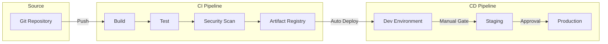
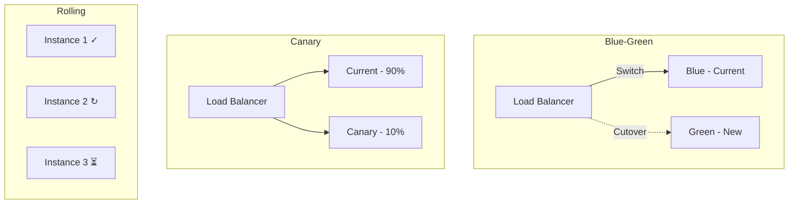

# DevOps - Concept Guide

## Overview

DevOps engineering topics covering CI/CD pipelines, infrastructure as code, deployment strategies, and operational practices. Essential knowledge for engineers who build and maintain production systems and need to demonstrate operational excellence in interviews.

## Prerequisites

- Familiarity with version control (Git)
- Basic understanding of containerization (Docker)
- Experience with at least one CI/CD tool

## Topics Covered

| Topic | Study Guide | Difficulty | Est. Time |
|-------|-------------|------------|-----------|
| CI/CD Pipeline Design | Coming soon | Intermediate | 60 min |
| Infrastructure as Code | Coming soon | Intermediate | 60 min |
| Container Orchestration | Coming soon | Advanced | 60 min |
| Deployment Strategies | Coming soon | Intermediate | 45 min |
| GitOps Patterns | Coming soon | Intermediate | 45 min |
| Secret Management | Coming soon | Intermediate | 30 min |
| Environment Management | Coming soon | Intermediate | 30 min |
| Reliability Engineering | Coming soon | Advanced | 45 min |

## Recommended Study Order

1. **CI/CD Pipeline Design** - Automated build, test, deploy
2. **Infrastructure as Code** - Terraform, CloudFormation, Pulumi
3. **Container Orchestration** - Kubernetes concepts and patterns
4. **Deployment Strategies** - Blue-green, canary, rolling updates
5. **GitOps Patterns** - Declarative infrastructure management
6. **Secret Management** - Vault, AWS Secrets Manager patterns
7. **Environment Management** - Dev, staging, production parity
8. **Reliability Engineering** - SRE practices, error budgets

## CI/CD Pipeline Diagram

## Deployment Strategies Comparison

## Interview Relevance

DevOps questions assess operational maturity:
- **Design**: "How would you design a CI/CD pipeline for this service?"
- **Troubleshooting**: "A deployment failed - walk me through your process"
- **Strategy**: "How would you implement zero-downtime deployments?"
- **Security**: "How do you manage secrets in your pipeline?"

Interviewers assess:
- Hands-on experience with deployment automation
- Understanding of reliability and operational concerns
- Ability to balance speed with safety

## Total Estimated Time: 6 hours
