# Study Guide: CI/CD Pipeline Design

## Metadata
- **Track**: system-design-architecture
- **Subdomain**: devops
- **Difficulty**: Intermediate
- **Target audience**: Junior engineers building and operating production services
- **Estimated time**: 60–90 minutes

## Prerequisites
- Comfortable with Git branching and pull requests
- Basic understanding of build/test steps for an application
- Familiarity with containers is helpful (but not required)

## Suggested study path (junior)
1. Start with [Infrastructure as Code (IaC)](./02-infrastructure-as-code.md) (how environments are created safely)
2. Read this guide (how changes are verified and promoted)
3. Next: [Deployment Strategies](./04-deployment-strategies.md) (how rollouts stay safe)
4. Then: [Environment Management](./07-environment-management.md) (dev/stage/prod discipline)
5. Later: [Reliability Engineering](./08-reliability-engineering.md) and [Three Pillars of Observability](../../observability/study-guides/01-three-pillars-of-observability.md)

## Related guides
- [Infrastructure as Code (IaC)](./02-infrastructure-as-code.md)
- [Deployment Strategies](./04-deployment-strategies.md)
- [GitOps Patterns](./05-gitops-patterns.md)
- [Secret Management](./06-secret-management.md)
- [Reliability Engineering](./08-reliability-engineering.md)
- [Three Pillars of Observability](../../observability/study-guides/01-three-pillars-of-observability.md)

## What you’ll learn
- How to design a CI/CD pipeline that is **fast**, **safe**, and **auditable**
- How to structure pipelines around **artifacts**, **environments**, and **gates**
- How to prevent common failures (flaky tests, config drift, bad rollouts)
- How to integrate **security** (SAST, dependency scans, SBOMs) without killing velocity

## Mental model
A CI/CD pipeline is a **risk-reduction conveyor belt**:
- **CI** reduces risk by proving the change builds, is tested, and is policy-compliant.
- **CD** reduces risk by proving the change can be deployed safely, observed, and rolled back.

The key design decision: **promote an immutable artifact** through environments, rather than rebuilding per environment.

## Reference architecture (generic)

```mermaid
flowchart LR
  Dev[Developer] -->|push_pr| Git[GitRepo]
  Git -->|webhook| CI[CI_System]

  subgraph ciStages [CI_Stages]
    Lint[Lint] --> Unit[Unit_Tests]
    Unit --> Build[Build_Image_or_Binary]
    Build --> SAST[SAST]
    SAST --> DepScan[Dependency_Scan]
    DepScan --> SBOM[Generate_SBOM]
    SBOM --> Sign[Sign_Artifact]
  end

  CI --> Lint
  Sign --> Reg[Artifact_Registry]

  subgraph cdStages [CD_Stages]
    DeployDev[Deploy_Dev] --> Smoke[Smoke_Tests]
    Smoke --> DeployStage[Deploy_Staging]
    DeployStage --> E2E[E2E_Tests]
    E2E --> Gate[Approval_or_Auto_Gate]
    Gate --> DeployProd[Deploy_Prod]
    DeployProd --> Verify[Post_Deploy_Verification]
  end

  Reg --> DeployDev
```

## Core principles (the “senior engineer defaults”)

### 1) Build once, deploy many
- Produce **one immutable artifact** (container image, package, binary).
- Promote that artifact across environments using the **same** deployment mechanism.
- Tagging strategy:
  - **Content addressable**: `sha256:<digest>` or commit SHA
  - **Human tags**: `v1.2.3`, `release-2026-02-07`
  - Never use `latest` for deployments.

### 2) Separate CI concerns from CD concerns
- **CI**: correctness, quality, security posture, reproducibility.
- **CD**: rollout safety, environment configuration, verification, rollback.

### 3) Fast feedback loops (optimize developer time)
Common pipeline ordering:
- Lint + typecheck early
- Unit tests next
- Build and package
- Security scans (parallel where possible)
- Integration/E2E after you have an artifact

Tactics:
- Cache dependencies
- Shard tests
- Use test impact analysis carefully (risk of missing regressions)
- Quarantine flaky tests with strict SLAs to fix them

### 4) Make it auditable by design
- Ensure every deployment is attributable to:
  - **who** approved it (if approvals exist)
  - **what** code + artifact was deployed
  - **when** it happened
  - **where** it was deployed (env/cluster/namespace)
  - **why** it was deployed (ticket/PR/release)
- Keep pipeline logs and deployment events with retention aligned to compliance needs.
- Treat the pipeline definition itself as code (reviewed changes, versioned).

### 5) Bake in safety mechanisms (not heroics)
Good pipelines make unsafe actions hard:
- Protected branches and required checks
- Policy checks (IaC policy, image policy) that fail fast
- Progressive delivery support (canary/blue-green)
- Automated rollback hooks
- Post-deploy verification and alerting gates

## CI design in depth

### Typical CI stages (what each stage proves)
- **Lint / formatting / typecheck**: cheap correctness and consistency.
- **Unit tests**: local correctness, fast feedback.
- **Build**: reproducibility; produces the artifact.
- **Integration tests**: correctness across boundaries (DB, queues).
- **Security**:
  - **SAST**: known bad code patterns (injection, insecure crypto usage)
  - **Dependency scan**: vulnerable libraries (CVEs)
  - **Secret scanning**: credentials accidentally committed
  - **SBOM**: inventory for vulnerability response
  - **Signing**: provenance (tamper-evidence)

### Branching model choices (and what they imply)
- **Trunk-based development** (recommended for most teams):
  - Short-lived branches
  - Feature flags for incomplete work
  - Faster integration, fewer long-running merges
- **GitFlow-style**:
  - More complex release branches
  - Higher coordination overhead
  - Sometimes justified for regulated release trains

Rule of thumb: choose the simplest model that supports your release needs and team size.

### Handling flaky tests (real-world hard mode)
Symptoms: tests fail, rerun passes.

Approach:
- **Measure flakiness** (rate per test, per suite, per change).
- **Quarantine** only with strict rules:
  - Quarantined tests must not block merges but must notify owners.
  - Require a fix SLA (e.g., 7 days) and auto-reenable when stable.
- Prefer deterministic fixes:
  - Control time with fake clocks
  - Isolate shared state and randomized ordering
  - Fix concurrency races, test data collisions

Anti-pattern: “rerun failed jobs automatically until green” without tracking flakiness.

## CD design in depth

### Environment strategy
Common tiers:
- **Dev**: fastest feedback, lowest controls.
- **Staging/Pre-prod**: production-like, used for verification and rehearsals.
- **Prod**: strict controls and observability.

Key idea: environments differ by **configuration and data access**, not by rebuilt artifacts.

### Gates: when to require humans vs automation
Use **human approval** for:
- High-risk changes (auth, payments)
- High-blast-radius deploys (shared infra)
- Changes during incidents or freeze windows

Use **automated gates** for:
- SLO-based verification (error rate, latency)
- Synthetic checks (key flows)
- Regression signals (crash loops, saturation)

### Progressive delivery patterns (pipeline-friendly)

#### Rolling
- Replace instances gradually.
- Risks: “bad” can still reach many users before detection.

#### Blue-green
- Deploy to green, switch traffic.
- Fast rollback by switching back.
- Needs DB migration discipline (backward compatibility).

#### Canary
- Send small % of traffic to new version.
- Great for catching real-user regressions.
- Needs good metrics segmentation and quick rollback.

### Post-deploy verification (what “done” means)
Verification should be explicit and measurable:
- **Golden signals**: latency, traffic, errors, saturation
- **Key business KPIs**: checkout success, sign-in success
- **SLO burn rate**: avoid slow-motion incidents
- **Error budget policy**: pause rollouts when budget is burning

## Database migrations and releases (common failure area)

### Safe migration rule: expand/contract
1. **Expand** schema to support old + new code (add nullable columns, new tables).
2. Deploy code that can read/write both representations.
3. Backfill data (idempotent jobs).
4. Switch reads to new representation.
5. **Contract** by removing old columns/tables later.

### Feature flags (release valves)
Use flags to decouple deploy from release:
- **Kill switch** for risky features
- **Gradual rollout** to cohorts
- **Per-tenant toggles** for enterprise apps

Pitfall: flags without ownership or cleanup become permanent complexity. Track them.

## Security in the pipeline (practical)

### Supply chain basics
- **Least privilege**: pipeline tokens scoped narrowly (read-only where possible).
- **Provenance**: record build inputs (commit, deps) and outputs (image digest).
- **Signing**: sign artifacts; verify signatures at deploy time.
- **Policy**: block deploys when critical vulns exist, with documented exceptions process.

### Secrets handling
Pipeline should never print secrets:
- Mask in logs
- Use short-lived credentials (OIDC, workload identity)
- Prefer secret managers over static secrets in CI variables

## Failure modes & mitigations
- **Artifact mismatch**: rebuilt artifacts per env cause “works in staging, fails in prod”
  - Mitigation: build once, promote digest; forbid env rebuilds.
- **Config drift**: manual changes in prod not reflected in code
  - Mitigation: GitOps, drift detection, immutable infrastructure.
- **Slow pipelines**: devs batch changes, larger blast radius
  - Mitigation: cache/shard, parallel stages, smaller PRs, trunk-based.
- **No rollback plan**: rollouts fail and engineers improvise
  - Mitigation: codify rollback/runbooks; practice in staging.
- **Alert noise**: gates block on noisy signals
  - Mitigation: tune alerts; use SLO-based gates; require actionable pages.

## Operational checklist (copy/paste)
- [ ] CI runs on every PR and blocks merge on required checks
- [ ] Build produces one immutable artifact (digest pinned)
- [ ] Artifacts are scanned, SBOM generated, and signed
- [ ] CD deploys the same artifact to dev/stage/prod
- [ ] Rollouts are progressive (canary/blue-green/rolling) with health checks
- [ ] Post-deploy verification checks golden signals and key flows
- [ ] Rollback is documented and tested
- [ ] Deploy events are logged/audited and searchable
- [ ] Secrets use short-lived credentials; no secrets in logs

## Exercises (junior-friendly)
1. **Design**: Draw a pipeline for a REST API + Postgres service. Identify which stages belong to CI vs CD.
2. **Safety**: Add a canary step that uses error rate and p95 latency to decide promotion.
3. **Incident drill**: Simulate a bad deploy. Write a step-by-step rollback runbook (who does what, what signals to check).
4. **Security**: Decide what should block a deploy vs warn only (e.g., critical CVE in a transitive dependency).

## Interview pack

### Common questions
1. “Design a CI/CD pipeline for a service with strict uptime requirements.”
2. “How do you make deployments safe and reversible?”
3. “How do you handle DB migrations in CI/CD?”
4. “How do you prevent supply chain attacks in your pipeline?”

### Strong answer outline (what interviewers want)
- Start with goals: speed, safety, auditability, cost.
- Emphasize immutable artifacts and promotion.
- Explain gates (automated vs human) and progressive delivery.
- Mention verification signals (golden signals + SLO burn).
- Cover migration safety and rollback.
- Address security scans, SBOM, signing, least privilege.

### Red flags
- Rebuilding per environment
- No rollback strategy
- “We just rerun until green” for flaky tests
- Deploying `latest` or unpinned artifacts
