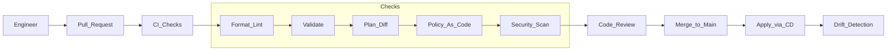

# Study Guide: Infrastructure as Code (IaC)

## Metadata
- **Track**: system-design-architecture
- **Subdomain**: devops
- **Difficulty**: Intermediate
- **Target audience**: Junior engineers supporting cloud infrastructure and deployments
- **Estimated time**: 60–90 minutes

## Prerequisites
- Basic cloud concepts: VPC/VNet, subnets, IAM, load balancers
- Comfortable reading configuration files (YAML/JSON/HCL)
- Familiarity with Git PR workflows

## Suggested study path (junior)
1. Start with this guide (IaC is a foundation for safe environments)
2. Next: [CI/CD Pipeline Design](./01-ci-cd-pipeline-design.md) (how infra/app changes ship safely)
3. Then: [GitOps Patterns](./05-gitops-patterns.md) (continuous reconciliation + drift control)
4. Later: [Secret Management](./06-secret-management.md) and [Environment Management](./07-environment-management.md)
5. When operating K8s: [Container Orchestration](./03-container-orchestration.md)

## Related guides
- [CI/CD Pipeline Design](./01-ci-cd-pipeline-design.md)
- [GitOps Patterns](./05-gitops-patterns.md)
- [Secret Management](./06-secret-management.md)
- [Environment Management](./07-environment-management.md)
- [Cloud Design Patterns](../../solutions-architecture/study-guides/01-cloud-design-patterns.md)

## What you’ll learn
- What IaC is and why it beats manual console changes
- How to structure IaC for **safety**, **reuse**, and **least privilege**
- How to handle state, drift, secrets, and rollbacks
- How to review and ship infra changes like application code

## Core idea
Infrastructure is software. Treat it like software:
- Version control
- Code review
- Automated tests and policy checks
- Repeatable builds (environments)
- Auditable change history

## IaC models

### Declarative (desired state)
You declare what you want; the tool computes the diff and applies changes.
- Examples: Terraform, CloudFormation, Kubernetes manifests
- Strength: idempotent, predictable diffs
- Risk: complex dependency graphs; state management

### Imperative (procedural)
You write steps (“create X then Y”).
- Examples: scripts, some Pulumi patterns
- Strength: flexible
- Risk: harder to reason about idempotency, drift, and partial failure

Most teams use declarative for core infra and imperative for orchestration glue.

## Reference architecture: safe IaC workflow

## Concepts you must be able to explain

### State (why it exists)
Tools like Terraform track:
- What resources exist
- What attributes they have
- Dependency graph

State enables:
- Accurate diffs (plan)
- Incremental changes

State risks:
- Sensitive data inside state
- Corruption/locking issues

Best practices:
- Remote state backend (locked + encrypted)
- Least-privilege access to state
- Separate state per env (dev/stage/prod) and often per domain (network vs app)

### Drift
Drift is “reality differs from code”.
Causes:
- Manual console edits
- Automatic changes by cloud services
- Out-of-band scripts

Mitigations:
- “No manual changes” culture + permissions to enforce it
- Drift detection job (scheduled plan)
- GitOps-like reconciliation (for K8s especially)

### Idempotency and convergence
A good IaC change can be safely reapplied:
- Apply twice yields same result
- Partial failures can be retried safely

### Blast radius
Infra mistakes are often high-blast-radius.
Reduce risk by:
- Small, reviewed changes
- Separation (accounts/projects/subscriptions)
- Modules with safe defaults
- Progressive rollouts (per region, per cluster)

## Structuring your codebase

### Modules
Use modules to:
- Encapsulate best practices (logging, encryption, tags)
- Reuse patterns (VPC, clusters, databases)
- Reduce copy/paste drift

Module design tips:
- Inputs explicit and validated
- Outputs minimal but useful
- Provide “secure-by-default” defaults
- Version modules (avoid breaking changes)

### Environment strategy
Options:
- **Per-env folders**: `env/dev`, `env/stage`, `env/prod`
- **Workspaces**: same code, different state and variables

Safer default: per-env folders + separate state. Workspaces can hide complexity for juniors.

### Naming and tagging
Decide conventions once:
- Resource names include app/env/region
- Mandatory tags: owner, cost_center, data_classification, environment

This enables cost allocation and incident response.

## Testing and policy (what “quality” means for IaC)

### Validation and linting
- Syntax checks (tool validate)
- Linting (style and common errors)
- Static checks (unused variables, deprecated fields)

### Policy as code
Goal: prevent risky infra from ever being applied.
Examples:
- No public S3 buckets
- Encryption required for storage
- No security groups allowing `0.0.0.0/0` on admin ports
- Mandatory logging and retention

Policy tools vary, but the pattern is consistent: evaluate the plan and block on violations.

### Integration tests (optional but powerful)
Test modules by applying in ephemeral envs:
- `apply` to sandbox
- run assertions (connectivity, IAM)
- `destroy`

## Security and secrets in IaC

### Avoid secrets in code and state
Common traps:
- Putting passwords in variables checked into git
- Storing secrets in state outputs

Better pattern:
- Reference secret manager IDs/paths in IaC
- Fetch at runtime by workloads using identity (not by CI)

### IAM and least privilege
Your IaC deploy role should be:
- Scoped per environment
- Scoped per domain (networking vs app)
- Audited

Avoid “one mega-admin key for everything”.

## Failure modes & mitigations
- **Accidental destroy** (wrong workspace/env)
  - Mitigation: environment separation, confirmations, “prevent destroy” protections, PR checks.
- **Plan/apply mismatch** (plan in CI, apply later against changed reality)
  - Mitigation: short plan-to-apply window; store plan artifact; lock main during apply.
- **State lock contention**
  - Mitigation: remote backend locking; queue applies; keep applies short.
- **Provider bugs/deprecations**
  - Mitigation: pin provider versions; monitor release notes; staged upgrades.

## Operational checklist
- [ ] Remote state with encryption and locking
- [ ] Separate state per environment
- [ ] CI runs fmt/validate/plan and posts diff to PR
- [ ] Policy checks block unsafe changes
- [ ] Drift detection runs on a schedule
- [ ] Access to apply is restricted and audited
- [ ] Secrets are referenced, not stored in code/state

## Exercises
1. Write a “safe change” checklist for modifying a VPC or firewall rules.
2. Design a module interface for a “standard service” (networking + IAM + logging + alarms).
3. Given an incident “prod is down”, explain how you would use IaC history to identify recent infra changes.

## Interview pack

### Common questions
1. “How do you prevent risky IaC changes from reaching production?”
2. “How do you manage Terraform state in a team?”
3. “What is drift and how do you handle it?”
4. “How do you structure multi-environment IaC?”

### Strong answer outline
- Workflow: PR → plan diff → policy checks → apply via CD
- State: remote, locked, encrypted, separated
- Safety: modules, small changes, blast-radius controls
- Security: least privilege, no secrets in code/state

