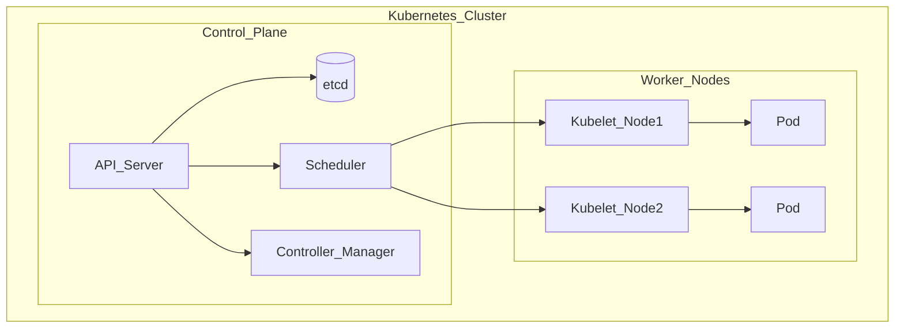

# Study Guide: Container Orchestration (Kubernetes and Friends)

## Metadata
- **Track**: system-design-architecture
- **Subdomain**: devops
- **Difficulty**: Advanced
- **Target audience**: Junior engineers operating containerized services
- **Estimated time**: 60–120 minutes

## Prerequisites
- Basic Docker/container concepts (images, containers, ports)
- Comfortable with networking basics (DNS, ports, load balancing)
- Familiarity with CI/CD helps

## Suggested study path (junior)
1. Start with [CI/CD Pipeline Design](./01-ci-cd-pipeline-design.md) (build/promote artifacts)
2. Next: [Deployment Strategies](./04-deployment-strategies.md) (rollouts and rollback)
3. Then read this guide (Kubernetes primitives + failure modes)
4. After that: [GitOps Patterns](./05-gitops-patterns.md) (how clusters are managed declaratively)
5. For operating safely: [Secret Management](./06-secret-management.md) and [Three Pillars of Observability](../../observability/study-guides/01-three-pillars-of-observability.md)

## Related guides
- [Deployment Strategies](./04-deployment-strategies.md)
- [GitOps Patterns](./05-gitops-patterns.md)
- [Secret Management](./06-secret-management.md)
- [Reliability Engineering](./08-reliability-engineering.md)
- [Three Pillars of Observability](../../observability/study-guides/01-three-pillars-of-observability.md)
- [Metrics Architecture](../../observability/study-guides/02-metrics-architecture.md)

## What you’ll learn
- Why orchestration exists (and what it automates)
- Core Kubernetes objects and how they map to real operations
- How scheduling, networking, and autoscaling work at a high level
- Failure modes: crash loops, bad rollouts, noisy neighbors, capacity exhaustion

## Why orchestration?
When you run more than a handful of containers, you need automation for:
- **Scheduling**: place workloads onto nodes
- **Service discovery**: find and load balance between instances
- **Self-healing**: restart failed containers, reschedule on node failure
- **Rolling updates**: deploy new versions safely
- **Scaling**: adjust replicas and capacity based on load
- **Isolation**: resources and security boundaries

## Reference architecture (Kubernetes control plane)

## Core Kubernetes objects (the minimum set)

### Pod
Smallest deployable unit. Often one container, sometimes sidecars.

Operational meaning:
- If a Pod dies, you want a controller (Deployment/StatefulSet) to recreate it.

### Deployment + ReplicaSet
For stateless services.
- Deployment defines desired state (image, replicas, strategy).
- ReplicaSet ensures desired number of Pods.

### StatefulSet
For stateful workloads needing stable identities and persistent storage.
- Stable network identity per replica
- PersistentVolumeClaims per replica

### Service
Stable virtual IP / DNS name that load balances to Pods.
- ClusterIP for internal
- LoadBalancer/Ingress for external access (cloud-managed)

### Ingress (or Gateway API)
HTTP routing at the edge of the cluster.

### ConfigMap + Secret
Configuration injection.
- ConfigMap: non-sensitive config
- Secret: sensitive config (still treat carefully; avoid putting “real secrets” in plaintext)

### Namespace
Soft multi-tenancy boundary. Used for organization and RBAC scoping.

## Scheduling and capacity

### How scheduling works (simplified)
1. Scheduler finds nodes that satisfy constraints (CPU/memory, taints/tolerations, node selectors).
2. Scores nodes based on preferences (spread, affinity).
3. Assigns Pod to a node; kubelet starts containers.

### Requests vs limits (common junior pitfall)
- **requests**: used for scheduling (guaranteed baseline)
- **limits**: hard cap enforced at runtime

If you set limits too low, you get throttling/OOM kills.
If you set requests too high, you waste capacity and reduce binpacking.

## Networking (high-level)
- Each Pod gets an IP (via CNI).
- Services provide stable discovery and load balancing.
- Ingress/Gateway routes external traffic.

Things juniors should watch:
- DNS issues (CoreDNS)
- MTU mismatches (packet loss)
- NetworkPolicy blocking traffic unexpectedly

## Autoscaling

### HPA (Horizontal Pod Autoscaler)
Scales replicas based on metrics (CPU, custom metrics).

### VPA (Vertical Pod Autoscaler)
Recommends/adjusts requests (careful with restarts).

### Cluster Autoscaler
Adds/removes nodes based on pending Pods.

Key insight: scaling needs **good signals** and **sane limits** to avoid oscillation.

## Rollouts and rollback

### Rolling update behavior
Deployments use maxSurge/maxUnavailable to control:
- How many new Pods start before old ones stop
- How much capacity drop is allowed

Rollback strategies:
- Roll back Deployment revision
- Use progressive delivery tooling for canaries (optional)

## Observability for orchestration
You need visibility into:
- **Cluster**: node pressure, unschedulable pods, kube-system health
- **Workloads**: restarts, readiness/liveness failures, latency/error rates
- **Events**: scheduling failures, image pull errors, OOM kills

## Failure modes & mitigations

### CrashLoopBackOff
Causes:
- App crashes, bad config, missing dependencies
- Probes too aggressive

What to do:
- Check logs and last termination reason
- Validate env vars/config mounts
- Loosen probes temporarily (then fix root cause)

### ImagePullBackOff
Causes:
- Wrong image tag/digest
- Registry auth issues

Mitigation:
- Use immutable digests
- Ensure workload identity/registry credentials are valid

### Pending pods
Causes:
- Not enough CPU/mem
- Node selectors/taints mismatch
- Quotas

Mitigation:
- Fix requests
- Add capacity (cluster autoscaler)
- Adjust constraints

### Noisy neighbors
Causes:
- One workload consumes shared resources

Mitigation:
- Requests/limits + QoS classes
- Pod disruption budgets
- Node pools per workload class

## Operational checklist
- [ ] Every workload has requests and limits (reviewed)
- [ ] Readiness and liveness probes are correct and not overly aggressive
- [ ] Rollout strategy is configured (surge/unavailable)
- [ ] Resource quotas and limit ranges are set per namespace
- [ ] RBAC is least privilege
- [ ] NetworkPolicy is intentional and tested
- [ ] Dashboards and alerts exist for cluster and workload health

## Exercises
1. Explain the difference between a Deployment and a StatefulSet using a concrete example.
2. Given `CrashLoopBackOff`, write a 10-step debug checklist.
3. Design node pools for “latency sensitive” vs “batch” workloads; pick requests/limits strategy.

## Interview pack

### Common questions
1. “What happens when a node dies?”
2. “How do rolling updates work and how do you make them safe?”
3. “Explain requests vs limits and why they matter.”
4. “How would you debug Pending pods or CrashLoopBackOff?”

### Strong answer outline
- Explain controllers (desired state) + self-healing
- Scheduling model and resources
- Rollouts and safety (probes, surge/unavailable)
- Operational diagnostics (events, logs, metrics)

