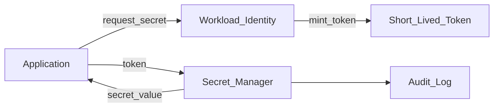

# Study Guide: Secret Management

## Metadata
- **Track**: system-design-architecture
- **Subdomain**: devops
- **Difficulty**: Intermediate
- **Target audience**: Junior engineers building and operating production systems
- **Estimated time**: 30–60 minutes

## Prerequisites
- Basic understanding of authentication/authorization (who you are vs what you can do)
- Familiarity with environment variables and config files
- Helpful: basic CI/CD pipeline knowledge

## Suggested study path (junior)
1. Start with [CI/CD Pipeline Design](./01-ci-cd-pipeline-design.md) (where secrets often leak)
2. Then read this guide (storage/access/rotation/audit)
3. Next: [GitOps Patterns](./05-gitops-patterns.md) (secrets are the hard part of GitOps)
4. If you run on K8s: [Container Orchestration](./03-container-orchestration.md)
5. Tie it to architecture decisions: [Cloud Design Patterns](../../solutions-architecture/study-guides/01-cloud-design-patterns.md)

## Related guides
- [CI/CD Pipeline Design](./01-ci-cd-pipeline-design.md)
- [GitOps Patterns](./05-gitops-patterns.md)
- [Infrastructure as Code (IaC)](./02-infrastructure-as-code.md)
- [Container Orchestration](./03-container-orchestration.md)
- [Cloud Design Patterns](../../solutions-architecture/study-guides/01-cloud-design-patterns.md)

## What you’ll learn
- What counts as a secret (and what doesn’t)
- How to store, access, rotate, and audit secrets safely
- Patterns for CI/CD, Kubernetes, and cloud-native secret delivery
- Common failure modes (leaks, over-privilege, rotation outages)

## Definitions (be precise)
- **Secret**: any value that grants access or authority if disclosed (API keys, passwords, private keys, tokens, DB creds).
- **Credential**: a secret used to authenticate (passwords, keys, certificates).
- **Config**: non-sensitive configuration (ports, feature toggles). Often confused with secrets.

If it can be used to impersonate something or access data: treat it as a secret.

## Threat model (what we’re defending against)
- Accidental leaks (logs, git commits, screenshots)
- Insider misuse (excess permissions, shared creds)
- CI compromise (tokens exposed in pipelines)
- Supply chain compromise (malicious dependencies stealing env vars)
- Lateral movement (one leaked secret unlocks everything)

## Core principles

### 1) Prefer identity over secrets
Best “secret” is **no secret**:
- Use workload identity / IAM roles instead of static keys
- Use short-lived tokens (OIDC exchange) instead of long-lived API keys

### 2) Least privilege everywhere
Secrets should be scoped:
- by environment (dev/stage/prod)
- by service (each service has its own creds)
- by action (read-only vs admin)

### 3) Short-lived + rotatable
Long-lived secrets are a liability.
Prefer:
- short TTL tokens
- automated rotation
- versioned secrets with safe rollout

### 4) Auditability
You need to know:
- who accessed a secret
- when they accessed it
- from where (workload identity)
- whether the access was expected

## Reference architecture (runtime secret delivery)

## Common patterns (and trade-offs)

### Pattern A: Cloud secret manager (recommended default)
Examples: AWS Secrets Manager / SSM Parameter Store, GCP Secret Manager, Azure Key Vault.

How it works:
- Secret stored centrally
- Workload authenticates using identity
- Secret fetched at startup or on-demand

Trade-offs:
- + Strong audit logs, rotation support
- + Central governance
- - Runtime dependency (secret manager availability)

Mitigation: caching + retries + circuit breakers; keep TTL reasonable.

### Pattern B: Vault-style dynamic secrets
Secrets are generated on demand with short TTL (DB creds, certificates).

Trade-offs:
- + Great blast-radius control (auto-expire)
- - More operational complexity

### Pattern C: Kubernetes Secrets (use carefully)
K8s secrets are convenient but often misunderstood.
- Base64 is **not** encryption.
- At-rest encryption requires explicit config.

Safe usage:
- Limit RBAC tightly
- Use encryption at rest
- Prefer external secrets operators that sync from a secret manager

### Pattern D: CI/CD injected secrets
Used for build/publish/deploy steps.

Rules:
- Use short-lived tokens (OIDC) when possible
- Mask secrets in logs
- Restrict who can run pipelines with secrets (trusted branches)
- Avoid secrets in PR pipelines from forks

## Rotation without outages (hard mode)
Rotation fails when:
- apps cache secrets forever
- multiple services share a secret
- rotation is not coordinated with deployments

Safer rotation model: **versioned secrets**
1. Create new version (v2) alongside v1.
2. Update apps to accept both (or fetch latest).
3. Shift workloads to v2.
4. Revoke v1 after confirmation window.

For DB credentials:
- Prefer dynamic creds per service with TTL
- Or dual-user approach during rotation

## Where secrets leak (and how to stop it)
- **Git**: committed `.env` or config
  - Use secret scanning and pre-commit hooks; block merges on leaks.
- **Logs**: printing env vars, request headers
  - Redaction middleware; structured logging allow-lists.
- **CI artifacts**: build logs, caches, uploaded archives
  - Masking + restricted access + rotate after suspected exposure.
- **Containers**: baked into images
  - Never bake secrets into images. Use runtime injection.

## Failure modes & mitigations
- **Secret manager outage** breaks app startup
  - Cache last-known-good; degrade gracefully; keep minimal critical secrets.
- **Over-privileged token** allows reading all secrets
  - Per-service identities; per-path policies; separate prod/dev.
- **Rotation breaks connections** (DB password changed)
  - Connection retries; dual versions; rotate during low traffic; monitor auth failures.

## Operational checklist
- [ ] Each service has its own identity and its own secrets
- [ ] No plaintext secrets in git, images, or logs
- [ ] Secrets are short-lived or rotated automatically
- [ ] Access is least privilege and audited
- [ ] Break-glass procedure exists for emergency rotation
- [ ] Runbooks include steps for leak response

## Exercises
1. Design a secret access model for a service that needs DB creds + third-party API key.
2. Write a “secret leaked in logs” incident runbook (contain, rotate, verify, learn).
3. Plan a rotation for a shared DB password without downtime (then explain why shared creds are bad).

## Interview pack

### Common questions
1. “How do you manage secrets in CI/CD and production?”
2. “What’s the safest way to authenticate services in the cloud?”
3. “How do you rotate secrets without downtime?”

### Strong answer outline
- Prefer identity (workload roles) + short-lived tokens
- Central secret manager with audit logs
- Least privilege and per-service isolation
- Versioned rotation strategy + monitoring for auth failures

