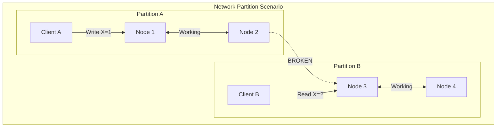
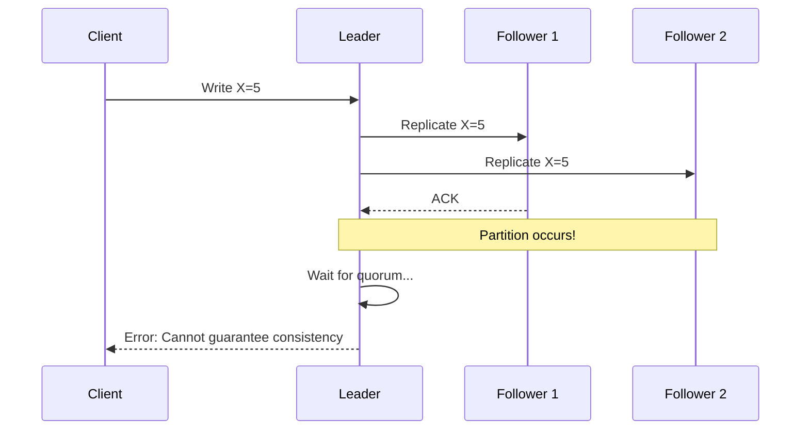
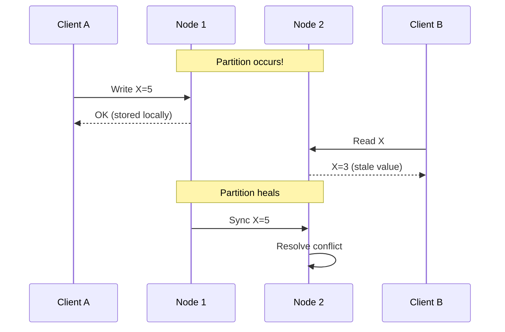
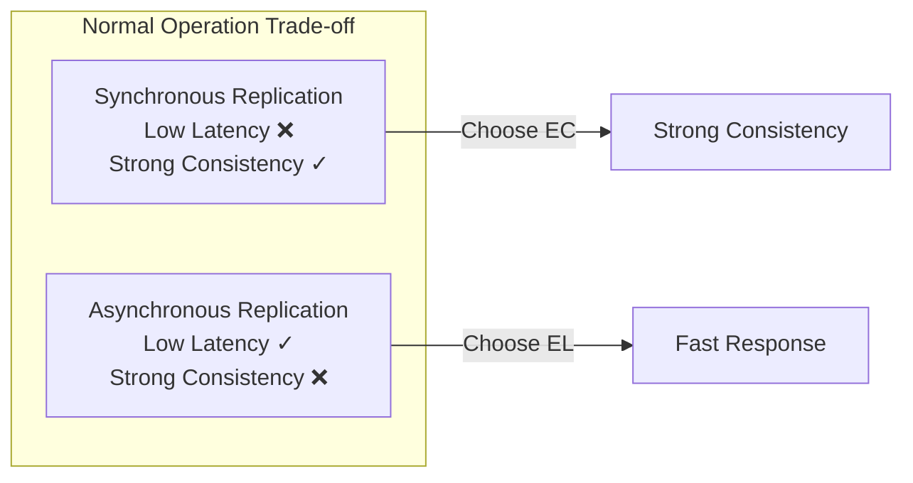
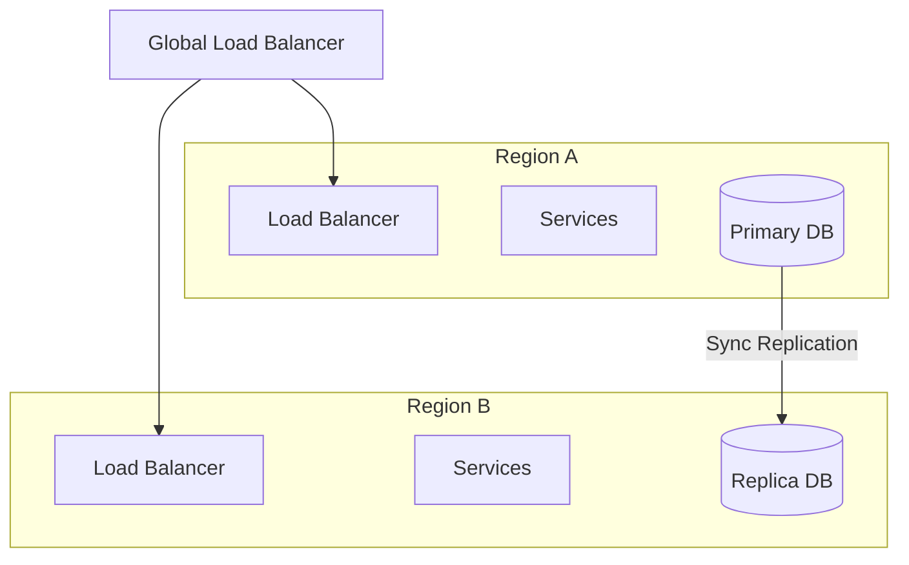
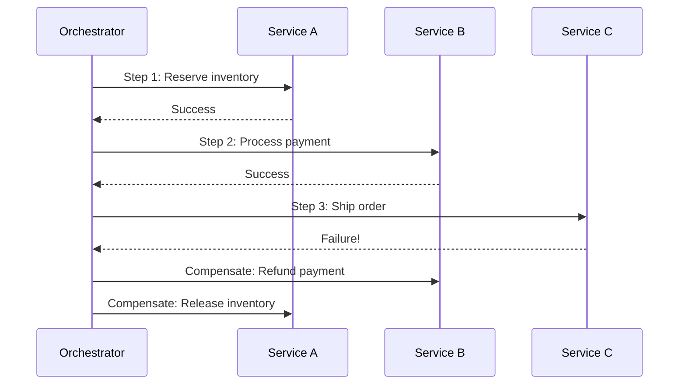

# Study Guide: CAP Theorem

## Metadata
- **Track**: system-design-architecture
- **Subdomain**: fundamentals
- **Difficulty**: Intermediate
- **Target Roles**: Senior Software Engineer, Solutions Architect, Staff Engineer, Platform Engineer
- **Estimated Time**: 60 minutes

## Questions

### Q1: What is the CAP theorem, and what does each letter represent?

**Answer:**
The CAP theorem, proposed by Eric Brewer in 2000 and proven by Gilbert and Lynch in 2002, states that a distributed data store can only guarantee two of the following three properties simultaneously:

**Consistency (C)**: Every read receives the most recent write or an error. All nodes see the same data at the same time. This is linearizability—operations appear to happen instantaneously.

**Availability (A)**: Every request receives a non-error response, without guarantee that it contains the most recent write. The system remains operational and responsive.

**Partition Tolerance (P)**: The system continues to operate despite network partitions (communication breakdowns between nodes). Messages between nodes can be lost or delayed.

```
┌─────────────────────────────────────────────────────────┐
│                    CAP Theorem                          │
│                                                         │
│         Consistency ─────────── Availability            │
│              │ \                    / │                 │
│              │   \      CA       /   │                 │
│              │     \   Systems /     │                 │
│              │       \       /       │                 │
│              │   CP    \   /    AP   │                 │
│              │ Systems   X   Systems │                 │
│              │         / \           │                 │
│              │       /     \         │                 │
│              │     /         \       │                 │
│              └───/─────────────\─────┘                 │
│                 Partition Tolerance                     │
└─────────────────────────────────────────────────────────┘
```

The key insight: In a distributed system, network partitions are inevitable. Therefore, you must choose between consistency and availability when a partition occurs.

**Key Concepts:**
- Linearizability (strong consistency)
- Network partitions are unavoidable
- Trade-off is only during partition events
- "2 out of 3" is a simplification

**Follow-up Questions:**
1. Why can't we have all three properties simultaneously?
2. What happens to a CA system during a network partition?

---

### Q2: Why is partition tolerance not optional in distributed systems?

**Answer:**
Partition tolerance is effectively mandatory in any distributed system because network failures are a fact of life, not a choice. Here's why:

**Network partitions happen due to:**
- Network hardware failures (switches, routers, cables)
- Software bugs in network stack
- Configuration errors
- Cloud provider issues
- Geographic distance and latency
- Datacenter connectivity problems

**What happens without partition tolerance:**
If you design a system that doesn't handle partitions, when a partition occurs, the system must either:
1. Stop responding entirely (sacrificing availability)
2. Return potentially stale/inconsistent data (sacrificing consistency)
3. Crash or behave unpredictably



**The real choice is CP vs AP:**
Since partitions will happen, the practical CAP theorem question becomes: "When a partition occurs, do you prioritize consistency or availability?"

**Key Concepts:**
- Network failures are inevitable
- Partitions can be partial or complete
- Duration of partitions varies
- Design must account for partition scenarios

**Follow-up Questions:**
1. How long do network partitions typically last?
2. Can you give an example of a partial partition?

---

### Q3: What are CP systems, and when would you choose them?

**Answer:**
CP (Consistency + Partition Tolerance) systems prioritize data consistency over availability. When a network partition occurs, the system may refuse to respond rather than return potentially stale data.

**Characteristics of CP systems:**
- Strong consistency guarantees
- May become unavailable during partitions
- Use consensus protocols (Paxos, Raft)
- Typically have a leader/primary node

**Examples of CP systems:**

| System | Use Case | Consistency Mechanism |
|--------|----------|----------------------|
| MongoDB (default) | Document store | Primary with replica acknowledgment |
| HBase | Wide-column store | Strong consistency via ZooKeeper |
| Redis Cluster | Cache/data store | Hash slots with failover |
| etcd | Configuration store | Raft consensus |
| ZooKeeper | Coordination | ZAB protocol |



**When to choose CP:**
- Financial transactions (banking, payments)
- Inventory management (prevent overselling)
- User authentication and authorization
- Configuration management
- Leader election and coordination
- Any scenario where stale data causes serious problems

**Trade-off during partition:**
The system may return errors or become read-only rather than serve potentially inconsistent data.

**Key Concepts:**
- Quorum-based writes
- Consensus protocols
- Leader election
- Linearizable reads

**Follow-up Questions:**
1. How does a CP system detect that a partition has occurred?
2. What happens to writes during a partition in a CP system?

---

### Q4: What are AP systems, and when would you choose them?

**Answer:**
AP (Availability + Partition Tolerance) systems prioritize availability over consistency. They continue serving requests during partitions, accepting that different nodes may have different views of the data.

**Characteristics of AP systems:**
- Always respond to requests
- May return stale data during partitions
- Use eventual consistency
- Often employ conflict resolution strategies

**Examples of AP systems:**

| System | Use Case | Consistency Model |
|--------|----------|-------------------|
| Cassandra | Time-series, IoT | Tunable consistency |
| DynamoDB | Key-value store | Eventual consistency |
| CouchDB | Document store | Multi-version concurrency |
| Riak | Distributed KV | Vector clocks |
| DNS | Name resolution | TTL-based caching |



**When to choose AP:**
- Social media feeds (eventual consistency acceptable)
- Shopping carts (merge conflicts later)
- Analytics and metrics collection
- Content delivery networks
- Session storage
- Any scenario where availability > perfect accuracy

**Conflict resolution strategies:**
- Last-write-wins (LWW)
- Vector clocks
- CRDTs (Conflict-free Replicated Data Types)
- Application-level merge logic

**Key Concepts:**
- Eventual consistency
- Conflict resolution
- Read-your-writes consistency
- Anti-entropy protocols

**Follow-up Questions:**
1. How do AP systems eventually become consistent?
2. What is a vector clock and how does it help with conflicts?

---

### Q5: How do real-world databases handle the CAP trade-off with tunable consistency?

**Answer:**
Many modern distributed databases offer tunable consistency, allowing you to choose your CAP trade-off on a per-operation basis rather than system-wide.

**Cassandra's Consistency Levels:**

```
┌────────────────────────────────────────────────────────────┐
│                  Cassandra Consistency                      │
├──────────────┬─────────────────────────────────────────────┤
│ Level        │ Behavior                                    │
├──────────────┼─────────────────────────────────────────────┤
│ ONE          │ Respond after 1 replica (fastest, AP)       │
│ QUORUM       │ Respond after majority (balanced)           │
│ ALL          │ Respond after all replicas (slowest, CP)    │
│ LOCAL_QUORUM │ Majority in local datacenter                │
└──────────────┴─────────────────────────────────────────────┘
```

**Strong consistency formula:**
```
R + W > N

Where:
R = Read consistency level (replicas to read from)
W = Write consistency level (replicas to write to)
N = Total number of replicas

Example with N=3:
- QUORUM read (2) + QUORUM write (2) = 4 > 3 ✓ Strong consistency
- ONE read (1) + ONE write (1) = 2 < 3 ✗ Eventual consistency
```

**DynamoDB consistency options:**
```python
# Eventually consistent read (default, faster, cheaper)
response = table.get_item(
    Key={'id': '123'},
    ConsistentRead=False
)

# Strongly consistent read (slower, more expensive)
response = table.get_item(
    Key={'id': '123'},
    ConsistentRead=True
)
```

**MongoDB read/write concerns:**
```javascript
// Write concern: wait for majority acknowledgment
db.collection.insertOne(
  { item: "xyz" },
  { writeConcern: { w: "majority", wtimeout: 5000 } }
)

// Read concern: read majority-committed data
db.collection.find().readConcern("majority")
```

**Key Concepts:**
- Tunable consistency per operation
- Quorum calculations
- Read/write concern levels
- Latency vs consistency trade-off

**Follow-up Questions:**
1. What consistency level would you use for a payment system?
2. How does tunable consistency affect latency?

---

### Q6: What is the PACELC theorem, and how does it extend CAP?

**Answer:**
PACELC (proposed by Daniel Abadi in 2012) extends CAP by addressing system behavior when there is NO partition, not just during partitions.

**PACELC states:**
- **PAC**: If there's a Partition, choose between Availability and Consistency
- **ELC**: Else (no partition), choose between Latency and Consistency

```
┌─────────────────────────────────────────────────────────────┐
│                      PACELC Theorem                          │
│                                                              │
│   IF Partition:          ELSE (Normal Operation):           │
│   ┌─────────────────┐    ┌─────────────────────────┐        │
│   │  Choose:        │    │  Choose:                │        │
│   │  • Availability │    │  • Latency (fast)       │        │
│   │  • Consistency  │    │  • Consistency (strong) │        │
│   └─────────────────┘    └─────────────────────────┘        │
└─────────────────────────────────────────────────────────────┘
```

**System classifications:**

| System | During Partition | Normal Operation | Classification |
|--------|------------------|------------------|----------------|
| Cassandra | AP | EL | PA/EL |
| DynamoDB | AP | EL | PA/EL |
| MongoDB | CP | EC | PC/EC |
| PNUTS (Yahoo) | CP | EL | PC/EL |
| VoltDB | CP | EC | PC/EC |

**Why PACELC matters:**
CAP only describes behavior during failures. But most of the time, your system isn't partitioned. PACELC helps you understand the latency-consistency trade-off during normal operation.



**Key Concepts:**
- Normal operation trade-offs
- Latency vs consistency
- Synchronous vs asynchronous replication
- System classification beyond CAP

**Follow-up Questions:**
1. Why might a system choose PC/EL (consistent during partition, low latency otherwise)?
2. How does geographic distribution affect the ELC choice?

---

### Q7: How would you design a system that needs both high availability AND strong consistency?

**Answer:**
While CAP says you can't have both during a partition, you can design systems that minimize the impact and provide strong guarantees most of the time.

**Strategy 1: Minimize partition scope**


Keep strongly consistent operations within a single region/datacenter where partitions are rare.

**Strategy 2: Separate read and write paths**
```python
class HybridDataStore:
    def write(self, key, value):
        # Strong consistency for writes
        # Use synchronous replication, accept higher latency
        self.primary.write(key, value, consistency='strong')
    
    def read(self, key, require_consistency=False):
        if require_consistency:
            # Read from primary for critical reads
            return self.primary.read(key)
        else:
            # Read from nearest replica for speed
            return self.replica.read(key)
```

**Strategy 3: Saga pattern for distributed transactions**


**Strategy 4: Use CRDTs for specific data types**
Conflict-free Replicated Data Types allow concurrent updates that automatically merge:
- G-Counter: Grow-only counter
- PN-Counter: Positive-negative counter
- G-Set: Grow-only set
- OR-Set: Observed-remove set

**Key Concepts:**
- Scope limitation
- Read/write separation
- Compensating transactions
- CRDTs for automatic conflict resolution
- Accepting trade-offs for specific operations

**Follow-up Questions:**
1. What are the downsides of the saga pattern?
2. When would you use CRDTs vs traditional conflict resolution?

