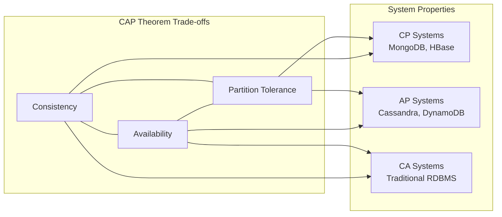

# Fundamentals - Concept Guide

## Overview

Core distributed systems concepts that form the foundation of system design interviews. These topics test your understanding of how large-scale systems work, the trade-offs involved, and your ability to reason about complex distributed scenarios.

## Prerequisites

- Basic understanding of client-server architecture
- Familiarity with databases and caching concepts
- Knowledge of HTTP and networking basics

## Topics Covered

| Topic | Study Guide | Difficulty | Est. Time |
|-------|-------------|------------|-----------|
| CAP Theorem | [cap-theorem-study-guide.md](./cap-theorem-study-guide.md) | Intermediate | 60 min |
| Consistency Models | Coming soon | Advanced | 60 min |
| Scalability Patterns | Coming soon | Intermediate | 90 min |
| Load Balancing | Coming soon | Intermediate | 45 min |
| Caching Strategies | Coming soon | Intermediate | 60 min |
| Database Sharding | Coming soon | Advanced | 60 min |
| Replication Patterns | Coming soon | Advanced | 45 min |
| Consensus Algorithms | Coming soon | Advanced | 90 min |
| Event-Driven Architecture | Coming soon | Intermediate | 60 min |
| Microservices vs Monolith | Coming soon | Intermediate | 45 min |

## Recommended Study Order

1. **CAP Theorem** - Foundation for understanding distributed trade-offs
2. **Consistency Models** - Deep dive into consistency guarantees
3. **Scalability Patterns** - Horizontal vs vertical, stateless design
4. **Load Balancing** - Traffic distribution strategies
5. **Caching Strategies** - Performance optimization patterns
6. **Database Sharding** - Data partitioning approaches
7. **Replication Patterns** - High availability strategies
8. **Event-Driven Architecture** - Async communication patterns
9. **Microservices vs Monolith** - Architecture decision framework
10. **Consensus Algorithms** - Paxos, Raft, and coordination

## Key Concepts Diagram

## Interview Relevance

Fundamentals questions appear in every system design interview:
- **CAP Theorem**: "What trade-offs would you make for a banking system vs social media feed?"
- **Consistency**: "How would you ensure data consistency across services?"
- **Scalability**: "How would you scale this system to 10x traffic?"
- **Caching**: "Where would you add caching and what invalidation strategy?"

Interviewers use these topics to gauge:
- Understanding of distributed systems trade-offs
- Ability to reason about failure scenarios
- Knowledge of industry-standard patterns and solutions

## Total Estimated Time: 10 hours
