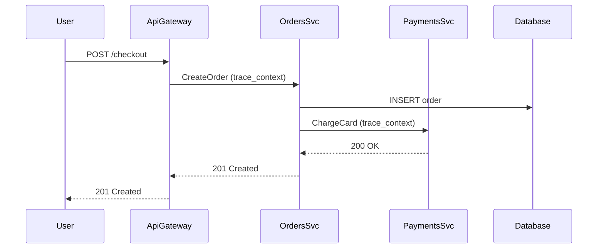

# Study Guide: Distributed Tracing

## Metadata
- **Track**: system-design-architecture
- **Subdomain**: observability
- **Difficulty**: Advanced
- **Target audience**: Junior engineers debugging multi-service latency and failures
- **Estimated time**: 60–90 minutes

## What you’ll learn
- How traces are built (trace, span, context propagation)
- Where tracing breaks in real systems and how to fix it
- How to use tracing to debug latency, errors, and dependency issues
- Sampling strategies that keep traces useful and affordable

## Core concepts
- **Trace**: a request’s end-to-end journey.
- **Span**: a timed operation within a trace (RPC call, DB query).
- **Context propagation**: passing trace context across process boundaries.
- **Baggage**: key/value metadata propagated with the trace (use sparingly).

## Trace anatomy (example)

## Instrumentation (what to add where)

### Server spans
Every inbound request should create or continue a span:
- HTTP server middleware
- gRPC interceptors

Include attributes:
- route template
- method
- status code
- peer service (if applicable)

### Client spans
