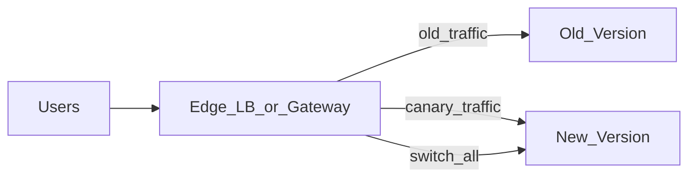

# Study Guide: Deployment Strategies

## Metadata
- **Track**: system-design-architecture
- **Subdomain**: devops
- **Difficulty**: Intermediate
- **Target audience**: Junior engineers shipping production changes
- **Estimated time**: 45–75 minutes

## Prerequisites
- Basic understanding of CI/CD concepts (build, test, deploy)
- Familiarity with service health checks and monitoring basics
- Helpful: basic database migration concepts

## Suggested study path (junior)
1. Start with [CI/CD Pipeline Design](./01-ci-cd-pipeline-design.md)
2. Then read this guide (rollout patterns + verification + rollback)
3. Next: [Environment Management](./07-environment-management.md) (staging vs prod discipline)
4. Then: [Reliability Engineering](./08-reliability-engineering.md) (SLOs and safe change)
5. For verification signals: [Metrics Architecture](../../observability/study-guides/02-metrics-architecture.md) and [Distributed Tracing](../../observability/study-guides/03-distributed-tracing.md)

## Related guides
- [CI/CD Pipeline Design](./01-ci-cd-pipeline-design.md)
- [Environment Management](./07-environment-management.md)
- [Reliability Engineering](./08-reliability-engineering.md)
- [Metrics Architecture](../../observability/study-guides/02-metrics-architecture.md)
- [Distributed Tracing](../../observability/study-guides/03-distributed-tracing.md)

## What you’ll learn
- The major deployment strategies and when to use each
- How to reduce risk with progressive exposure and verification
- How deployments interact with databases, caches, and backwards compatibility
- How to choose rollback mechanisms that actually work

## The problem deployments solve
You want to ship changes with:
- minimal downtime
- minimal user impact
- fast rollback
- clear observability signals

Deployments are about controlling **blast radius**.

## Strategy overview

### 1) Recreate (stop old, start new)
- **How**: bring down old version, deploy new version
- **Pros**: simplest
- **Cons**: downtime; risky for critical services
- **When**: internal tools, low-traffic, maintenance windows

### 2) Rolling update
- **How**: replace instances gradually
- **Pros**: no downtime if done right; common default
- **Cons**: mixed versions during rollout; can be hard with stateful dependencies
- **When**: stateless services, good backward compatibility

### 3) Blue-green
- **How**: deploy to a separate “green” environment, switch traffic
- **Pros**: fast cutover, fast rollback (switch back)
- **Cons**: double capacity during rollout; tricky DB changes
- **When**: high reliability needs, clear cutover point

### 4) Canary
- **How**: route small % of traffic to new version first
- **Pros**: catches real-user regressions early; controlled blast radius
- **Cons**: requires good routing + good metrics + fast rollback
- **When**: high risk changes, large user bases, mature observability

### 5) Shadow / mirroring (dark launch)
- **How**: duplicate traffic to new version but don’t use its response
- **Pros**: realistic load without user impact
- **Cons**: expensive; hard to compare correctness
- **When**: major rewrites, performance testing, ML services

### 6) Feature-flag rollout (release decoupled from deploy)
- **How**: deploy code with feature disabled; enable gradually
- **Pros**: fastest rollback (disable flag); reduces deploy stress
- **Cons**: flag debt; complex interactions
- **When**: product changes, risky logic changes, per-tenant releases

## Traffic shifting and control points

Control points for traffic splitting:
- Service mesh (per-request routing)
- Ingress/controller weighted routes
- API gateway / load balancer weighted target groups
- DNS (slow, coarse; use carefully)

## Verification: what signals decide “promote” vs “rollback”
Minimum signals:
- Error rate (5xx, failed requests)
- Latency (p95/p99)
- Saturation (CPU, memory, queue depth)
- Golden business flow success (login, checkout)

Advanced:
- SLO burn rate (fast + slow windows)
- Per-region and per-tenant segmentation
- Comparison against control group

## Database and schema compatibility (deployments often fail here)
Mixed-version deployments (rolling/canary) require:
- Backward-compatible APIs
- Backward-compatible schemas

Use **expand/contract** migrations:
- Expand schema (additive)
- Deploy code that supports old + new
- Migrate data
- Contract schema later

## Rollback strategies (be honest)

### Rollback by redeploying previous version
Works when:
- Schema changes are backward compatible
- Config changes are reversible

### Roll-forward (fix forward)
Often the only option when:
- Data migrations are not reversible
- Side effects already happened (emails sent, charges made)

Good teams plan both:
- Quick rollback for safe cases
- Controlled roll-forward for unsafe-to-rollback cases

## Common failure modes
- **Silent correctness bugs**: latency and error rate look fine, but business outcomes fail
  - Mitigation: business KPIs and synthetic checks as gates.
- **Cache incompatibility**: new version reads/writes incompatible cached data
  - Mitigation: versioned cache keys; dual read during migration.
- **Config mismatch**: new version depends on a config not present everywhere
  - Mitigation: config validation; staged config rollout.
- **Partial rollout stuck**: unhealthy instances prevent progress
  - Mitigation: max unavailable settings; automatic rollback triggers.

## Operational checklist
- [ ] Strategy chosen matches risk level and traffic patterns
- [ ] Health checks/probes are accurate and fast
- [ ] Rollback plan is documented and tested
- [ ] DB migration is expand/contract compatible
- [ ] Verification gates include golden signals and key business flows
- [ ] Alerts during rollout are tuned to be actionable

## Exercises
1. Pick a deployment strategy for: (a) internal admin tool, (b) payments API, (c) batch ETL workers. Justify.
2. Design a canary gate using p95 latency and error rate thresholds.
3. Create a rollback decision tree: when to roll back vs roll forward.

## Interview pack

### Common questions
1. “Compare blue-green vs canary.”
2. “How do you ensure zero downtime deployments?”
3. “How do you handle database migrations with rolling deploys?”

### Strong answer outline
- Start with risk/blast radius
- Choose a strategy and explain trade-offs (capacity, complexity, detectability)
- Explain verification and rollback constraints (especially schema changes)

