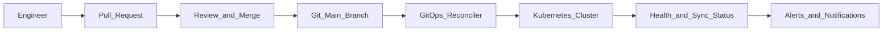

# Study Guide: GitOps Patterns

## Metadata
- **Track**: system-design-architecture
- **Subdomain**: devops
- **Difficulty**: Intermediate
- **Target audience**: Junior engineers operating Kubernetes and infrastructure platforms
- **Estimated time**: 45–75 minutes

## Prerequisites
- Comfortable with Git workflows (PRs, branching, code review)
- Basic Kubernetes concepts help (Deployments, namespaces), but you can still follow without deep K8s knowledge
- Helpful: familiarity with IaC concepts (state, drift)

## Suggested study path (junior)
1. Start with [Infrastructure as Code (IaC)](./02-infrastructure-as-code.md) (why desired state matters)
2. Next: [CI/CD Pipeline Design](./01-ci-cd-pipeline-design.md) (artifact promotion + gates)
3. Then read this guide (reconciliation + drift control)
4. After that: [Environment Management](./07-environment-management.md) (promotion models and controls)
5. When operating clusters: [Container Orchestration](./03-container-orchestration.md) and [Secret Management](./06-secret-management.md)

## Related guides
- [Infrastructure as Code (IaC)](./02-infrastructure-as-code.md)
- [CI/CD Pipeline Design](./01-ci-cd-pipeline-design.md)
- [Environment Management](./07-environment-management.md)
- [Secret Management](./06-secret-management.md)
- [Container Orchestration](./03-container-orchestration.md)

## What you’ll learn
- What GitOps is (and what it is not)
- How reconciliation-based deployment works
- How GitOps reduces drift and improves auditability
- Practical patterns for environments, promotions, and rollbacks

## Definition
GitOps is an operating model where:
- **Git is the source of truth** for desired state (apps and/or infra)
- A **reconciler** continuously compares desired vs actual state
- Differences are corrected automatically (or via controlled process)

GitOps is not “we store YAML in git”. The key is **continuous reconciliation**.

## Reference architecture

## Core components (conceptual)
- **Repo structure**: where desired state lives (apps, infra, policies)
- **Reconciler**: reads git, applies changes, reports status
- **Policy**: what is allowed to be applied (RBAC, guardrails)
- **Secrets strategy**: how secrets are referenced without committing plaintext
- **Promotion mechanism**: how changes move from dev to prod

## Repository patterns

### Mono-repo vs multi-repo
- **Mono-repo**:
  - One repo for platform and apps
  - Easier cross-cutting changes
  - Risk: bigger blast radius, more permissions complexity
- **Multi-repo**:
  - Platform repo + per-app repos
  - Clear ownership boundaries
  - Requires coordination for shared changes

### Environment layout
Common patterns:
- `environments/dev`, `environments/stage`, `environments/prod`
- Per-cluster directories
- Overlays (base + env-specific overrides)

Safe junior-friendly default:
- Base manifests + env overlays
- Clear ownership and review rules per env

## Promotion patterns (how code moves)

### Pull-request promotion
Promote by PR from `dev` overlay to `prod` overlay.
- Pros: auditable, reviewable
- Cons: slower, more manual

### Automated promotion with gates
Promotion happens automatically when:
- tests pass
- SLO-based verification passes in lower env
- no policy violations

Be cautious: automation without good signals can amplify mistakes quickly.

## Rollback in GitOps
Rollback is “git revert” + reconciliation.
To make rollback fast:
- Keep changes small
- Avoid coupling multiple services in one PR
- Keep migrations safe (expand/contract)

## Drift control
With GitOps, drift becomes:
- Detectable: reconciler reports out-of-sync
- Correctable: reconcile restores desired state

But you still need to prevent manual change:
- Restrict cluster admin rights
- Require break-glass process with audit trails

## Secrets in GitOps (the hard part)
Goals:
- Git remains source of truth without storing plaintext secrets

Common patterns:
- Store **references** (secret names/paths) in git
- Encrypt secrets in git using envelope encryption (still requires key management)
- Prefer workload identity to fetch secrets at runtime

Rule: “If the reconciler can read it, treat it as sensitive.”

## Security and policy
GitOps is a security boundary:
- Reconciler service account permissions must be least privilege
- Enforce policy checks on manifests (admission controls)
- Require code review for high-risk directories (prod overlays)

## Failure modes & mitigations
- **Reconciler applies broken config** (bad YAML or unsafe change)
  - Mitigation: validate in CI, policy gates, staged promotion.
- **Infinite reconcile loop** (controller fights autoscalers or manual changes)
  - Mitigation: define clear ownership of fields; avoid two controllers managing same fields.
- **Secrets exposure** (logs, manifests, diff outputs)
  - Mitigation: secret scanning, avoid plaintext, mask logs.
- **Repo compromise** leads to cluster compromise
  - Mitigation: protected branches, signed commits, least-privilege tokens, 2FA, audit.

## Operational checklist
- [ ] Clear repo structure for envs/clusters
- [ ] Protected branches and required reviews for prod
- [ ] CI validates manifests and runs policy checks
- [ ] Reconciler has least privilege and isolated credentials
- [ ] Secrets are referenced/encrypted, not plaintext
- [ ] Promotion and rollback processes are documented
- [ ] Observability: sync status and apply events are monitored

## Exercises
1. Propose a repo layout for 3 environments and 2 clusters (prod in two regions).
2. Write a “break glass” procedure: when manual changes are allowed and how they are reconciled.
3. Define a promotion gate based on SLO burn rate (what metrics, what threshold).

## Interview pack

### Common questions
1. “What does GitOps solve compared to traditional CD?”
2. “How do you handle secrets with GitOps?”
3. “How do you roll back a bad deployment in GitOps?”

### Strong answer outline
- Git as source of truth + reconciler
- Drift detection and auditability
- Promotion via PRs with gates
- Security boundaries and secrets strategy

