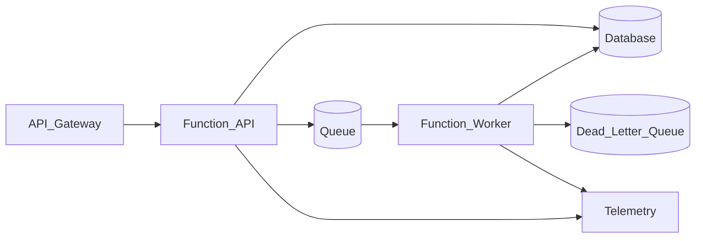

# Study Guide: Serverless Patterns

## Metadata
- **Track**: system-design-architecture
- **Subdomain**: solutions-architecture
- **Difficulty**: Intermediate
- **Target audience**: Junior engineers designing event-driven/serverless systems
- **Estimated time**: 60–90 minutes

## What you’ll learn
- Common serverless building blocks (functions, queues, streams, schedulers)
- Patterns for reliability: retries, idempotency, DLQs, and backpressure
- Operational realities: cold starts, concurrency limits, and observability
- When serverless is a great fit (and when it’s not)

## Mental model
Serverless optimizes for:
- **time-to-ship** and reduced ops for compute
- **burstiness** and pay-per-use pricing

You still own:
- correctness (idempotency)
- event design and contracts
- failure handling and observability

## Reference architecture (async event processing)

## Data/control flows

### Happy path
1. Request hits API gateway; function validates and writes state.
2. Function publishes a message to a queue for async work.
3. Worker function processes message and performs side effects.
4. Telemetry links requests to async processing (correlation IDs).

### Under failure
- **Downstream transient failure**: queue retries with backoff; message eventually succeeds.
- **Poison message**: after max attempts, route to DLQ for quarantine.
- **Burst traffic**: concurrency scales up until limits; queue depth grows (backpressure).

## Core patterns (what to apply)

### 1) Idempotency (mandatory)
Assume at-least-once delivery.
Use:
- idempotency keys on APIs
- dedupe tables for message processing
- exactly-once at the business level

### 2) DLQs and replay
DLQ is not “drop it”; it’s a controlled recovery tool:
- quarantine
- alert owners
- fix root cause
- replay safely (idempotent handlers)

### 3) Timeouts and retry budgets
Retries can amplify outages.
Rules:
- cap attempts
- use exponential backoff + jitter
- respect overall time budgets

### 4) Ordering and consistency
Queues/streams have ordering semantics—understand them:
- per-key ordering is common; global ordering is rare/expensive

### 5) Observability for async systems
You need:
- queue depth/lag metrics
- handler success/failure rates
- processing latency (enqueue to completion)
- tracing across async boundaries (propagate correlation IDs)

## Trade-offs
- **Cold starts**: can hurt tail latency (especially for synchronous APIs).
- **Concurrency limits**: protect dependencies but can increase backlog.
- **Vendor lock-in**: managed event sources and runtimes can be sticky.
- **Debugging**: distributed async flows are harder without strong instrumentation.

## Failure modes & mitigations
- **Retry storms**
  - Mitigation: retry budgets, circuit breakers, backpressure, rate limits.
- **Duplicate side effects**
  - Mitigation: idempotency keys, dedupe storage, transactional outbox where needed.
- **Queue backlog**
  - Mitigation: autoscaling, concurrency tuning, batch sizes, prioritization.
- **DLQ growth ignored**
  - Mitigation: alerts on DLQ size and age; runbooks for replay.

## Operational playbook
- **Backlog rising**:
  - check downstream latency/errors
  - increase concurrency cautiously
  - reduce per-message work (batching)
  - shed non-critical work
- **DLQ events**:
  - inspect payloads
  - classify as poison vs transient
  - fix handler or data contract
  - replay with idempotency

## Security considerations
- Principle of least privilege for function roles.
- Validate event payloads (schema validation).
- Avoid secrets in environment variables when possible; use a secrets manager.

## Metrics & SLOs (suggested)
- API success rate and p95 latency (sync path)
- Queue age (oldest message) and depth
- Worker success rate and processing latency
- DLQ size and age

## Exercises
1. Design a serverless “image processing” pipeline with DLQ and replay.
2. Define idempotency for “Send Email” worker to prevent duplicates.
3. Create alerts for backlog growth and DLQ accumulation with runbooks.

## Interview pack

### Common questions
1. “What problems does serverless solve well?”
2. “How do you prevent duplicate processing?”
3. “How do you handle poison messages?”
4. “How do you debug an async workflow?”

### Strong answer outline
- Describe event-driven architecture with idempotency and DLQs
- Call out backpressure and dependency protection
- Emphasize observability for async lag and failures
- Discuss trade-offs (cold starts, concurrency, lock-in)

### Red flags
- Assuming exactly-once delivery by default
- No DLQ or replay plan
- No correlation IDs across async boundaries

## Related guides
- `01-cloud-design-patterns.md`
- `04-cost-optimization.md`
- `05-security-architecture.md`
- `..\..\observability\study-guides\03-distributed-tracing.md`
