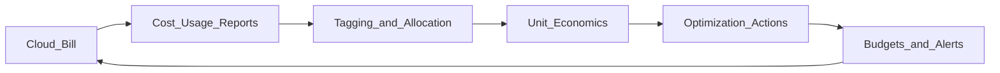

# Study Guide: Cost Optimization (Cloud)

## Metadata
- **Track**: system-design-architecture
- **Subdomain**: solutions-architecture
- **Difficulty**: Intermediate
- **Target audience**: Junior engineers learning practical FinOps and cost levers
- **Estimated time**: 45–75 minutes

## What you’ll learn
- The biggest cost drivers (compute, storage, egress, managed services)
- High ROI levers: right-sizing, autoscaling, commitments, and lifecycle policies
- How to set up cost visibility (tagging, allocation, unit economics)
- Guardrails to prevent surprise spend during incidents or growth

## Mental model
Cloud costs are mostly:
- **capacity you provision** (idle waste)
- **data you store** (retention + replication)
- **data you move** (egress is often the shocker)

Cost optimization is a continuous loop: **measure → attribute → change → verify**.

## Reference architecture: cost control loop

## Concepts and levers (practical)

### 1) Visibility first
If you can’t attribute cost, you can’t optimize it.
Basics:
- consistent **tags/labels**: `team`, `service`, `env`, `tenant` (when safe)
- separate accounts/projects/subscriptions per environment when possible
- dashboards: daily spend, top services, anomalies

### 2) Compute optimization
Common wins:
- **right-size** (CPU/memory) based on p95 usage, not peak guess
- **autoscale** based on load (RPS, queue depth) with sane limits
- use **spot/preemptible** for fault-tolerant batch and stateless workers
- buy **commitments** (Reserved Instances / Savings Plans / committed use) for steady baselines

### 3) Storage optimization
Common wins:
- lifecycle rules: hot → warm → cold tiers
- delete old snapshots and orphaned volumes
- compress and archive logs, traces, and backups with retention policies

### 4) Data transfer (egress) optimization
Often overlooked:
- CDN for static content
- keep producers/consumers co-located to avoid cross-region egress
- minimize cross-AZ chatter for chatty services when safe

### 5) Managed services vs self-hosted
Trade-off:
- managed: higher unit cost, lower toil, fewer outages
- self-hosted: cheaper sometimes at scale, higher operational burden

Rule of thumb: optimize **engineering time** before micro-optimizing infra.

## Trade-offs
- **Aggressive autoscaling** can amplify latency during cold-starts or scale-up delays.
- **Spot instances** reduce cost but require retries and idempotency.
- **Commitments** reduce cost but increase lock-in and forecast risk.

## Failure modes & mitigations
- **Unexpected spend spikes**
  - Mitigation: budgets/alerts, anomaly detection, per-tenant quotas, rate limits.
- **Cost cutting breaks reliability**
  - Mitigation: tie changes to SLOs; run load tests; monitor golden signals.
- **Tagging drift**
  - Mitigation: enforce tagging policy-as-code; block untagged resources.
- **Orphaned resources**
  - Mitigation: scheduled cleanup jobs; idle resource reports.

## Operational playbook (copy/paste)
- **Weekly**:
  - review top 10 cost drivers
  - check anomalies vs baseline
  - validate tagging coverage
- **Monthly**:
  - adjust commitments for steady baselines
  - review storage lifecycle and retention
  - evaluate major architecture shifts (caching, batching, async)

## Security considerations
- Cost data can leak business information; restrict access.
- Least privilege for automation that deletes resources.
- Audit “cleanup” actions; protect production with approvals.

## Metrics & SLOs (cost and value)
Useful KPIs:
- cost per request
- cost per active user
- cost per GB ingested (logs/traces)
- idle capacity percentage
- egress per request

## Exercises
1. Identify 5 likely sources of waste in a typical microservice stack.
2. Propose a tagging standard and a policy to enforce it.
3. Design a budget alerting strategy with escalation (warn → page).

## Interview pack

### Common questions
1. “How would you reduce cloud costs for a service?”
2. “What are the biggest cost drivers in your architecture?”
3. “When do you use spot instances?”
4. “How do you ensure cost optimizations don’t hurt reliability?”

### Strong answer outline
- Start with visibility and attribution (tags, dashboards)
- Attack biggest drivers first (compute, storage, egress)
- Use guardrails (budgets, quotas) and verify with SLOs
- Prefer architectural wins (batching, caching) over tiny tweaks

### Red flags
- Cutting capacity without measuring impact
- No tagging/attribution strategy
- Ignoring egress and retention

## Related guides
- `03-disaster-recovery-strategies.md`
- `06-serverless-patterns.md`
- `..\..\observability\study-guides\08-cost-effective-observability.md`
