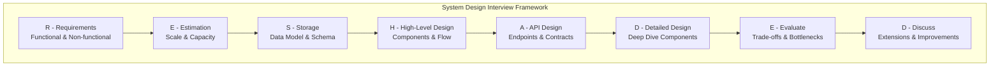
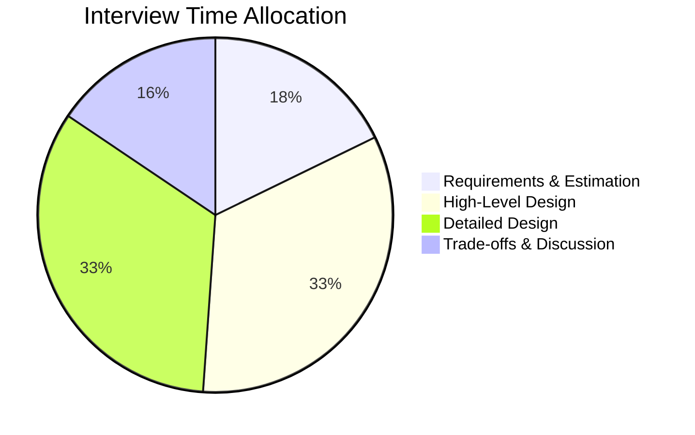

# Interview Frameworks - Concept Guide

## Overview

Structured approaches and frameworks for tackling system design interviews. Learn how to organize your thinking, communicate effectively, and demonstrate senior-level problem-solving skills within the time constraints of an interview.

## Prerequisites

- Basic understanding of distributed systems concepts
- Familiarity with common system components (databases, caches, queues)
- Some experience with system design discussions

## Topics Covered

| Topic | Study Guide | Difficulty | Est. Time |
|-------|-------------|------------|-----------|
| RESHADED Framework | Coming soon | Beginner | 45 min |
| Requirements Gathering | Coming soon | Beginner | 30 min |
| Back-of-Envelope Estimation | Coming soon | Intermediate | 45 min |
| Component Design Patterns | Coming soon | Intermediate | 45 min |
| Trade-off Analysis | Coming soon | Intermediate | 30 min |
| Communication Strategies | Coming soon | Beginner | 30 min |
| Common Pitfalls | Coming soon | Beginner | 30 min |

## Recommended Study Order

1. **RESHADED Framework** - Master the structured approach
2. **Requirements Gathering** - Ask the right questions
3. **Back-of-Envelope Estimation** - Quick capacity planning
4. **Component Design Patterns** - Building blocks toolkit
5. **Trade-off Analysis** - Justify your decisions
6. **Communication Strategies** - Present effectively
7. **Common Pitfalls** - Avoid typical mistakes

## RESHADED Framework

## Time Allocation (45-min Interview)

| Phase | Time | Focus |
|-------|------|-------|
| Requirements | 3-5 min | Clarify scope, users, scale |
| Estimation | 3-5 min | QPS, storage, bandwidth |
| High-Level Design | 10-15 min | Components, data flow |
| Detailed Design | 10-15 min | Deep dive 1-2 components |
| Trade-offs | 5-7 min | Alternatives, bottlenecks |

## Interview Relevance

Framework knowledge demonstrates interview readiness:
- **Structure**: Shows organized thinking under pressure
- **Communication**: Demonstrates ability to explain complex systems
- **Prioritization**: Shows you can focus on what matters
- **Adaptability**: Ability to adjust based on interviewer feedback

Interviewers assess:
- How you approach ambiguous problems
- Your ability to drive the conversation
- Whether you can balance breadth and depth
- How you handle feedback and constraints

## Total Estimated Time: 4 hours
