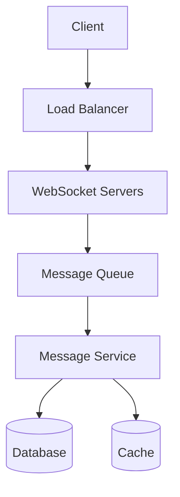

# Mock Interview: System Design & Architecture

## Interview Details
- **Date**: {YYYY-MM-DD}
- **Track**: System Design & Architecture
- **Target Role**: {Solutions Architect | Senior Engineer | Staff Engineer | Principal Engineer}
- **Total Duration**: 60 minutes
- **Focus Areas**: Distributed systems, scalability, observability, cloud architecture

---

## Time Allocation

| Section | Duration | Focus |
|---------|----------|-------|
| Introduction & Warm-up | 5 min | Background, architecture experience |
| Fundamentals Deep Dive | 10 min | CAP, consistency, scalability |
| System Design Exercise | 30 min | End-to-end design problem |
| Architecture Discussion | 10 min | Trade-offs, operational concerns |
| Your Questions | 5 min | Role, team, challenges |

---

## Section 1: Introduction (5 minutes)

### Warm-up Questions
1. Tell me about a system you've designed or significantly contributed to.
2. What's the largest scale system you've worked with?

### Your Response Notes
{Record key points from your response}

---

## Section 2: Fundamentals Deep Dive (10 minutes)

### Q1: CAP Theorem & Consistency
**Time**: 5 minutes

"Explain the CAP theorem and give examples of when you'd choose CP vs AP systems."

**Key Points to Cover**:
- [ ] CAP theorem explanation
- [ ] Real-world CP examples (banking, inventory)
- [ ] Real-world AP examples (social media, caching)
- [ ] PACELC extension
- [ ] Consistency models (eventual, strong, causal)

**Your Answer**:
{Record your response}

---

### Q2: Scalability Patterns
**Time**: 5 minutes

"What strategies would you use to scale a system from 1,000 to 1,000,000 users?"

**Key Points to Cover**:
- [ ] Horizontal vs. vertical scaling
- [ ] Database sharding strategies
- [ ] Caching layers (CDN, application, database)
- [ ] Load balancing approaches
- [ ] Async processing and queues

**Your Answer**:
{Record your response}

---

## Section 3: System Design Exercise (30 minutes)

### Framework: RESHADED

Use this framework to structure your design:

| Step | Time | Focus |
|------|------|-------|
| **R**equirements | 5 min | Clarify functional & non-functional |
| **E**stimation | 3 min | Scale, storage, bandwidth |
| **S**torage | 5 min | Data model, database choice |
| **H**igh-level Design | 7 min | Components, data flow |
| **A**PI Design | 3 min | Key endpoints |
| **D**etailed Design | 5 min | Deep dive on critical component |
| **E**valuation | 2 min | Trade-offs, alternatives |
| **D**istinctive | - | Unique considerations |

---

### Design Problem: {Choose one}

#### Option A: Design a URL Shortener (like bit.ly)

**Requirements Clarification**:
- Functional: {your clarifying questions and answers}
- Non-functional: {availability, latency, scale requirements}

**Estimations**:
- Daily active users: 
- URLs shortened per day:
- Read:Write ratio:
- Storage requirements:

**High-Level Design**:
```
┌─────────────┐     ┌─────────────┐     ┌─────────────┐
│   Client    │────▶│  API Gateway │────▶│  Service    │
└─────────────┘     └─────────────┘     └─────────────┘
                                              │
                    ┌─────────────┐     ┌─────▼───────┐
                    │    Cache    │◀────│  Database   │
                    └─────────────┘     └─────────────┘
```

{Draw your detailed architecture}

**Data Model**:
```
{Your schema design}
```

**API Design**:
```
POST /shorten
GET /{shortCode}
```

**Key Design Decisions**:
1. {decision and rationale}
2. {decision and rationale}

---

#### Option B: Design a Real-time Chat System (like Slack)

**Requirements Clarification**:
- Functional: {your clarifying questions and answers}
- Non-functional: {availability, latency, scale requirements}

**Estimations**:
- Daily active users:
- Messages per day:
- Storage requirements:

**High-Level Design**:


{Draw your detailed architecture}

**Key Design Decisions**:
1. {decision and rationale}
2. {decision and rationale}

---

#### Option C: Design a Distributed Cache (like Redis)

**Requirements Clarification**:
- Functional: {your clarifying questions and answers}
- Non-functional: {availability, latency, scale requirements}

**High-Level Design**:
{Your architecture}

**Key Design Decisions**:
1. {decision and rationale}
2. {decision and rationale}

---

## Section 4: Architecture Discussion (10 minutes)

### Q1: Operational Concerns
**Time**: 5 minutes

"How would you ensure this system is observable and maintainable in production?"

**Key Points to Cover**:
- [ ] Logging strategy (structured logs, log aggregation)
- [ ] Metrics and dashboards (latency, throughput, errors)
- [ ] Distributed tracing
- [ ] Alerting and on-call
- [ ] Runbooks and incident response

**Your Answer**:
{Record your response}

---

### Q2: Failure Scenarios
**Time**: 5 minutes

"What happens if [component X] fails? How does the system handle it?"

**Key Points to Cover**:
- [ ] Single points of failure
- [ ] Graceful degradation
- [ ] Circuit breakers
- [ ] Retry strategies
- [ ] Data consistency during failures

**Your Answer**:
{Record your response}

---

## Section 5: Your Questions (5 minutes)

### Suggested Questions
1. What are the biggest architectural challenges the team is facing?
2. How do you handle technical debt and system evolution?
3. What does the on-call rotation look like?
4. How are architectural decisions made and documented?

### Your Questions
1. {Your question}
2. {Your question}

---

## Self-Evaluation Rubric

### Fundamentals
| Criteria | Score (1-5) | Notes |
|----------|-------------|-------|
| CAP theorem understanding | | |
| Consistency models | | |
| Scalability patterns | | |
| Database knowledge | | |
| Networking basics | | |

### System Design Process
| Criteria | Score (1-5) | Notes |
|----------|-------------|-------|
| Requirements gathering | | |
| Estimation accuracy | | |
| High-level design clarity | | |
| Component selection rationale | | |
| API design | | |
| Data model design | | |

### Trade-off Analysis
| Criteria | Score (1-5) | Notes |
|----------|-------------|-------|
| Identifying trade-offs | | |
| Justifying decisions | | |
| Considering alternatives | | |
| Operational concerns | | |
| Failure handling | | |

### Communication
| Criteria | Score (1-5) | Notes |
|----------|-------------|-------|
| Structured approach | | |
| Whiteboard/diagram clarity | | |
| Asking clarifying questions | | |
| Handling feedback | | |
| Time management | | |

---

## Score Summary

**Total Score**: {sum} / 100

| Rating | Score Range | Interpretation |
|--------|-------------|----------------|
| Excellent | 80-100 | Ready for staff/principal roles |
| Good | 60-79 | Ready for senior roles |
| Fair | 40-59 | More practice needed |
| Needs Work | <40 | Focus on fundamentals |

---

## Action Items

### Strengths
1. {strength}
2. {strength}

### Areas for Improvement
1. {area} - Study: {specific topic}
2. {area} - Practice: {specific design problem}

### Study Guides to Review
- [ ] [CAP Theorem](./fundamentals/cap-theorem-study-guide.md)
- [ ] {other relevant guides}

### Practice Problems to Attempt
- [ ] [URL Shortener](./_practice/url-shortener-problem.md)
- [ ] {other problems}

### Next Mock Interview: {YYYY-MM-DD}
