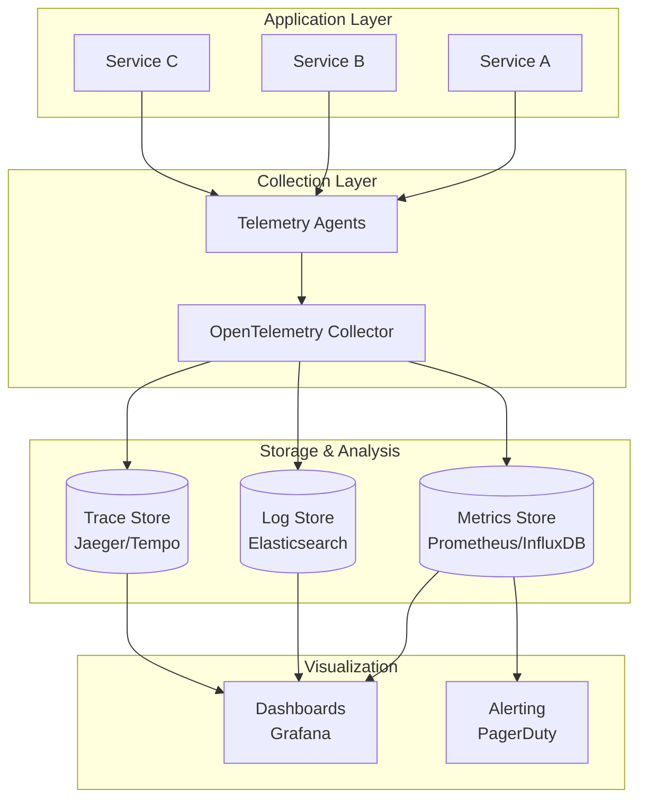

# Observability - Concept Guide

## Overview

Observability architecture topics covering the three pillars (metrics, logs, traces) and how to design systems that are debuggable, monitorable, and maintainable at scale. Essential knowledge for senior engineers who need to operate production systems.

## Prerequisites

- Basic understanding of logging and monitoring concepts
- Familiarity with at least one monitoring tool (Prometheus, Datadog, etc.)
- Experience debugging production issues

## Topics Covered

| Topic | Study Guide | Difficulty | Est. Time |
|-------|-------------|------------|-----------|
| Three Pillars of Observability | Coming soon | Intermediate | 45 min |
| Metrics Architecture | Coming soon | Intermediate | 60 min |
| Distributed Tracing | Coming soon | Advanced | 60 min |
| Log Aggregation Patterns | Coming soon | Intermediate | 45 min |
| Alerting Strategy | Coming soon | Intermediate | 45 min |
| SLIs, SLOs, and SLAs | Coming soon | Intermediate | 45 min |
| Incident Response | Coming soon | Advanced | 45 min |
| Cost-Effective Observability | Coming soon | Advanced | 30 min |

## Recommended Study Order

1. **Three Pillars of Observability** - Understand metrics, logs, and traces
2. **SLIs, SLOs, and SLAs** - Define what "healthy" means
3. **Metrics Architecture** - Design metric collection systems
4. **Log Aggregation Patterns** - Centralized logging at scale
5. **Distributed Tracing** - Follow requests across services
6. **Alerting Strategy** - Actionable alerts, avoiding noise
7. **Incident Response** - Structured debugging approaches
8. **Cost-Effective Observability** - Sampling, retention, optimization

## Observability Architecture Diagram

## Interview Relevance

Observability questions are common in senior-level interviews:
- **Design**: "How would you add observability to this system?"
- **Debugging**: "Walk me through how you'd debug a latency spike"
- **Trade-offs**: "How do you balance observability cost vs coverage?"
- **SLOs**: "How would you define SLOs for this service?"

Interviewers assess:
- Production experience and operational maturity
- Understanding of debugging at scale
- Ability to design maintainable systems

## Total Estimated Time: 6 hours
