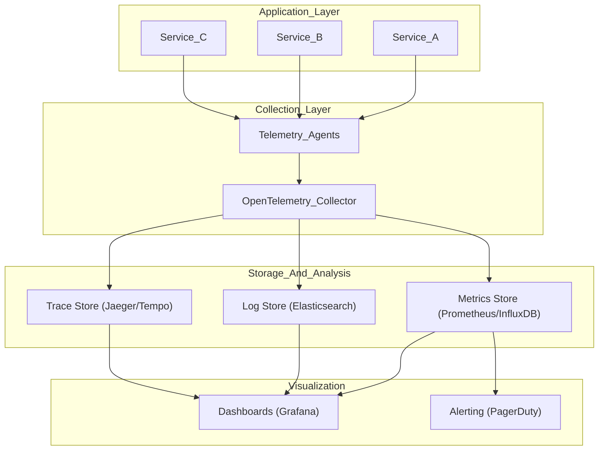

# Observability - Concept Guide

## Overview

Observability architecture topics covering the three pillars (metrics, logs, traces) and how to design systems that are debuggable, monitorable, and maintainable at scale. Essential knowledge for senior engineers who need to operate production systems.

## Prerequisites

- Basic understanding of logging and monitoring concepts
- Familiarity with at least one monitoring tool (Prometheus, Datadog, etc.)
- Experience debugging production issues

## Topics Covered

| Topic | Study Guide | Difficulty | Est. Time |
|-------|-------------|------------|-----------|
| Three Pillars of Observability | [Study guide](study-guides/01-three-pillars-of-observability.md) | Intermediate | 45 min |
| Metrics Architecture | [Study guide](study-guides/02-metrics-architecture.md) | Intermediate | 60 min |
| Distributed Tracing | [Study guide](study-guides/03-distributed-tracing.md) | Advanced | 60 min |
| Log Aggregation Patterns | [Study guide](study-guides/04-log-aggregation-patterns.md) | Intermediate | 45 min |
| Alerting Strategy | [Study guide](study-guides/05-alerting-strategy.md) | Intermediate | 45 min |
| SLIs, SLOs, and SLAs | [Study guide](study-guides/06-slis-slos-and-slas.md) | Intermediate | 45 min |
| Incident Response | [Study guide](study-guides/07-incident-response.md) | Advanced | 45 min |
| Cost-Effective Observability | [Study guide](study-guides/08-cost-effective-observability.md) | Advanced | 30 min |

## What you’ll learn (by topic)

### Three Pillars of Observability
- Detection vs diagnosis: what each pillar is best at
- How to correlate signals using `trace_id` / `request_id`
- Common anti-patterns (cardinality, noisy logs, broken traces)
- Deep dive: `study-guides/01-three-pillars-of-observability.md`

### Metrics Architecture
- End-to-end metrics pipeline (emit → collect → store → query → alert)
- Pull vs push trade-offs and hybrid setups
- Naming/labeling and cardinality control
- Deep dive: `study-guides/02-metrics-architecture.md`

### Distributed Tracing
- Trace/span concepts and context propagation
- Debugging latency across multiple services
- Sampling strategies (keep errors and slow requests)
- Deep dive: `study-guides/03-distributed-tracing.md`

### Log Aggregation Patterns
- Designing structured logs for search and correlation
- Log pipelines and backpressure/buffering behavior
- Retention/indexing trade-offs and cost control
- Deep dive: `study-guides/04-log-aggregation-patterns.md`

### Alerting Strategy
- Symptom vs cause alerting (what should page)
- SLO-first burn-rate alerting patterns
- Runbooks, routing, dedup, and alert hygiene
- Deep dive: `study-guides/05-alerting-strategy.md`

### SLIs, SLOs, and SLAs
- Defining “good” for key user journeys (availability/latency/correctness)
- Error budgets as a policy tool for release velocity
- Connecting SLOs to alerting (burn rates)
- Deep dive: `study-guides/06-slis-slos-and-slas.md`

### Incident Response
- First-10-minutes triage checklist using golden signals
- Stabilize-first mitigations (rollback, flags, rate limits)
- Comms cadence, roles, and blameless postmortems
- Deep dive: `study-guides/07-incident-response.md`

### Cost-Effective Observability
- Cost drivers for metrics/logs/traces (volume, cardinality, retention)
- Sampling and retention tiering without losing debuggability
- Guardrails to prevent cost blowups during incidents
- Deep dive: `study-guides/08-cost-effective-observability.md`

## Recommended Study Order

1. **Three Pillars of Observability** - Understand metrics, logs, and traces
2. **SLIs, SLOs, and SLAs** - Define what "healthy" means
3. **Metrics Architecture** - Design metric collection systems
4. **Log Aggregation Patterns** - Centralized logging at scale
5. **Distributed Tracing** - Follow requests across services
6. **Alerting Strategy** - Actionable alerts, avoiding noise
7. **Incident Response** - Structured debugging approaches
8. **Cost-Effective Observability** - Sampling, retention, optimization

## Observability Architecture Diagram

## Interview Relevance

Observability questions are common in senior-level interviews:
- **Design**: "How would you add observability to this system?"
- **Debugging**: "Walk me through how you'd debug a latency spike"
- **Trade-offs**: "How do you balance observability cost vs coverage?"
- **SLOs**: "How would you define SLOs for this service?"

Interviewers assess:
- Production experience and operational maturity
- Understanding of debugging at scale
- Ability to design maintainable systems

## Total Estimated Time: 6 hours
