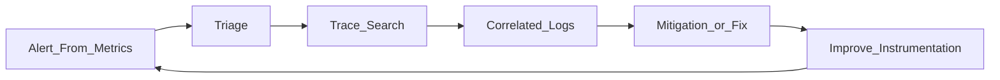

# Study Guide: Three Pillars of Observability (Metrics, Logs, Traces)

## Metadata
- **Track**: system-design-architecture
- **Subdomain**: observability
- **Difficulty**: Intermediate
- **Target audience**: Junior engineers who debug and operate services
- **Estimated time**: 45–75 minutes

## What you’ll learn
- What each pillar is best at (and what it’s bad at)
- How pillars work together to answer “what, where, why”
- How to instrument services so observability is designed-in, not bolted on
- Common anti-patterns (cardinality explosions, noisy logs, broken traces)

## Observability vs monitoring (quick distinction)
- **Monitoring**: tells you something is wrong (known failure modes).
- **Observability**: lets you understand why it’s wrong (unknown unknowns) by exposing system state via telemetry.

You want both.

## The three pillars (and the questions they answer)

### Metrics (numbers over time)
Best for:
- “Is it getting worse?”
- “How many?”
- “How fast?”

Examples:
- request rate, error rate, latency percentiles
- CPU/memory, queue depth, saturation

Weak at:
- detailed context for *why* something happened (without labels/exemplars)

### Logs (events with context)
Best for:
- “What happened?”
- “What errors occurred and with what inputs?”

Examples:
- structured application logs
- audit logs (auth, permission changes)

Weak at:
- trend detection (expensive to aggregate at scale)
- easy correlation (unless you include IDs)

### Traces (request journeys)
Best for:
- “Where is the time going across services?”
- “Which dependency call is failing?”

Examples:
- spans across API gateway → service → DB → cache

Weak at:
- complete coverage (sampling)
- requires consistent propagation

## How they fit together (the “what/where/why” loop)

Typical flow:
1. Metrics alert you (what + how bad).
2. Traces locate where time/errors happen (where).
3. Logs reveal exact errors and context (why).
4. You improve instrumentation to make next time faster.

## Instrumentation basics (what juniors should do)

### Start with “golden signals”
For every service, produce metrics for:
- Latency (p50/p95/p99)
- Traffic (RPS)
- Errors (5xx, exceptions, failed business outcomes)
- Saturation (CPU/mem, DB connections, queue depth)

### Use consistent correlation IDs
You need a stable identifier across pillars:
- `trace_id` (preferred if tracing exists)
- `request_id` (fallback)

Log format rule: every log line should include:
- timestamp
- severity
- service name
- environment
- correlation id (trace_id / request_id)
- message + structured fields

### Make logs structured by default
Prefer key/value fields over free text. It enables:
- filtering
- aggregation
- better alerting and dashboards

### Sampling strategy (especially for traces)
Sampling is not “reduce cost blindly”. It’s choosing what to keep for debugging.
- Keep errors at higher rates
- Consider tail-based sampling (keep slow/failed requests)

## Common anti-patterns

### Cardinality explosions in metrics
Bad labels:
- user_id
- request_id
- email
- full URL with path params

Good labels:
- endpoint template (`/users/:id`)
- status code class (`2xx`, `5xx`)
- region/az

### Logging everything at INFO
Results:
- massive cost
- important signals drowned out

Better:
- INFO for high-level lifecycle events
- WARN for abnormal but recoverable
- ERROR for failed operations
- DEBUG gated and sampled, not always-on in prod

### Traces without propagation
If services don’t propagate context, traces become broken chains.
Rule: every inbound request starts/continues a trace; every outbound request propagates it.

## Operational checklist
- [ ] Each service has golden signal dashboards
- [ ] Logs are structured and include correlation IDs
- [ ] Tracing context propagates across service boundaries
- [ ] Sampling keeps slow and failed requests
- [ ] Label cardinality is controlled and reviewed
- [ ] Alerting uses metrics, not logs, for primary paging

## Exercises
1. Pick one service you know. Define the 4 golden signals and how you’d measure them.
2. Design a log schema for a “checkout” service and include correlation fields.
3. Draw a trace for “create order” across 3 services and identify where you’d add spans.

## Interview pack

### Common questions
1. “When would you use logs vs traces?”
2. “How do you avoid metric cardinality problems?”
3. “How would you debug a latency spike end-to-end?”

### Strong answer outline
- Metrics for detection and trend; traces for path attribution; logs for detailed context
- Correlation IDs tie pillars together
- Sampling and cardinality controls keep cost manageable

