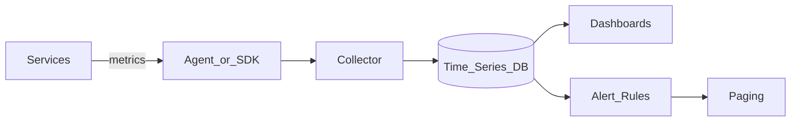

# Study Guide: Metrics Architecture

## Metadata
- **Track**: system-design-architecture
- **Subdomain**: observability
- **Difficulty**: Intermediate
- **Target audience**: Junior engineers instrumenting and operating services
- **Estimated time**: 60–90 minutes

## What you’ll learn
- The end-to-end metrics pipeline: emit → collect → store → query → alert
- Pull vs push models and how to choose
- How to design metric names/labels safely (cardinality, aggregation)
- Practical alert design and dashboard patterns

## Reference pipeline

## Metric types (and when to use them)

### Counter
Monotonic increasing count.
Use for:
- requests total
- errors total

### Gauge
Current value that goes up/down.
Use for:
- memory usage
- queue depth
- in-flight requests

### Histogram / Summary
Distribution of values (latency, sizes).
Use for:
- request latency percentiles
- payload size

Rule of thumb: histograms are better for aggregation across instances, but require thoughtful bucket design.

## Pull vs push

### Pull (scrape) model
Collector scrapes targets periodically.
- Pros: easier target discovery, backpressure handled by scraper
- Cons: harder for short-lived jobs unless you use gateways

### Push model
Targets push metrics to a gateway/collector.
- Pros: works for short-lived jobs, fire-and-forget
- Cons: easier to overload receivers; harder to validate target identity

Hybrid is common: pull for services, push for batch jobs.

## Naming and labeling (cardinality is the #1 risk)

### Naming conventions
Prefer consistent patterns:
- `http_server_requests_total`
- `http_server_request_duration_seconds_bucket`

Avoid embedding values in names.

### Label guidelines
Good labels:
- `service`
- `env`
- `region`
- `route` (templated)
- `status_class`

Bad labels (high cardinality):
- `user_id`
- `request_id`
- `ip_address`
- `email`
- raw `path` with IDs

High cardinality causes:
- memory blowups
- slow queries
- expensive storage
- alert evaluation slowness

## Aggregation and what percentiles mean
Common pitfall: “average latency looks fine”.
Reality: tail latency matters.

Use:
- p95/p99 for latency
- rates for counters

Be careful:
- Percentiles don’t aggregate cleanly across shards unless you use histograms.

## Alerting with metrics (actionable by design)

### Use symptom-based alerts for paging
Page on user impact:
- high error rate
- high latency
- SLO burn rate

### Use cause-based alerts for investigation
Ticket or low-severity notifications:
- high CPU
- disk filling
- node pressure

### Burn rate (high signal pattern)
Two-window approach:
- Fast window detects rapid outages
- Slow window detects gradual issues

This reduces noise and aligns alerting to SLOs.

## Dashboard design (junior-friendly patterns)

### Golden signals per service
For each service dashboard:
- traffic
- errors
- latency
- saturation

### Dependency panels
Show:
- downstream error rate
- downstream latency
- queue depth and retries

### Segment by dimensions that matter
Common:
- region
- endpoint route
- tenant (if low cardinality)

## Failure modes & mitigations
- **Cardinality blow-up**
  - Mitigation: label allow-lists, route templating, review new labels.
- **Scrape gaps**
  - Mitigation: redundant collectors; alert on scrape failures; sane timeouts.
- **Over-alerting**
  - Mitigation: SLO-based paging, deduplication, clear runbooks.
- **Metric misuse**
  - Mitigation: education; standard libraries; golden signal templates.

## Operational checklist
- [ ] Standard metric library used across services
- [ ] Label cardinality reviewed and controlled
- [ ] Golden signal dashboards exist for each service
- [ ] Paging alerts map to user impact (SLO burn where possible)
- [ ] Alerts have runbooks and ownership
- [ ] Collectors and storage are monitored for ingestion/query health

## Exercises
1. Define metrics for an API with endpoints `/login` and `/checkout`.
2. Find 5 labels that would be too high-cardinality and propose replacements.
3. Design a paging alert for “checkout latency is bad” and write the first 5 debug steps.

## Interview pack

### Common questions
1. “Pull vs push metrics: when would you choose each?”
2. “Explain metric cardinality and why it matters.”
3. “How do you design alerts that don’t spam?”

### Strong answer outline
- End-to-end pipeline
- Pull/push trade-offs
- Naming/label best practices
- SLO-aligned alerting and golden signal dashboards

