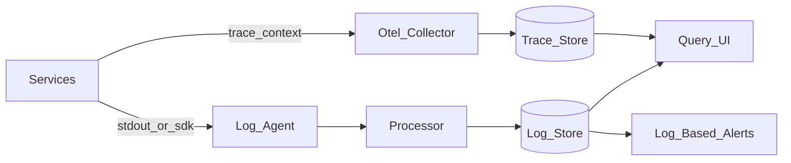

# Study Guide: Log Aggregation Patterns

## Metadata
- **Track**: system-design-architecture
- **Subdomain**: observability
- **Difficulty**: Intermediate
- **Target audience**: Junior engineers operating services with centralized logging
- **Estimated time**: 45–75 minutes

## What you’ll learn
- How a log pipeline works end-to-end (emit → ship → process → store → query)
- How to design **structured logs** that are searchable and correlate with traces
- Common storage/query trade-offs (cost, retention, indexing)
- Failure modes (dropped logs, hot shards, noisy tenants) and mitigations

## Mental model
Logs are **events with context**. Good logging is not “print everything”; it’s **high-signal, structured, and correlated** so you can answer:
- **What** happened? (error messages, state transitions)
- **Where** did it happen? (service, region, instance)
- **Why** did it happen? (inputs, dependency error, code path)

## Reference architecture

### Components (what each does)
- **App**: writes structured logs (JSON) to stdout or a library.
- **Log agent**: tails files/stdout and ships logs (batching, retries).
- **Processor**: parsing, normalization, enrichment, sampling, routing.
- **Log store**: indexes selected fields; retains raw payload; supports search.
- **Query UI**: filters, aggregations, dashboards; pivots by correlation IDs.

## Data/control flows

### Happy path
1. Service emits a **structured** log with `timestamp`, `level`, `service`, `env`, and `trace_id` (when available).
2. Agent buffers and ships logs in batches (with backoff on errors).
3. Processor parses JSON, normalizes fields, and enriches (e.g., `region`, `k8s_namespace`).
4. Store indexes selected fields (keep index small and intentional).
5. Engineers query by `trace_id` to jump from a trace to relevant logs.

### Under failure (examples)
- **Agent can’t ship**: agent buffers to disk; if disk fills, logs drop (usually oldest-first).
- **Processor overload**: backpressure builds; logs are delayed or sampled/dropped.
- **Store hot shards**: certain fields (tenant/service) concentrate writes; ingestion slows and queries time out.

## Log design (practical rules)

### 1) Default to structured logs
Prefer JSON with stable keys over free text.

Minimum recommended fields:
- `ts` (ISO8601 or epoch)
- `level` (`INFO`, `WARN`, `ERROR`)
- `service`, `env`, `region`
- `message`
- `trace_id` and `span_id` when tracing exists
- `request_id` (fallback)

### 2) Log at the right level
- **INFO**: important state transitions (start/stop, request summary)
- **WARN**: abnormal but recoverable (retrying, partial degradation)
- **ERROR**: failed operations / user-impacting errors
- **DEBUG**: gated (sampling, allowlist, short time windows)

### 3) Don’t log secrets or sensitive payloads
Redact at source. Treat logs as a high-risk data store.

### 4) Keep log volume intentional
High volume increases cost and slows queries.
- Prefer **metrics** for paging signals.
- Use logs for **context** and **forensics**.

## Trade-offs
- **Index more fields**:
  - Pros: faster queries
  - Cons: more cost, slower ingestion, larger blast radius for bad fields
- **Longer retention**:
  - Pros: compliance and forensics
  - Cons: expensive; requires tiering (hot/warm/cold)
- **Log-based alerts**:
  - Pros: can detect specific error messages quickly
  - Cons: prone to noise; expensive; can miss issues if logs drop

## Failure modes & mitigations
- **Dropped logs**
  - Mitigation: agent disk buffers, ingestion SLOs, alerts on drop rates, size limits.
- **No correlation IDs**
  - Mitigation: enforce middleware that injects `trace_id`/`request_id` into every log line.
- **Noisy tenant / cardinality in fields**
  - Mitigation: per-tenant rate limits, sampling, field allowlists, multi-tenant index separation.
- **PII leakage**
  - Mitigation: redaction libraries, linting rules, access controls, audit logging.

## Operational playbook (first 10 minutes)
- **Is the pipeline healthy?** Check agent errors, ingestion lag, and store write errors.
- **Scope**: isolate by `service`, `env`, `region`, `tenant`.
- **Correlate**: start from a trace or request ID, pivot to logs.
- **Stabilize**: apply sampling or rate limiting if ingestion is overloaded.

## Security considerations
- **Access control**: least privilege; restrict who can query prod logs.
- **Auditability**: log-store access should be audited.
- **Data minimization**: avoid payloads that include tokens, passwords, full customer data.
- **Retention policy**: align retention with compliance; tier older logs to cheaper storage.

## Metrics & SLOs (for the logging platform)
Suggested platform SLIs:
- Ingestion success rate
- End-to-end lag (emit to searchable)
- Query success rate and p95 query latency
- Drop rate / sampling rate

## Exercises
1. Define a structured log schema for a “checkout” request including correlation IDs.
2. Draw a log pipeline for Kubernetes (stdout → agent → store). Identify where buffering happens.
3. Choose 5 fields to index and justify why (and why not more).

## Interview pack

### Common questions
1. “How do you design centralized logging for microservices?”
2. “Why not page on logs?”
3. “How do you correlate logs and traces?”
4. “How do you prevent secrets from landing in logs?”

### Strong answer outline
- Explain pipeline stages and backpressure/buffering
- Emphasize structured logs + correlation IDs
- Call out indexing/retention trade-offs and cost control
- Mention security: redaction, access controls, auditing

### Red flags
- “Log everything at INFO in prod”
- No correlation IDs
- Indexing arbitrary dynamic fields without guardrails
- Storing secrets/PII in logs

## Related guides
- `01-three-pillars-of-observability.md`
- `03-distributed-tracing.md`
- `05-alerting-strategy.md`
- `07-incident-response.md`
