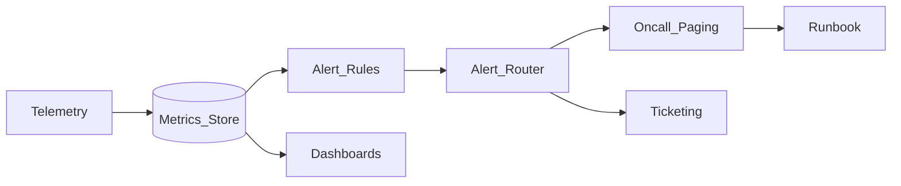

# Study Guide: Alerting Strategy

## Metadata
- **Track**: system-design-architecture
- **Subdomain**: observability
- **Difficulty**: Intermediate
- **Target audience**: Junior engineers creating actionable alerts and on-call hygiene
- **Estimated time**: 45–75 minutes

## What you’ll learn
- How to design alerting that is **actionable**, **low-noise**, and **SLO-aligned**
- Symptom vs cause alerts and what belongs in paging vs tickets
- How to use burn-rate alerting (fast/slow windows)
- How to attach runbooks and reduce alert fatigue over time

## Mental model
Alerts are a **decision system**:
- A page means “wake someone up because users are impacted or will be soon”.
- Alerts without a clear action are **monitoring**, not paging.

Default: **page on symptoms**, investigate causes with dashboards.

## Reference architecture

## Concepts (what to get right)

### 1) Symptom vs cause alerts
- **Symptom (page)**: user-visible errors, high latency, SLO burn.
- **Cause (ticket/notify)**: CPU high, disk usage, node pressure, leader elections.

Reason: causes are often ambiguous and noisy. Symptoms are closer to impact.

### 2) Define alert intent
For every alert, write one sentence:
“This alert fires when _____, and the first action is _____.”

If you can’t write that, the alert probably shouldn’t page.

### 3) Deduplication and routing
You need:
- grouping keys (service, env, region)
- suppression (maintenance windows)
- escalation policies (if unacked)
- ownership (who is responsible)

## SLO-first alerting (recommended)

### Burn rate (high signal)
Burn rate answers: “At current error rate, how fast will we consume the error budget?”

Two-window pattern:
- **Fast window** catches sharp outages.
- **Slow window** catches gradual degradation.

Example intent:
- Fast: “Budget will be exhausted in hours”
- Slow: “Budget will be exhausted in days”

## Designing good pages

### Required fields (practical)
Every paging alert should include:
- **What**: symptom and threshold
- **Where**: service, env, region, endpoint (templated)
- **Since when**: duration
- **Impact**: affected % or SLI/SLO context
- **Runbook**: link with first steps

### Thresholds and windows
Avoid “instant” alerts.
- Use short windows for outages (e.g., 1–5 min).
- Use longer windows for slow burns (e.g., 30–120 min).

Prefer rate-based conditions over raw counts.

## Data/control flows

### Happy path
1. Metrics arrive in the store with correct labels (service/env/region).
2. Rules evaluate on a schedule with consistent lookback windows.
3. Router deduplicates, applies inhibition/silences, routes to the right team.
4. On-call follows runbook and either mitigates or escalates.

### Under failure
- **Metrics ingestion gap**: rules may miss signals or produce false “no data” alerts.
  - Mitigation: alert on scrape/ingestion health; choose explicit no-data semantics.
- **Alert storm**: one dependency outage triggers many symptoms.
  - Mitigation: dependency-based inhibitions; route to primary incident; group alerts.

## Trade-offs
- **Tighter thresholds**: faster detection, more noise.
- **More alerts**: better coverage, higher fatigue and slower response.
- **Cause-based paging**: sometimes helpful (e.g., disk full), but often noisy.

## Failure modes & mitigations
- **Alert fatigue**
  - Mitigation: budget pages, tune noise weekly, delete low-value alerts aggressively.
- **No runbooks**
  - Mitigation: “no runbook, no page” policy.
- **Cardinality explosion in labels**
  - Mitigation: alert on aggregated dimensions; avoid `request_id`-like labels.
- **Flapping**
  - Mitigation: longer windows, hysteresis, multi-window confirmation, stabilize the signal.

## Operational checklist
- [ ] Paging alerts are symptom-based and map to user impact
- [ ] SLOs exist for critical user journeys
- [ ] Burn-rate alerts exist for each SLO
- [ ] Alerts have owners and runbooks
- [ ] Dedup, grouping, and maintenance silences are configured
- [ ] Weekly alert review exists (top noisy alerts and actions)

## Exercises
1. For a “checkout” SLO, define a fast and slow burn-rate page (intent + windows).
2. Convert 3 noisy cause-based pages into dashboard panels + ticket alerts.
3. Write a runbook for “5xx error rate high” with the first 5 debug steps.

## Interview pack

### Common questions
1. “How do you avoid alert noise?”
2. “What’s the difference between symptom and cause alerts?”
3. “How do burn-rate alerts work?”
4. “What belongs in a runbook?”

### Strong answer outline
- Start from SLIs/SLOs and error budgets
- Page on user-impact symptoms; investigate causes with dashboards
- Use burn-rate alerts and sensible windows
- Enforce runbooks + ownership; tune iteratively

### Red flags
- Paging on CPU for everything
- Alerts without owners/runbooks
- Hundreds of pages per week accepted as “normal”

## Related guides
- `06-slis-slos-and-slas.md`
- `02-metrics-architecture.md`
- `07-incident-response.md`
- `..\..\devops\study-guides\08-reliability-engineering.md`
