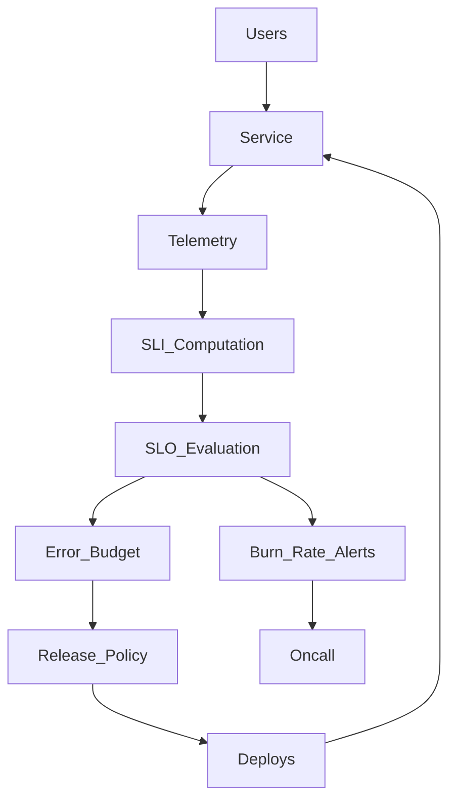

# Study Guide: SLIs, SLOs, and SLAs

## Metadata
- **Track**: system-design-architecture
- **Subdomain**: observability
- **Difficulty**: Intermediate
- **Target audience**: Junior engineers defining reliability targets and alerting policies
- **Estimated time**: 45–75 minutes

## What you’ll learn
- The differences between **SLI**, **SLO**, and **SLA** (and why teams confuse them)
- How to choose good SLIs for user journeys (availability, latency, correctness)
- How error budgets turn reliability into a **decision tool**
- How SLOs connect to alerting (burn rates) and release velocity

## Core definitions (short and sharp)
- **SLI (Service Level Indicator)**: a measurable indicator of service behavior (a metric or computed metric).
- **SLO (Service Level Objective)**: a target value for an SLI over a time window.
- **SLA (Service Level Agreement)**: a contract with customers; often includes penalties and legal terms.

Rule: engineering teams operate on **SLOs**, not SLAs.

## Mental model: reliability as a budget
If your SLO is 99.9% over 30 days, your error budget is:
\[
1 - 0.999 = 0.001
\]
That is ~43 minutes of allowed “badness” per 30 days.

The point is not the math — it’s the **policy**:
- burning budget fast → reduce risk (pause risky releases, focus on stability)
- budget healthy → ship normally, invest in reliability debt

## Reference architecture: the SLO control loop

## Picking SLIs (what to measure)

### 1) Start from user journeys (not host metrics)
Examples:
- “User can log in”
- “Checkout completes”
- “Search returns results”

### 2) Common SLI types
- **Availability**: \( \frac{good\ requests}{total\ requests} \)
- **Latency**: % of requests under a threshold (e.g., under 300ms)
- **Correctness**: % of responses that are correct (not just HTTP 200)
- **Freshness**: data lag under a threshold (for pipelines)
- **Durability**: successful writes / successful reads of persisted data

### 3) Define “good” precisely
For example, “good checkout” might mean:
- HTTP status is 2xx
- payment succeeded
- order persisted
- response time under 600ms

If you only count HTTP status, you can miss business failures.

## Choosing SLO targets (how strict should it be?)
Constraints to consider:
- user expectations and competitors
- revenue and contractual needs
- engineering maturity and budget

Practical tip: start slightly conservative, then tighten when you can sustain it.

## SLAs (when they matter)
SLAs are typically:
- simpler than SLOs
- negotiated
- measured with different exclusions (planned maintenance, force majeure)

Engineering risk: if your SLA is stricter than your internal SLO, you will constantly be in “breach” territory.

## Connecting SLOs to alerting

### Burn-rate alerting
Burn rate expresses how quickly you’re consuming the budget.
You page on burn rate rather than raw CPU/latency spikes because it maps to user impact.

Implementation notes:
- use at least two windows (fast/slow)
- route by service/team
- include the SLO context and runbook links

## Trade-offs
- **Tight SLOs**: better UX, more cost and engineering toil
- **Loose SLOs**: cheaper, but can hide user pain and reduce trust
- **Many SLOs**: better coverage, higher cognitive load

## Failure modes & mitigations
- **Bad SLI definition**
  - Mitigation: define “good” using business outcomes; review with product.
- **Measuring the wrong population**
  - Mitigation: measure from the user edge (synthetics and real-user metrics), not just internal calls.
- **SLOs without policy**
  - Mitigation: explicitly define what happens when budget is burning (release freeze, review gates).
- **Alerting not tied to SLOs**
  - Mitigation: migrate paging to burn-rate alerts; keep causes as dashboard/tickets.

## Operational checklist
- [ ] 1–3 SLOs defined per critical service (not 20)
- [ ] SLIs map to user journeys and business correctness
- [ ] Error budget policy exists and is enforced
- [ ] Burn-rate alerts exist and include runbooks
- [ ] SLOs reviewed quarterly (targets and definitions)

## Exercises
1. Define 2 SLIs and SLOs for a checkout service (availability + latency).
2. Write an error budget policy: what changes when budget burn is high?
3. Identify one “HTTP 200 but failed” case and redesign the SLI to capture it.

## Interview pack

### Common questions
1. “What’s the difference between SLI, SLO, and SLA?”
2. “How do error budgets affect release velocity?”
3. “How would you define SLOs for an API?”
4. “Why page on burn rate instead of CPU?”

### Strong answer outline
- Clear definitions and examples
- Start from user journeys and correctness
- Explain error budgets as a policy tool
- Tie into burn-rate alerting and incident response

### Red flags
- “SLO = SLA”
- Measuring only infrastructure metrics (CPU) as SLIs
- Setting targets without a plan to meet them

## Related guides
- `05-alerting-strategy.md`
- `02-metrics-architecture.md`
- `07-incident-response.md`
- `..\..\devops\study-guides\08-reliability-engineering.md`
