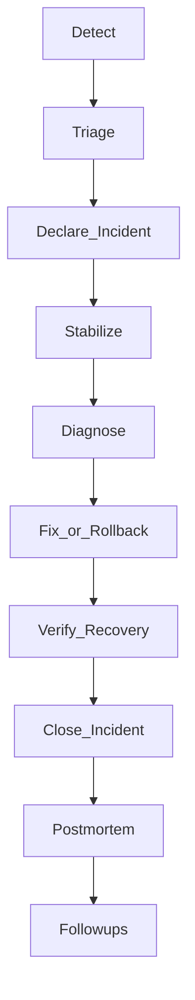

# Study Guide: Incident Response

## Metadata
- **Track**: system-design-architecture
- **Subdomain**: observability
- **Difficulty**: Advanced
- **Target audience**: Junior engineers participating in on-call and incident handling
- **Estimated time**: 45–75 minutes

## What you’ll learn
- How to run an incident with clear roles and structured communication
- The “stabilize first, then diagnose” workflow
- A practical triage checklist using golden signals and correlation
- How to create postmortems that reduce future incidents (not blame)

## Mental model
An incident is a **time-bounded risk management event**.
Your priorities:
1. **Protect users and business** (stop the bleeding)
2. **Restore service** (mitigate)
3. **Understand** (diagnose)
4. **Prevent recurrence** (follow-ups)

## Reference workflow

## Roles (keep it simple)
- **Incident commander (IC)**: coordinates, prioritizes, delegates, makes calls.
- **Operations lead**: executes mitigations (rollback, scaling, feature flags).
- **Comms**: updates stakeholders and status pages.
- **Scribe**: records timeline, decisions, key metrics.

If the team is small, one person can cover multiple roles, but make it explicit.

## Triage playbook (first 10 minutes)

### 1) Confirm impact
Check:
- error rate
- p95/p99 latency
- saturation (CPU/mem, queue depth)
- key business KPIs (checkout success, login success)

### 2) Scope the blast radius
Slice by:
- service
- region/zone
- deployment version
- tenant/cohort
- endpoint route (templated)

### 3) Find what changed
Common culprits:
- deploy
- config change
- dependency outage
- traffic spike
- expired cert/secret

### 4) Stabilize (do not over-diagnose first)
Pick the smallest safe mitigation:
- roll back the last deploy
- disable via feature flag
- shed load / rate limit
- scale up capacity
- fail over (if practiced)

## Correlation loop (what/where/why)
Use the pillars intentionally:
1. **Metrics**: detect and quantify impact.
2. **Traces**: locate where latency/errors happen across dependencies.
3. **Logs**: extract specific errors and contextual fields.

## Communication (reduces chaos)
Cadence: every 5–15 minutes depending on severity.

Template:
- **What happened** (symptoms)
- **Impact** (users/regions)
- **What we’re doing now** (mitigation)
- **ETA** (if known) or next update time

## Trade-offs
- **Speed vs safety**: quick mitigations can cause secondary issues (e.g., aggressive scaling).
- **Fail over vs fix in place**: failover is powerful but risky if not exercised.
- **Transparency vs noise**: keep comms frequent but high-signal.

## Failure modes & mitigations
- **Alert storm / paging overload**
  - Mitigation: group/dedup; appoint IC; silence non-critical noise.
- **No clear owner**
  - Mitigation: on-call ownership, service catalog, runbooks per service.
- **Over-retrying dependencies**
  - Mitigation: retry budgets, circuit breakers, backpressure.
- **Fixing the symptom forever**
  - Mitigation: postmortems with action items tied to root causes.

## Operational checklist (copy/paste)
- [ ] Assign IC, Ops, Comms, Scribe
- [ ] Confirm impact with golden signals + business KPI
- [ ] Identify scope (service/region/version/tenant)
- [ ] Apply a safe mitigation (rollback/flag/rate limit/scale)
- [ ] Verify recovery (SLO burn stops, KPIs recover)
- [ ] Capture timeline and decisions for postmortem

## Postmortems (blameless and useful)
Good postmortems include:
- customer impact and duration
- timeline of events and decisions
- root causes and contributing factors
- detection gaps (why didn’t we know sooner?)
- follow-ups (owned, dated, prioritized)

Avoid “human error” as the root cause; design systems that make mistakes harder.

## Exercises
1. Write a “first 10 minutes” checklist for a latency spike.
2. Simulate a bad deploy incident: define the mitigation steps and comms updates.
3. Draft a postmortem for “dependency outage caused retry storm”.

## Interview pack

### Common questions
1. “Walk me through how you handle an incident.”
2. “What do you do in the first 10 minutes?”
3. “How do you decide to roll back vs keep diagnosing?”
4. “What makes a good postmortem?”

### Strong answer outline
- Roles and structure (IC, comms, scribe)
- Stabilize first (rollback/flag), then diagnose with pillars
- Clear comms cadence and impact reporting
- Postmortem with follow-up actions that reduce recurrence

### Red flags
- No mitigation plan (only debugging)
- No runbooks or ownership
- Blame-focused postmortems without systemic fixes

## Related guides
- `05-alerting-strategy.md`
- `06-slis-slos-and-slas.md`
- `01-three-pillars-of-observability.md`
- `..\..\devops\study-guides\08-reliability-engineering.md`
