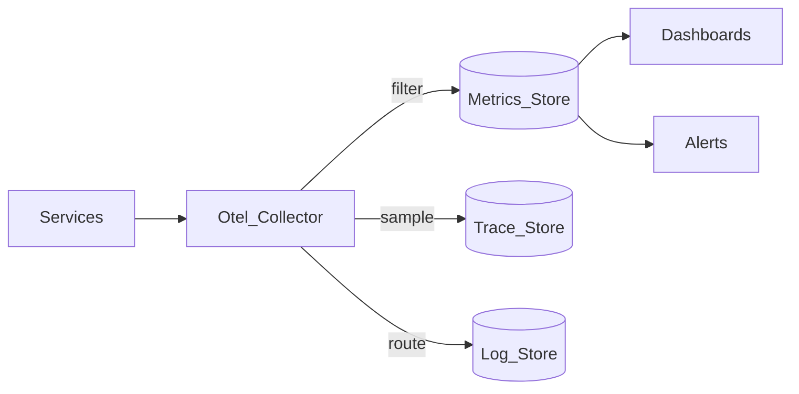

# Study Guide: Cost-Effective Observability

## Metadata
- **Track**: system-design-architecture
- **Subdomain**: observability
- **Difficulty**: Advanced
- **Target audience**: Junior engineers learning to control telemetry cost without losing debuggability
- **Estimated time**: 30–60 minutes

## What you’ll learn
- The main cost drivers for metrics, logs, and traces
- Practical strategies: sampling, retention tiering, aggregation, and cardinality control
- How to keep “high-signal” coverage while reducing spend
- How to set guardrails so cost doesn’t explode during incidents

## Mental model
Observability cost is mostly driven by **volume**, **cardinality**, and **retention**.
The goal is not “collect less” — it’s **collect the right data**:
- Keep enough to debug the hardest incidents
- Prefer cheaper signals for detection (metrics)
- Use expensive signals for context (logs/traces) with sampling and guardrails

## Reference architecture: cost control points

Cost controls often live in:
- SDK/agent (what you emit)
- collector (filtering, sampling, routing)
- storage (retention, tiers, indexing)

## Cost drivers by pillar

### Metrics
Cost drivers:
- number of time series (cardinality)
- scrape interval / resolution
- long retention at high resolution

High ROI optimizations:
- reduce label cardinality
- downsample older data (keep high-res short, low-res long)
- record rules for heavy queries

### Logs
Cost drivers:
- bytes ingested (volume)
- indexing (which fields, how many)
- retention length

High ROI optimizations:
- structured logs with intentional fields
- sample or drop low-value logs (debug/info spam)
- tiered retention (hot/warm/cold)

### Traces
Cost drivers:
- spans per request
- sampling rate
- attributes/baggage size

High ROI optimizations:
- head or tail sampling (keep slow/failed)
- reduce span verbosity for hot paths
- limit high-cardinality attributes

## Practical strategies (what to do)

### 1) Control cardinality first
Cardinality explosions can take down metric stores and balloon costs.
Guardrails:
- label allowlists
- route templating (`/users/:id` not `/users/123`)
- block dynamic labels (`user_id`, `request_id`)

### 2) Tier retention
Common approach:
- **Hot**: 7–14 days (fast queries, high resolution)
- **Warm**: 30–90 days (medium resolution)
- **Cold**: 6–24 months (cheap storage, slower queries)

### 3) Sampling with intent
- **Traces**:
  - Keep 100% of errors (or very high %)
  - Use tail sampling for slow requests
  - Keep representative baseline (e.g., 1–5%)
- **Logs**:
  - Keep ERROR and WARN
  - Sample repetitive INFO logs
  - Drop debug by default in prod (or gate it)

### 4) Prefer metrics for paging signals
Logs/traces are expensive for alert evaluation at scale.
Pattern:
- page on metrics
- use trace/log links for fast context

### 5) Budget and guardrail during incidents
Incidents often increase volume (retries, error logs).
Mitigations:
- per-tenant/service ingestion quotas
- dynamic sampling when error volume spikes
- circuit breakers in collectors to protect stores

## Trade-offs
- **More sampling**: cheaper, but lower forensic coverage.
- **Short retention**: cheaper, but less ability to investigate long-running issues.
- **Less indexing**: cheaper ingestion, but slower/more complex queries.

## Failure modes & mitigations
- **Cost spikes during outages**
  - Mitigation: quotas, sampling, and alerting on ingestion volume.
- **Losing the only useful signals**
  - Mitigation: protect critical telemetry (errors, key journeys) from sampling.
- **Debuggability regression**
  - Mitigation: periodic “incident drills” validating you can answer key questions.

## Operational checklist
- [ ] Cardinality guardrails exist (route templating, label allowlists)
- [ ] Retention tiers are defined and enforced
- [ ] Trace sampling keeps errors and slow requests at high rates
- [ ] Logs are structured; debug is gated; indexing is intentional
- [ ] Ingestion volume and drop/sampling rates are monitored
- [ ] Quotas/limits exist to protect shared platforms

## Exercises
1. Identify 3 high-cardinality labels in a hypothetical service and redesign them.
2. Propose a retention policy for metrics/logs/traces with cost vs value justification.
3. Design a tail-sampling policy that keeps slow and failed requests.

## Interview pack

### Common questions
1. “How do you reduce observability cost without losing visibility?”
2. “What causes cardinality explosions?”
3. “Head vs tail sampling: which would you choose and why?”
4. “What telemetry do you keep at 100%?”

### Strong answer outline
- Start with cost drivers (volume, cardinality, retention)
- Protect high-signal telemetry (errors, key journeys)
- Use sampling and tiered retention
- Add guardrails (quotas) and monitor platform health

### Red flags
- “Just sample everything at 1%”
- No plan for incidents increasing telemetry volume
- Allowing dynamic labels/attributes in metrics

## Related guides
- `02-metrics-architecture.md`
- `03-distributed-tracing.md`
- `04-log-aggregation-patterns.md`
- `05-alerting-strategy.md`
