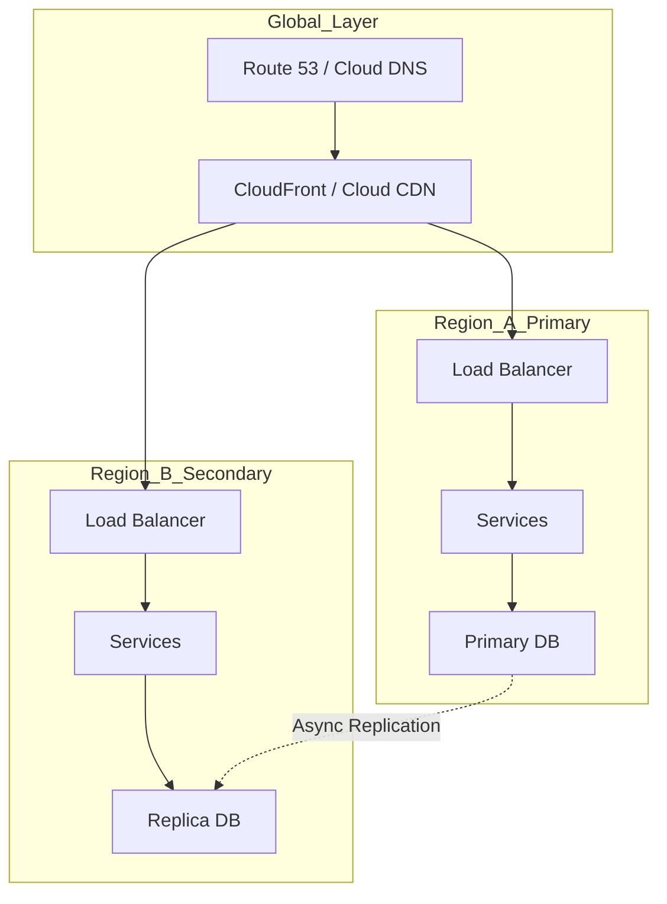

# Solutions Architecture - Concept Guide

## Overview

Cloud architecture patterns and solutions design topics for building scalable, resilient, and cost-effective systems. Covers multi-region deployments, cloud-native patterns, and architectural decision-making frameworks used by solutions architects and senior engineers.

## Prerequisites

- Experience with at least one major cloud provider (AWS, GCP, Azure)
- Understanding of networking and security basics
- Familiarity with infrastructure concepts (VPCs, load balancers, etc.)

## Topics Covered

| Topic | Study Guide | Difficulty | Est. Time |
|-------|-------------|------------|-----------|
| Cloud Design Patterns | [Study guide](study-guides/01-cloud-design-patterns.md) | Intermediate | 60 min |
| Multi-Region Architecture | [Study guide](study-guides/02-multi-region-architecture.md) | Advanced | 90 min |
| Disaster Recovery Strategies | [Study guide](study-guides/03-disaster-recovery-strategies.md) | Advanced | 60 min |
| Cost Optimization | [Study guide](study-guides/04-cost-optimization.md) | Intermediate | 45 min |
| Security Architecture | [Study guide](study-guides/05-security-architecture.md) | Advanced | 60 min |
| Serverless Patterns | [Study guide](study-guides/06-serverless-patterns.md) | Intermediate | 60 min |
| Data Architecture | [Study guide](study-guides/07-data-architecture.md) | Advanced | 60 min |
| Migration Strategies | [Study guide](study-guides/08-migration-strategies.md) | Advanced | 45 min |

## What you’ll learn (by topic)

### Cloud Design Patterns
- Core pattern families (resilience, scalability, integrity, operability, security)
- How to choose sync vs async and managed vs self-hosted trade-offs
- Failure modes (retry storms, hot partitions) and mitigations
- Deep dive: `study-guides/01-cloud-design-patterns.md`

### Multi-Region Architecture
- Active-active vs active-passive designs and traffic management
- Data replication trade-offs (consistency, latency, failover)
- Operational concerns (health checks, DNS/GSLB, failover drills)
- Deep dive: `study-guides/02-multi-region-architecture.md`

### Disaster Recovery Strategies
- RTO/RPO definitions and choosing DR tiers (backup/restore to hot standby)
- Runbooks and game days for failover and recovery
- Designing for partial-region failures and dependency outages
- Deep dive: `study-guides/03-disaster-recovery-strategies.md`

### Cost Optimization
- Biggest cost levers (compute, storage, egress, managed services)
- Right-sizing, autoscaling, and commitment discounts
- FinOps basics: tagging, allocation, and cost guardrails
- Deep dive: `study-guides/04-cost-optimization.md`

### Security Architecture
- Defense-in-depth, least privilege, and secure network boundaries
- Identity-first design (authn/authz), secrets, and auditability
- Threat modeling and secure-by-default service design
- Deep dive: `study-guides/05-security-architecture.md`

### Serverless Patterns
- Event-driven designs, queues/streams, and idempotency
- Concurrency limits, cold starts, and operational visibility
- Cost/perf trade-offs and when not to use serverless
- Deep dive: `study-guides/06-serverless-patterns.md`

### Data Architecture
- OLTP vs OLAP, lakes vs warehouses, and pipeline patterns
- Governance basics (quality, lineage, access controls)
- Reliability concerns (backfills, late data, exactly-once at business layer)
- Deep dive: `study-guides/07-data-architecture.md`

### Migration Strategies
- 6R framework (rehost, refactor, replatform, retire, retain, replace)
- Strangler, parallel runs, cutover planning, and rollback
- Risk management: data migration, performance, and org change
- Deep dive: `study-guides/08-migration-strategies.md`

## Recommended Study Order

1. **Cloud Design Patterns** - Common architectural patterns
2. **Serverless Patterns** - Event-driven and FaaS architectures
3. **Security Architecture** - Defense in depth, zero trust
4. **Data Architecture** - Data lakes, warehouses, pipelines
5. **Multi-Region Architecture** - Global scale deployments
6. **Disaster Recovery Strategies** - RTO, RPO, failover patterns
7. **Cost Optimization** - Right-sizing, reserved capacity, spot
8. **Migration Strategies** - Lift-and-shift to re-architecture

## Multi-Region Architecture Diagram

## Interview Relevance

Solutions architecture questions test strategic thinking:
- **Design**: "Design a globally distributed e-commerce platform"
- **Trade-offs**: "How would you balance cost vs availability?"
- **Migration**: "How would you migrate this monolith to microservices?"
- **Security**: "Walk me through your security architecture"

Interviewers assess:
- Breadth of cloud services knowledge
- Ability to make and justify architectural decisions
- Understanding of business requirements and constraints

## Total Estimated Time: 8 hours
