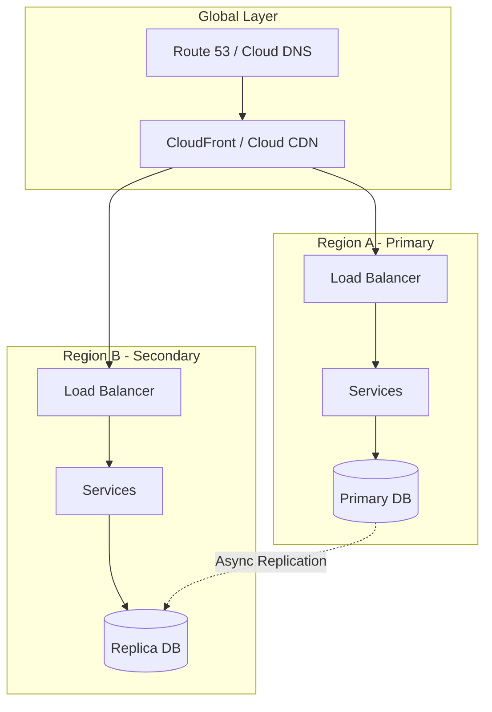

# Solutions Architecture - Concept Guide

## Overview

Cloud architecture patterns and solutions design topics for building scalable, resilient, and cost-effective systems. Covers multi-region deployments, cloud-native patterns, and architectural decision-making frameworks used by solutions architects and senior engineers.

## Prerequisites

- Experience with at least one major cloud provider (AWS, GCP, Azure)
- Understanding of networking and security basics
- Familiarity with infrastructure concepts (VPCs, load balancers, etc.)

## Topics Covered

| Topic | Study Guide | Difficulty | Est. Time |
|-------|-------------|------------|-----------|
| Cloud Design Patterns | Coming soon | Intermediate | 60 min |
| Multi-Region Architecture | Coming soon | Advanced | 90 min |
| Disaster Recovery Strategies | Coming soon | Advanced | 60 min |
| Cost Optimization | Coming soon | Intermediate | 45 min |
| Security Architecture | Coming soon | Advanced | 60 min |
| Serverless Patterns | Coming soon | Intermediate | 60 min |
| Data Architecture | Coming soon | Advanced | 60 min |
| Migration Strategies | Coming soon | Advanced | 45 min |

## Recommended Study Order

1. **Cloud Design Patterns** - Common architectural patterns
2. **Serverless Patterns** - Event-driven and FaaS architectures
3. **Security Architecture** - Defense in depth, zero trust
4. **Data Architecture** - Data lakes, warehouses, pipelines
5. **Multi-Region Architecture** - Global scale deployments
6. **Disaster Recovery Strategies** - RTO, RPO, failover patterns
7. **Cost Optimization** - Right-sizing, reserved capacity, spot
8. **Migration Strategies** - Lift-and-shift to re-architecture

## Multi-Region Architecture Diagram

## Interview Relevance

Solutions architecture questions test strategic thinking:
- **Design**: "Design a globally distributed e-commerce platform"
- **Trade-offs**: "How would you balance cost vs availability?"
- **Migration**: "How would you migrate this monolith to microservices?"
- **Security**: "Walk me through your security architecture"

Interviewers assess:
- Breadth of cloud services knowledge
- Ability to make and justify architectural decisions
- Understanding of business requirements and constraints

## Total Estimated Time: 8 hours
