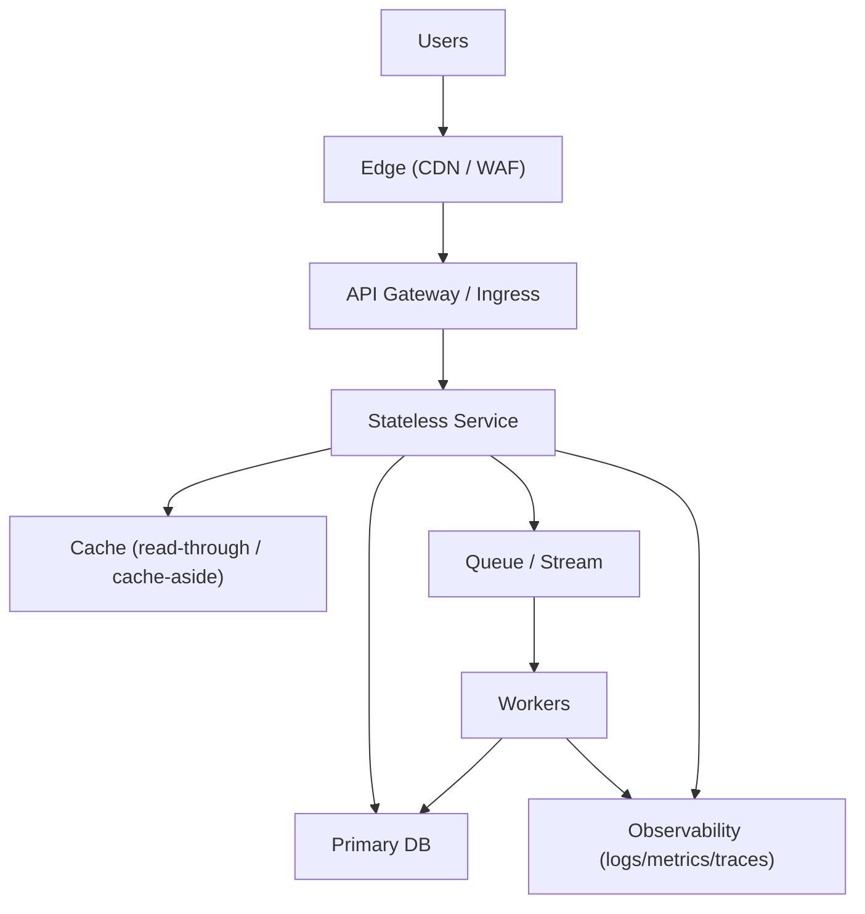

# Cloud Design Patterns (Solutions Architecture)

## Overview

Cloud design patterns are reusable, proven approaches to solve recurring distributed-systems problems (scalability, resilience, security, operability) using cloud primitives.

**Use this guide when** you need to quickly choose an architecture shape (synchronous vs async, stateful vs stateless, single-tenant vs multi-tenant) and defend the trade-offs.

---

## Concepts (mental models + common misconceptions)

### Pattern families

- **Availability & resilience**: bulkheads, circuit breakers, graceful degradation, failover
- **Scalability**: load leveling, sharding, cache-aside, CQRS
- **Data integrity**: idempotency, outbox/inbox, saga, compensation
- **Security**: least privilege, token exchange, secure-by-default network boundaries
- **Operability**: health checks, feature flags, immutable infrastructure

### Mental models

- **Time vs coordination**: avoid tight coupling across network boundaries; prefer async where possible.
- **State is the hard part**: stateless scales easily; state needs partitions, replication, or managed services.
- **Failure is normal**: design for partial failure (timeouts, retries, backpressure) as a first-class requirement.

### Common misconceptions

- **“Microservices = scalability”**: microservices increase coordination overhead; scaling depends on data + traffic patterns.
- **“Retries fix errors”**: retries can amplify outages; use timeouts, budgets, jitter, and idempotency.
- **“Caching is always good”**: caching adds consistency complexity and operational burden (invalidation, stampedes).

---

## Reference architecture

### Pattern map (where they fit)

### Core patterns to know (quick definitions)

- **Cache-aside**: app reads cache; on miss reads DB then populates cache.
- **CQRS**: separate read model from write model to scale and simplify.
- **Event-driven**: publish events; subscribers react asynchronously.
- **Outbox pattern**: write business state and an “event to publish” in one DB transaction.
- **Idempotency keys**: ensure retries don’t duplicate side effects.
- **Circuit breaker**: stop calling a failing dependency to protect the system.
- **Bulkhead**: isolate resources (pools/queues) so one failure doesn’t take down everything.

---

## Data/control flows

### Happy path (cache-aside + async work)

1. User request hits **Edge**, then **API**.
2. Service checks **Cache**; on miss reads **DB** and populates cache.
3. Service publishes an event to **Queue/Stream** (optionally via **Outbox**).
4. **Workers** process event and update downstream state.

### Under failure (examples)

- **DB slow**: service times out and serves stale cache (if safe) or degrades features.
- **Queue down**: outbox buffers events; a relay publishes when queue recovers.
- **Dependency flapping**: circuit breaker opens; requests short-circuit to fallback.

---

## Trade-offs (latency / availability / cost / operability / security)

- **Sync vs async**:
  - Sync: simpler UX consistency; higher tail latency and blast radius.
  - Async: better resilience and throughput; eventual consistency + harder debugging.
- **Managed vs self-hosted**:
  - Managed: higher unit cost; lower operational load; fewer sharp edges.
  - Self-hosted: cheaper at scale sometimes; higher toil and failure modes.
- **Cache**:
  - Faster reads and lower DB cost; risk of staleness, stampedes, and eviction churn.

---

## Failure modes & mitigations

- **Retry storms / thundering herd**
  - Mitigate: retries with jitter + exponential backoff; request hedging sparingly; cache locking; rate limits.
- **Duplicate side effects (payments, emails)**
  - Mitigate: idempotency keys; dedupe tables; exactly-once semantics at the business layer.
- **Poison messages**
  - Mitigate: DLQ; max attempts; quarantine + alert; payload validation.
- **Hot partitions**
  - Mitigate: better partition keys; adaptive sharding; load leveling; caching; write spreading.

---

## Operational playbook (checklists)

### Before production

- **Dependency contracts**: timeouts, retry budgets, backpressure strategy documented
- **Idempotency**: keys defined and stored; dedupe window defined
- **Load testing**: include tail latency, dependency failures, and overload scenarios
- **Runbooks**: known failure modes + “first 5 minutes” response

### Incident “first 10 minutes”

- **Is it user-impacting?** Check error rate, saturation, and p95/p99 latency.
- **Scope blast radius**: which endpoint/region/tenant?
- **Find the choke point**: DB, queue, cache, downstream dependency, or deploy regression.
- **Stabilize**: enable circuit breakers, shed load, roll back, scale read replicas/workers.

---

## Security considerations

- **Least privilege**: separate IAM roles for service, workers, and CI/CD.
- **Network boundaries**: private subnets for DB; restrict egress; WAF at edge.
- **Secrets**: use a secrets manager; rotate; avoid long-lived keys.
- **Supply chain**: signed artifacts; SBOM; dependency scanning; provenance checks.

---

## Metrics & SLOs (suggested)

- **Golden signals**: latency (p50/p95/p99), traffic, errors, saturation
- **Dependency health**: DB latency, cache hit rate, queue lag, worker backlog
- **SLO example**: 99.9% of requests under 300ms excluding planned maintenance
- **Alerts**: burn-rate alerts + symptom-based alerts (not only CPU)

---

## Hands-on exercises (small + constrained)

1. **Add idempotency**: Design an idempotency key scheme for “Create Order”.
2. **Outbox**: Sketch tables for `orders` + `outbox_events` and the relay worker logic.
3. **Circuit breaker**: Define thresholds and fallback behavior for a flaky pricing service.
4. **Cache strategy**: Pick TTLs + invalidation approach for a product catalog.

---

## Interview pack

### Common questions

- “When would you choose synchronous vs asynchronous communication?”
- “How do you guarantee an event is published if you commit a DB transaction?”
- “How do you prevent duplicate processing with retries?”
- “What patterns do you use to handle dependency failures gracefully?”

### Strong answer outlines

- Start with **requirements** (consistency needs, latency, throughput, failure tolerance).
- Pick **2–3 key patterns** and explain how they work together (timeouts + retries + idempotency + outbox).
- Call out **failure modes** and your mitigations (DLQ, backpressure, circuit breakers).
- Tie back to **operability** (metrics, SLOs, runbooks).

### Red flags

- “Just increase retries” without budgets/backoff/jitter
- No plan for partial failure or idempotency
- Overusing microservices without data/ownership boundaries

---

## Related guides

- `02-multi-region-architecture.md`
- `03-disaster-recovery-strategies.md`
- `04-cost-optimization.md`
- `05-security-architecture.md`

