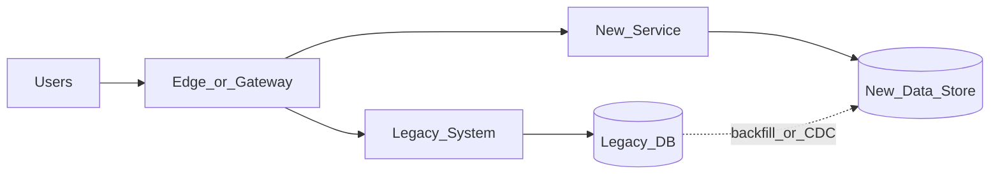

# Study Guide: Migration Strategies

## Metadata
- **Track**: system-design-architecture
- **Subdomain**: solutions-architecture
- **Difficulty**: Advanced
- **Target audience**: Junior engineers planning and executing system/cloud migrations
- **Estimated time**: 45–75 minutes

## What you’ll learn
- The **6Rs** of migration and when each applies
- How to reduce risk with strangler patterns, parallel runs, and phased cutovers
- Data migration strategies (backfills, dual writes, validation, rollback)
- Operational planning: metrics, SLOs, runbooks, and stakeholder comms

## Mental model
Migrations are risk management projects. Success is:
- minimal user impact
- measurable progress
- reversible steps
- clear ownership and communication

Don’t migrate “everything at once”. Prefer incremental and verifiable changes.

## The 6Rs (common classification)
- **Rehost**: lift-and-shift (same app, new infra)
- **Replatform**: small changes to use managed services
- **Refactor**: significant changes to architecture/code
- **Retire**: decommission unused systems
- **Retain**: keep as-is (for now)
- **Replace**: buy/SaaS or new system

## Reference architecture: strangler + parallel run

## Data/control flows

### Safe incremental cutover
1. Add gateway routing rules by endpoint/tenant/percentage.
2. Backfill data from legacy into new store (idempotent).
3. Run in **read-only** mode or shadow mode first.
4. Enable writes with dual-write or event-driven sync if needed.
5. Validate correctness with metrics and sampling.
6. Increase traffic gradually; keep rollback available.

### Rollback (must be planned)
Rollback is easiest when:
- steps are small
- data writes are either compatible or can be replayed
- you have a clear “source of truth”

## Key migration choices

### 1) Cutover style
- **Big bang**: fastest, highest risk.
- **Phased**: safer; requires routing and compatibility.

### 2) Data strategy
Options:
- **Backfill + read switch**: migrate historical data then switch reads.
- **Dual write**: write to both systems (hard; needs reconciliation).
- **CDC/event sync**: replicate changes from legacy to new store.

### 3) Compatibility discipline
Use expand/contract for schema changes:
- expand schema to support old + new
- deploy compatible code
- switch reads/writes
- contract later

## Trade-offs
- **Rehost**: low engineering cost, may not solve operational pain.
- **Refactor**: higher cost, best long-term outcome if done well.
- **Dual write**: reduces cutover risk, increases correctness complexity.

## Failure modes & mitigations
- **Hidden dependencies**
  - Mitigation: dependency mapping, traffic shadowing, comprehensive observability.
- **Data drift between systems**
  - Mitigation: reconciliation jobs, checksums, sampling, idempotent events.
- **Performance regressions**
  - Mitigation: load tests, canary rollouts, latency budgets and SLOs.
- **Rollback impossible**
  - Mitigation: plan rollback per step; keep old system warm until confidence is high.
- **Stakeholder misalignment**
  - Mitigation: explicit milestones, comms cadence, and success criteria.

## Operational playbook
- **Before cutover**:
  - [ ] define success metrics + SLO thresholds
  - [ ] ensure dashboards exist (errors, latency, saturation)
  - [ ] rehearsal in staging (game day)
  - [ ] freeze window and rollback owner
- **During cutover**:
  - [ ] increase traffic gradually
  - [ ] watch golden signals and business KPIs
  - [ ] record decisions and timestamps
- **After cutover**:
  - [ ] run reconciliation
  - [ ] keep rollback window until stable
  - [ ] decommission only after verification

## Security considerations
- Ensure access controls match or improve (don’t “open it up” to migrate faster).
- Treat migration pipelines as privileged; audit and restrict.
- Validate that logs/traces don’t leak sensitive data during parallel runs.

## Metrics & SLOs (suggested)
- Error rate and latency for cutover cohort vs control cohort
- Data correctness metrics (reconciliation mismatch rate)
- Migration progress metrics (backfill completion, lag)
- Operational metrics (deploy frequency, rollback frequency during migration)

## Exercises
1. Choose an app (monolith) and propose a phased migration plan with the 6Rs.
2. Design a data backfill strategy and a reconciliation job.
3. Write a rollback plan for a “new checkout service” cutover.

## Interview pack

### Common questions
1. “How would you migrate a monolith to microservices?”
2. “How do you migrate data safely?”
3. “What is the strangler pattern?”
4. “How do you plan rollback during a migration?”

### Strong answer outline
- Classify with 6Rs, then pick an incremental approach
- Use routing + shadowing + canaries
- Treat data correctness as first-class (backfill, CDC, reconciliation)
- Use SLOs and runbooks to manage cutover risk

### Red flags
- Big bang cutover without rollback
- Dual writes without reconciliation
- No success metrics or verification plan

## Related guides
- `01-cloud-design-patterns.md`
- `05-security-architecture.md`
- `07-data-architecture.md`
